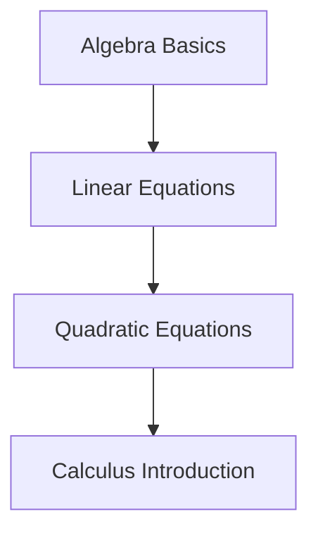

Table of Contents:
1. Algebra Basics
2. Linear Equations
3. Quadratic Equations
4. Calculus Introduction

Skills to learn:
- Addition and Subtraction
- Solving for X
- Factoring Quadratics
- Limits and Derivatives

Dependencies:
- Linear Equations requires Algebra Basics
- Quadratic Equations requires Linear Equations
- Calculus Introduction requires Quadratic Equations

