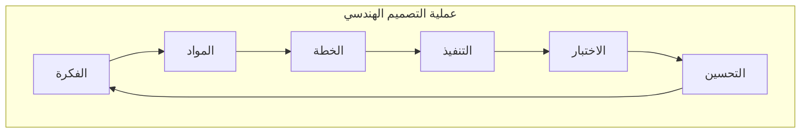

الصف الخامس الابتدائي

وزارة التربية والتعليم والتعليم الفني

# العلوم – الفصل الدراسي الثاني

٢٠٢٥ - ٢٠٢٦


العلوم - الصف الخامس الابتدائي

الاسم _________________________________________________


Discovery Education logo

جميع الحقوق محفوظة لمؤسسة ديسكفري التعليمية 2025. لا يجوز نسخ أو توزيع أو نقل أي جزء من هذا العمل بأي شكل أو بأي وسيلة، أو تخزينه في نظام للاسترجاع أو قاعدة البيانات، دون إذن كتابي مسبق من مؤسسة ديسكفري التعليمية.

وللحصول على الإذن (الأذونات)، أو للاستفسار، يمكنك إرسال طلب إلى:

Discovery Education, Inc.
4350 Congress Street, Suite 700
Charlotte, NC 28209
9084800-323-
Education_Info@DiscoveryEd.com

ISBN 13: 3978-1-61708-848-

1 2 3 4 5 6 7 8 9 10 CJK 25 24 23 22 21 A

<mark>مراجعة</mark>
**الإدارة المركزية لتطوير المناهج**
<mark>تحت إشراف</mark>
**د. أكرم حسن**
مساعد الوزير
لشئون تطوير المناهج التعليمية
والمشرف على الادارة المركزية لتطوير المناهج

<page_number>iii</page_number> العلوم - الفصل الدراسي الثاني


# مراجعة
## الإدارة المركزية لتطوير المناهج

أ/ فايز فوزي حنا
د/ شاهيناز نصر عبد الله
أ/ موندا عبد الرحمن سلام
أ/ هناء محمد أبو بكرة

**رئيس قسم العلوم**
د. حنان أبوالعباس محمد

**مستشار العلوم**
د. عزيزة رجب خليفة

# إشراف
د. أكرم حسن محمد
**مساعد الوزير**
**لشئون تطوير المناهج التعليمية**
**والمشرف علي الإدارة المركزية لتطوير المناهج**

<page_number>iv</page_number>


# مقدمة الكتاب المدرسي

أطلقت وزارة التربية والتعليم رؤية مصر الإصلاحية لتطوير التعليم وجاءت عملية تطوير المناهج في القلب من هذه الرؤية؛ إذ انطلقت إشارة البدء في تنفيذ هذه الرؤية بدءًا من مرحلة رياض الأطفال بصفيها الأول والثاني ٢٠١٨ ومستمرة على التوالي حتى نهاية المرحلة الثانوية.

وقد استهدفت تلك الرؤية إجراء تحولات كبرى في عمليات التعليم والتعلم حيث الانتقال من اكتساب المعرفة إلى إنتاجها، ومن تعلم المهارات إلى توظيفها في مواقف التعلم وتعميمها في حياة المتعلم خارج الصفوف، كما تضمنت مناهجنا القيم البانية لمجتمعنا والتي تعد سياجًا يحمي وطننا، كما استهدفت رؤية مصر الإصلاحية لتطوير المناهج مراعاة مواصفات خريج التعليم قبل الجامعي، وما تواجهه مصر من تحديات محليًا وإقليميًا وعالميًا إذ استهدفت المناهج المطورة بناء مواطن قادر على التواصل الحضاري وبناء حوار إيجابي مع الآخر، فضلًا عن اكتساب مهارات المواطنة الرقمية.

وفي هذا الصدد تتقدم وزارة التربية والتعليم والتعليم الفني بكل الشكر والتقدير للإدارة المركزية لتطوير المناهج والمواد التعليمية، تخص كذلك - بالشكر والعرفان مؤسسة دسكفري لمشاركتها الفاعلة في إعداد هذا الكتاب، كما تتقدم بالشكر لجميع خبراء الوزارة الذين أسهموا في إثراء هذا العمل.

إن تغيير نظامنا التعليمي لم يكن ممكنًا دون الإيمان العميق للقيادة السياسية المصرية بضرورة التغيير؛ فالإصلاح الشامل للتعليم في مصر هو جزء أصيل من رؤية السيد الرئيس عبد الفتاح السيسي لإعادة بناء المواطن المصري، ولقد تم تفعيل هذه الرؤية بالتنسيق الكامل مع السادة وزراء التعليم العالي والبحث العلمي، ووزارة الثقافة، ووزارة الشباب والرياضة.

إن نظام تعليم مصر الجديد هو جزء من مجهود وطني كبير ومتواصل؛ للارتقاء بمصر إلى مصاف الدول المتقدمة لضمان مستقبل عظيم لجميع مواطنيها.

| <page_number>iv</page_number>


**السيد الفاضل ولي الأمر/المعلم،**

في هذا العام، يستخدم تلميذك كتاب مادة العلوم، كمحتوى شامل تم تطويره لإلهام التلاميذ ليسلكوا منحى العلماء والمهندسين في تصرفاتهم وتفكيرهم؛ وعلى مدار العام الدراسي، سيطرح التلاميذ أسئلة عن العالم من حولهم وسيحاولون حل مشكلات واقعية عن طريق تطبيق التفكير الناقد في كافة مجالات العلوم مثل (علوم الحياة، وعلوم الفضاء والأرض، علوم الفيزياء، والعلوم البيئية، والهندسة والتكنولوجيا).

يحتوي كتاب مادة العلوم على أنشطة مبتكرة تساعد التلاميذ على إتقان المفاهيم العلمية الأساسية، حيث يشارك التلاميذ في مواد العلوم التفاعلية لتحليل وتفسير البيانات واستخدام التفكير الناقد وحل المشكلات وإنشاء الروابط عبر تخصصات العلوم.

شريط التنقل العلوي للكتاب

## وحدة 3: الموارد الطبيعية على سطح الأرض

* **المفهوم 1.3: التفاعلات بين الغلاف الحيوي والغلاف المائي**
* **المفهوم 2.3: الماء كأهم الموارد الطبيعية على سطح الأرض** (استعراض المفهوم)

## وحدة 4: الأنماط في السماء

* **المفهوم 1.4: تأثير الجاذبية** (استعراض المفهوم)
* **المفهوم 2.4: أنماط الحركة في السماء** (استعراض المفهوم)

<page_number>vi</page_number>


كما يتضمن أكواد QR تتضمن محتوى تفاعلي، ومقاطع فيديو، واستقصاءات علمية ومعملية، وأنشطة على شكل ألعاب لتحفيز وإلهام تعلم التلاميذ للعلوم وإثارة فضولهم.

ينقسم كتاب مادة العلوم إلى وحدات، وكل وحدة تحتوي على مفاهيم، ويحتوي كل مفهوم على دروس تتضمن ثلاثة أقسام: تساءل، وتعلّم، وشارك.

* **الوحدات والمفاهيم**: يفكر التلاميذ في العلاقة بين مجالات العلوم لفهم وتحليل ووصف الظواهر الحقيقية.
* **تساءل**: يُطوّر التلاميذ من معرفتهم السابقة بالمفاهيم الأساسية، ثم يربطون بينها وبين مواقف من الحياة اليومية.
* **تعلّم**: يتعمق التلاميذ في المفاهيم العلمية الأساسية من خلال القراءة الناقدة للنصوص وتحليل المصادر متعددة الوسائط. يُطوّر التلاميذ تعلمهم بإجراء الأبحاث وممارسة الأنشطة التي تركز على أهداف التعلم.
* **شارك**: يشارك التلاميذ ما تعلموه مع معلمهم وزملائهم باستخدام الأدلة التي حصلوا عليها وقاموا بتحليلها أثناء نشاط تعلّم. يربط التلاميذ بين تعلمهم ومهارات ريادة الأعمال والوظائف ومهارات حل المشكلات.

صورة توضيحية لصفحة من كتاب التلميذ تحتوي على نشاط تعليمي ورمز استجابة سريع QR

في هذه النسخة المطبوعة من كتاب التلميذ، رموز الاستجابة أكواد QR (الرموز السريعة) التي تنقلك وتلميذك إلى جزء رقمي عبر الإنترنت.

نشجعك على دعم تلميذك باستخدام أكواد QR. مع أطيب أمنياتنا لك ولتلميذك بالاستمتاع معًا بعام دراسي رائع من العلوم والاستكشاف.

وتفضلوا بقبول فائق الاحترام،
فريق العلوم

العلوم - الفصل الدراسي الثاني <page_number>vii</page_number>


# قائمة المحتوى

## المحور الثالث | حماية كوكبنا

**الوحدة الثالثة: الموارد الطبيعية على سطح الأرض**

ابدأ
1 حقائق علمية درستها
2 الظاهرة الرئيسة: حلول للحفاظ على المياه: معالجة مياه الصرف
3 نظرة عامة على مشروع الوحدة: الحياة بجوار مصادر المياه

## المفهوم 1.3 التفاعلات بين الغلاف الحيوي والغلاف المائي
5 الدرس الأول
8 الدرس الثاني
11 الدرس الثالث
14 الدرس الرابع
15 الدرس الخامس

## المفهوم 2.3 الماء كأهم الموارد الطبيعية على سطح الأرض
19 الدرس الأول
23 الدرس الثاني
25 الدرس الثالث
27 الدرس الرابع
31 الدرس الخامس

## ملخص الوحدة
36 مشروع الوحدة: الحياة بجوار مصادر المياه

## المشروع بيني التخصصات
39 تحلية مياه البحر

48 قيم تعلمك

<page_number>viii</page_number>


# المحور الرابع | التغير والثبات

**الوحدة الرابعة: الأنماط في السماء**

ابدأ
51 حقائق علمية درستها
52 الظاهرة الرئيسة: اختفاء الظل
53 نظرة عامة على مشروع الوحدة: الساعة الشمسية

## المفهوم 1.4 تأثير الجاذبية
55 الدرس الأول
58 الدرس الثاني
60 الدرس الثالث
64 الدرس الرابع
67 الدرس الخامس

## المفهوم 2.4 أنماط حركة الأجسام في السماء
71 الدرس الأول
75 الدرس الثاني
79 الدرس الثالث
81 الدرس الرابع
83 الدرس الخامس
86 الدرس السادس

**ملخص الوحدة**
90 مشروع الوحدة: الساعة الشمسية

91 قيم تعلمك

العلوم - الفصل الدراسي الثاني <page_number>ix</page_number>


# المحور الثالث | حماية كوكبنا

# الوحدة الثالثة
# الموارد الطبيعية على سطح الأرض

صورة لجمل مزين بكرات ملونة على شاطئ رملي

شعار وزارة التربية والتعليم والتعليم الفني


# ابدأ

## حقائق علمية درستها
لقد تعلّمت في الفصل الدراسي الأول الكثير عن المياه. فكّر في استخدامات المياه المختلفة في حياتنا وفي مصادر المياه. اقترح طرقًا تساعد على تقليل كميات المياه المهدرة، وسبل توفير مياه نظيفة وكافية للكائنات الحية تساعدها على البقاء.

زجاجة مياه معبأة
ري نباتات
صنبور مياه

لاحظ الصور واكتب ما تعرفه عن المياه. استخدم الصور لمساعدتك على شرح طرق توفير المياه وحماية هذا المورد الطبيعي شديد الأهمية.

____________________________________________________________________________________________________
____________________________________________________________________________________________________
____________________________________________________________________________________________________

**تحدث إلى زميلك** يحتاج الإنسان إلى مياه نقية صالحة للشرب لأغراض الشرب والطهي. ففي بعض المناطق، يلجأ الإنسان إلى شرب المياه المعبأة لعدم توفر المياه الصالحة للشرب، أما في غيرها من الأماكن، فهناك من يُفضل شرب المياه المعبأة رغم سهولة الحصول على مياه صالحة للشرب. إذا، برأيك هل شرب المياه المعبأة مفيد أم ضار؟ اشرح أفكارك.

في هذه الوحدة، ستبحث عن طرق تساعد على حماية المياه كمورد مهم، وستتعلم المزيد عن كيفية تفاعل <mark>الكائنات الحية</mark> مع مصادر المياه. كما ستتعرف على مواقع المسطحات المائية على سطح الأرض، وستستخدم الأدلة لإجراء مناقشة عن طرق الحفاظ على المياه العذبة. بعد ذلك، ستتعلم المزيد عن الموارد الطبيعية الأخرى على سطح الأرض، ومدى التأثير الهائل للأنشطة البشرية على هذه الموارد. وأخيرًا ستبحث عن دور المياه في حياة الكائنات الحية باستخدام نموذج لمستجمع مياه محلي في مشروع الوحدة "الحياة بجوار مصادر المياه".

الوحدة الثالثة: الموارد الطبيعية على سطح الأرض <page_number>1</page_number>


# ابدأ

## حلول للحفاظ على المياه: معالجة مياه الصرف

تحتاج جميع الكائنات الحية إلى المياه من أجل البقاء، حيث يستخدم الإنسان المياه للشرب والطهي والاستحمام. ونظرًا لأن مصادر المياه العذبة على كوكب الأرض تتناقص باستمرار، نتيجة للتغير المناخي والتلوث وإهدار المياه؛ مما يهدد العديد من البشر بنقص إمدادات المياه. تُعتبر معالجة مياه الصرف أحد الحلول لمواجهة هذه المشكلة. تُسمى المياه التي نستخدمها في النظافة والاستحمام بمياه الصرف المعالجة، والتي يمكن تصفيتها وتنقيتها، ثم إعادة استخدامها في أغراض أخرى.

وتُعتبر محطة بحر البقر لمعالجة المياه في مصر إحدى أكبر محطات معالجة المياه في العالم. ويمكن استخدام المياه المعالجة لري الأراضي الزراعية في مصر. هل تعرف طرقًا أخرى للحفاظ على المياه أو إعادة استخدامها؟

محطة بحر البقر لمعالجة مياه الصرف في مصر

كيف تتفاعل موارد أغلفة الأرض مع بعضها البعض؟ ما مقدار المياه على سطح الأرض؟ كيف يمكننا حماية الموارد الطبيعية والمحافظة على موارد كوكب الأرض؟

<page_number>2</page_number>


# نظرة عامة على مشروع الوحدة

حل المشكلات كعالم

## مشروع الوحدة: الحياة بجوار مصادر المياه

في هذا المشروع، ستستعين بما تعرفه عن المياه كمورد طبيعي لتصميم نموذج لمصادر المياه الموجودة قريبًا من منزلك. وستبحث عن كيف يمكن أن يؤثر تلوث أحد المسطحات المائية على غيره من مصادر المياه الأخرى والكائنات الحية.

## طرح أسئلة عن المشكلة

فكر فيما تعرفه عن أماكن المسطحات المائية على كوكب الأرض، ومدى اعتماد الكائنات الحية على المياه. وكيف تتأثر الكائنات الحية بتلوث أحد مصادر المياه؟ وإلى أي مدى يمكن أن تنتشر آثار تلوث المياه؟ اكتب بعض الأسئلة التي يمكن طرحها لتتعلم المزيد عن المياه كمورد طبيعي. ومن خلال معرفتك بدور المياه في حياة الكائنات الحية، بالإضافة إلى الارتباط بين مصادر المياه المختلفة، اكتب الإجابات عن أسئلتك.

نهر النيل، مصر

**المهارات الحياتية** أستطيع تطبيق فكرة بطريقة جديدة.
الوحدة الثالثة: الموارد الطبيعية على سطح الأرض | <page_number>3</page_number>


# المفهوم 1.3 التفاعلات بين الغلاف الحيوي والغلاف المائي

## الأهداف
بعد الانتهاء من دراسة هذا المفهوم، أستطيع أن:
* [ ] أصنّف الأنظمة الموجودة على الأرض كأجزاء من الغلاف المائي، والغلاف الحيوي، والغلاف الأرضي، والغلاف الجوي.
* [ ] أطوّر نموذجًا للتفاعلات بين الغلاف المائي والغلاف الحيوي.
* [ ] أحدد الخصائص المميزة للأنظمة البيئية المائية المختلفة.

## المفردات الأساسية
* [ ] الغلاف الجوي
* [ ] المياه الجوفية
* [ ] المنطقة الإحيائية
* [ ] الغلاف المائي
* [ ] الغلاف الحيوي
* [ ] المياه المالحة
* [ ] الأنظمة البيئية
* [ ] المياه العذبة
* [ ] الغلاف الأرضي

<page_number>4</page_number>


الدرس الأول

**نشاط 1**

**هل تستطيع الشرح؟**

صورة للأرض من الفضاء

صورة للأرض من الفضاء

فكر في العالم من حولنا. درست في الفصل الدراسي الأول <mark>الأنظمة البيئية</mark> وتعلمت كيف يمكن للكائنات الحية أن تتفاعل مع بيئاتها المحيطة. تحدث مع زملائك في الفصل عن الغلاف الحيوي والغلاف المائي. ما الغلاف الحيوي للأرض؟ ما الغلاف المائي للأرض؟ اقرأ السؤال وسجل إجابتك.

كيف يتفاعل الغلاف الحيوي مع الغلاف المائي على سطح الأرض؟

__________________________________________________________________
__________________________________________________________________
__________________________________________________________________
__________________________________________________________________
__________________________________________________________________

QR code

المفهوم 1.3: التفاعلات بين الغلاف الحيوي والغلاف المائي | <page_number>5</page_number>


الدرس الأول 1.3 تساءل كيف يتفاعل الغلاف الحيوي مع الغلاف المائي على سطح الأرض؟

## نشاط 2
## تساءل كعالم

**أهمية الماء للكائنات الحية**

نستخدم الماء يوميًا في حياتنا. لاحظ الصورة، وفكر في أسباب أهمية الماء.

ري مشتل الزهور

**ري مشتل الزهور**

سجل أي تساؤل لديك عن الماء واستخداماته.

**أتساءل . . .**

[________________________________________________________________________________________________________________________________________________________________________________________________________________________________________________________________________________________________________________________________________________________________________________________________________________________________________________________________________________________________________________________________________________________________________________________________________________________________________________________________________________________________________________________________________________________________________________________________________________________________________________________________________________________________________________


# الدرس الأول

## نشاط 3
## لاحظ كعالم

**أهمية الماء للحياة على الأرض**

فكّر كم مرة ترى الماء في يومك؟ كيف تستخدم الماء في حياتك؟ اقرأ النص وفكر.

صورة لبحيرة محاطة بأرض خضراء وسماء زرقاء

يوجد الماء في كل مكان؛ في البحيرات والأنهار والبحار والمحيطات وتحت الأرض. يوجد الكثير من الماء على الأرض لدرجة أن كوكبنا يشبه كرة زرقاء بالنظر إليه من الفضاء. ما يقرب من ثلاثة أرباع الأرض مغطاة بالمياه. يمكن أن يتحول الماء من سائل إلى صلب (ثلج) بالتجمد، كما أن الماء قد يتحول إلى بخار في الهواء الجوي. لا تتغير الكمية الإجمالية للمياه على الأرض، حتى لو تغيرت حالته. يمكننا إعادة تدوير المياه، لكن لا يمكننا توفير مياه جديدة. نستخدم الماء للشرب، وإعداد الطعام، والاستحمام وغيرها من الاستخدامات اليومية. تحتاج جميع الحيوانات والنباتات إلى الماء كي تبقى على قيد الحياة، كما أن الإنسان يستخدم الماء أيضًا في أعمال النظافة ونقل البضائع والسفر عبر السفن وفي الصناعة.

اكتب جملًا توضح كيفية استخدام الماء على كوكب الأرض في العمود الأول، ثم اشرح السبب وراء أهمية الماء في العمود الثاني.

| كيف يُستخدم الماء؟ | ما أهمية الماء؟ |
| ------------------ | --------------- |
|                    |                 |
|                    |                 |
|                    |                 |
|                    |                 |
|                    |                 |


المفهوم 1.3: التفاعلات بين الغلاف الحيوى والغلاف المائى <page_number>7</page_number>


# الدرس الثاني 1.3 تساؤل: كيف يتفاعل الغلاف الحيوي مع الغلاف المائي على سطح الأرض؟

**نشاط 4**
**قيّم كعالم**

**ما الذي تعرفه عن التفاعلات بين الغلاف الحيوي والغلاف المائي؟**
فكّر في الأماكن المختلفة التي يوجد فيها الماء على الأرض. كيف يتفاعل الغلاف المائي مع الغلاف الحيوي؟

## أنواع المسطحات المائية
اكتب كل مصطلح من بنك الكلمات بجوار العبارة التي تصفه بصورة صحيحة.

مياه جوفية | بحيرة
--- | ---
محيط (أو بحر) | نهر

1. مسطح مائي محاط باليابسة من جميع الجهات به مياه غالبًا ما تكون عذبة، ولكنها تكون مالحة أحيانًا. [____________________]
2. الماء الذي يتدفق من منطقة عالية الارتفاع إلى منطقة منخفضة الارتفاع في قناة محددة. [____________________]
3. مسطح مائي هائل من الماء المالح. [____________________]
4. المياه التي تقع تحت سطح الأرض وتم تسربها إلى الأرض من خلال طبقة من الصخور المسامية. [____________________]

## الموارد المتجددة
فكّر فيما تعرفه عن النباتات والماء، ثم أجب عن الأسئلة.

هل تُعتبر النباتات من الموارد المتجددة؟ إذا كان الأمر كذلك، فكيف تتجدد النباتات؟ اشرح أفكارك.
[____________________________________________________________________________________________________]

هل يُعتبر الماء من الموارد المتجددة؟ إذا كان الأمر كذلك، فكيف يتجدد الماء؟ اشرح أفكارك.
[____________________________________________________________________________________________________]

<page_number>8</page_number>


# 1.3 تعلّم | الدرس الثاني
## كيف يتفاعل الغلاف الحيوي مع الغلاف المائي على سطح الأرض؟

### نشاط 5
### ابحث كعالم

**البحث العملي: ما الكائنات الموجودة في بيئتك؟**

لقد كنت تفكر في كيفية تفاعل الأنظمة الحية وغير الحية على سطح الأرض، والآن، حان الوقت للتفكير في بيئتك الخاصة. في هذا البحث، ستستكشف فناء مدرستك، وبعد ذلك، ستقوم بإدراج وتصنيف الكائنات الحية والأشياء غير الحية التي تجدها.

**توقع**
فكّر في الفئات المختلفة من الكائنات الحية والأشياء غير الحية على سطح الأرض.
ما أنواع الكائنات الحية والأشياء غير الحية التي تعتقد أنك ستلاحظها في بيئتك؟

**ما المواد التي ستحتاج إليها؟ (لكل مجموعة)**
* أقلام تلوين خشبية، 4 ألوان
* قلم رصاص
* ورق للكتابة، 6 ورقات

**خطوات التجربة**
1. اقض نحو 15 دقيقة بمفردك في ملاحظة وتسجيل أكبر عدد ممكن من الأشياء من حولك. وهي كائنات حية وأشياء غير حية.
2. انضم إلى زملائك واعمل في مجموعات واجمعوا العناصر من البيئة.
3. صنّف العناصر التي لاحظتها مجموعتك إلى الفئات التي تناسبها. استخدم أقلامك الملونة في التصنيف.
4. قم بإنشاء مخطط للفئات والعناصر المختلفة في كل فئة. سجّل أسماء الفئات في الصف الأول. سجّل العناصر في الصف الثاني.
5. اعرض نتائج مجموعتك على الفصل.

المفهوم 1.3: التفاعلات بين الغلاف الحيوي والغلاف المائي | <page_number>9</page_number>


# الدرس الثاني 1.3 تعلَّم
كيف يتفاعل الغلاف الحيوي مع الغلاف المائي على سطح الأرض؟

**الكائنات الحية والأشياء غير الحية في بيئتك**

|   |   |   |   |
| - | - | - | - |
|   |   |   |   |


**فكِّر في النشاط**
ما الأنماط التي تراها في ملاحظاتك؟

____________________________________________________________________________________________________

____________________________________________________________________________________________________

كيف تعتبر الكائنات الحية والأشياء غير الحية الموجودة في أي نظام ضرورية لاستدامة الحياة فيه؟

____________________________________________________________________________________________________

____________________________________________________________________________________________________

**المهارات الحياتية** أستطيع أن أدير وقتي بفاعلية.

<page_number>10</page_number>


# الدرس الثالث

## نشاط 6
## حلّل كعالم

### أنظمة الأرض

يقوم العلماء بتصنيف الكائنات الحية والأشياء غير الحية إلى أربعة أنظمة رئيسة على الأرض. اقرأ النص، وضع خطًا تحت الكلمات التي لا تعرفها.

الأرض تدعم الحياة عليها بطرق مختلفة. لوصف كيفية عمل أجزاء الأرض المختلفة مع بعضها البعض، قام العلماء بتصنيف الأشياء غير الحية والكائنات الحية والظواهر في مجموعات أو أنظمة مشتركة. وقد استخدم العلماء كلمة غلاف لتسمية كل نظام من هذه الأنظمة؛ لأن كوكب الأرض على شكل كرة (غير كاملة الاستدارة).

## الغلاف الأرضي والغلاف المائي

النظام الأول هو <mark>الغلاف الأرضي</mark> ويُعرف أيضًا بالغلاف الصخري. ويحتوي على مكونات مثل الصخور، والمعادن، والتضاريس، والتربة، وحتى الصخور المنصهرة داخل الأرض. ما المكونات الموجودة في الغلاف الأرضي والتي لاحظتها في بيئتك؟

النظام الثاني هو <mark>الغلاف المائي</mark>. ويحتوي على جميع المياه الموجودة على الأرض، مثل البحار، والمحيطات، والأنهار، <mark>والمياه الجوفية</mark>. كما يعتبر النهر الجليدي، الذي يتكون من الثلج، جزءًا من الغلاف المائي.

الأنظمة المتفاعلة

## الغلاف الجوي والغلاف الحيوي

النظام الثالث هو <mark>الغلاف الجوي</mark>. ويحتوي الغلاف الجوي على كل الغازات التي تحيط بالأرض، وعادةً ما نسمي هذه الغازات بالهواء الجوي؛ وهو عبارة عن خليط من الغازات المختلفة. الغاز هو حالة من حالات المادة.

المفهوم 1.3: التفاعلات بين الغلاف الحيوي والغلاف المائي | <page_number>11</page_number>


# الدرس الثالث 1.3 اتعلَّم
كيف يتفاعل الغلاف الحيوي مع الغلاف المائي على سطح الأرض؟

النظام الرابع هو <mark>الغلاف الحيوي</mark>. ويحتوي على جميع الكائنات الحية، بما في ذلك الإنسان. وتشكل هذه الأغلفة الأربعة معًا نظام الأرض.

## تفاعل أنظمة الأرض معًا
يتفاعل الغلاف المائي مع الغلاف الأرضي، ويمكنك ملاحظة ظواهر مثل التعرية وتكوين البحيرات، عندما يتفاعل الغلاف الجوي مع الغلاف الحيوي، يظهر ذلك من خلال عمليتى البناء الضوئى والتنفس التى يقوم بهما النبات وينتج عنهما نواتج ثانوية، عندما يتفاعل الغلاف الأرضي مع الغلاف الحيوي، توفر التربة العناصر الغذائية للنباتات.

اختر اثنين من الأنظمة و ارسم صورة لكيفية تفاعل هذان النظامان معًا.

إطار فارغ للرسم

**المهارات الحياتية** أستطيع اتخاذ قرارات صحيحة. <page_number>12</page_number>


# الدرس الثالث

**نشاط 7**
**لاحظ كعالم**

## خصائص الغلاف المائي والغلاف الحيوي

تنتمي كل الكائنات الحية إلى الغلاف الحيوي. توجد الكائنات الحية في كل مكان على الأرض.
<mark>المنطقة الأحيائية</mark> هي منطقة كبرى تتميز بكساء خضري وتربة ومناخ وحياة برية تميزها عن غيرها من المناطق الأحيائية الأخرى، ومن أمثلتها: الصحاري، والغابات، والأراضي الرطبة.
الإنسان جزء من الغلاف الحيوي. من المهم تذكر أن الإنسان يمكن أن يؤثر في كل أنظمة الأرض.

يحتوي الغلاف المائي على كل المياه بجميع حالاتها السائلة والصلبة والغازية لكوكبنا. فإن الماء يغطي نحو 71% من اليابسة و منها 96.5% تقريبًا <mark>مياه مالحة</mark> معظمها في المحيطات والبحار والخلجان، تمثل <mark>المياه العذبة</mark> نسبة 3.5% تقريبًا من الغلاف المائي، وتوجد في صورة مياه الأمطار، ومعظم البحيرات، والمياه الجوفية، والأنهار. المياه الجوفية هي المياه التي توجد تحت سطح الأرض حيث تسربت من خلال طبقة من الصخور المسامية، معظم المياه العذبة ليست سائلة، أو جارية، لكنها مياه متجمدة.

خريطة العالم

ما خصائص كل غلاف؟

| الغلاف المائي | الغلاف الحيوي |
| ------------- | ------------- |
|               |               |
|               |               |
|               |               |
|               |               |


فكّر في التفاعلات بين الغلاف الحيوي والغلاف المائي. اكتب أكبر عدد ممكن من التفاعلات.

المفهوم 1.3: التفاعلات بين الغلاف الحيوي والغلاف المائي | <page_number>13</page_number>


# 1.3 الدرس الرابع: كيف يتفاعل الغلاف الحيوي مع الغلاف المائي على سطح الأرض؟

## نشاط 8: حلّل كعالم

### أنواع الأنظمة البيئية المائية

اقرأ النص، وأثناء القراءة، ضع خطًا تحت الخصائص التي تحدد كل نظام من الأنظمة البيئية المائية، ثم ناقش مع زملائك في مكونات الأنواع المختلفة للأنظمة البيئية للمياه العذبة والمياه المالحة.

هناك أنواع مختلفة من الأنظمة البيئية المائية، والتي توجد في المياه ويمكن تصنيفها بطرق مختلفة.

## الأنظمة البيئية للمياه المالحة

النظام البيئي للبحيرات المالحة

تغطي الأنظمة البيئية للمياه المالحة جزءًا كبيرًا من سطح الأرض تشمل محيطات وبحار تحتوي على كم هائل من مختلف الكائنات الحية، وبها مناطق ضحلة مثل مناطق الشعاب المرجانية ومناطق المد والجزر، وهي المناطق الواقعة على طول الشاطيء، وأثناء المد تكون مغمورة بالمياه حيث يرتفع منسوب المياه وتنحسر المياه عند الجزر. تشمل الأنظمة البيئية البحرية أيضًا مناطق شديدة العمق لا يصل إليها ضوء الشمس.

بعض البحيرات مثل بحيرة البردويل في مصر، وبحيرة عسل في جيبوتي من الأنظمة البيئية المائية المالحة، وتحتوي على تركيز عالٍ من الأملاح الطبيعية. لهذا السبب فهي مالحة جدًا بالنسبة للأسماك ومعظم الحيوانات المائية الأخرى، كما أن نسبة قليلة من النباتات يمكنها أن تنمو في هذه المنطقة. بينما توجد أنواع مختلفة من البكتيريا في تلك البحيرة.

## الأنظمة البيئية للمياه العذبة

النظام البيئي للنهر

تشمل البرك ومعظم البحيرات مثل بحيرة ناصر في مصر توجد المياه العذبة في العديد من البرك والبحيرات طوال العام، بينما تجف برك وبحيرات أخرى في أشهر الصيف الحارة. يجب أن تتكيف النباتات والحيوانات التي تعيش في تلك البحيرات مع هذا التغير. توجد الأنظمة البيئية للمياه العذبة أيضًا في المسطحات المائية الجارية، مثل الجداول والأنهار، حيث تزدهر النباتات وتنمو الحيوانات المختلفة في المياه الجارية.

<page_number>14</page_number>


# الدرس الخامس

## نشاط 9
## لاحظ كعالم
## الأنظمة البيئية المائية

اقرأ الفقرة، ثم سجّل بياناتك في مخطط الأفكار وأجب عن الأسئلة.

هل تساءلت يومًا لماذا تعيش الحيتان في المحيطات فقط؟ ولماذا لا تستطيع قناديل البحر العيش في البرك؟ ذلك لأن الأنظمة البيئية الموجودة في البرك والمحيطات مختلفة جدًا، ولكل كائن بيئته التي تناسبه.

البرك مياهها عذبة راكدة، وتنمو فيها زهور اللوتس كما يعيش بها السلمندر والضفادع، وبعض أنواع الديدان.

الجداول من الأنظمة البيئية للمياه العذبة. يكون فيها الماء بارد وسريع التدفق. ويعيش بها سمك السلمون، والسلور (القرموط).

البحار والمحيطات هي أكبر الأنظمة البيئية للمائية المالحة. تتحرك مياه البحار باستمرار، وتدور مياه المحيطات حول العالم في أنماط تسمى تيارات المحيط، ويوجد في البيئة البحرية العديد من الأنظمة البيئية الأصغر. ومن أمثلة الأنواع الموجودة في المحيط الدلافين، ونجم البحر، وعشب البحر، والسمك المفلطح مثل سمك موسى.

سمك موسى
نجم البحر

**المهارات الحياتية** أستطيع أن أتوقع النتائج الممكنة لحدث ما.

المفهوم 1.3: التفاعلات بين الغلاف الحيوى والغلاف المائى | <page_number>15</page_number>


# الدرس الخامس 1.3 تعلّم
كيف يتفاعل الغلاف الحيوي مع الغلاف المائي على سطح الأرض؟

سجّل بياناتك في مخطط الأفكار.

| النظام البيئي | أنواع المياه | حركة المياه | أنواع الكائنات الحية |
| ------------- | ------------ | ----------- | -------------------- |
| بركة          |              |             |                      |
| جدول مائي     |              |             |                      |
| محيط/بحر      |              |             |                      |


ما الفرق بين نوع المياه في البحار والجداول؟
____________________________________________________________________________________________________
____________________________________________________________________________________________________
____________________________________________________________________________________________________

اذكر أحد الأمثلة على كيفية تفاعل الغلاف المائي والغلاف الحيوي في أحد الأنظمة البيئية المائية.
____________________________________________________________________________________________________
____________________________________________________________________________________________________
____________________________________________________________________________________________________

| <page_number>16</page_number>


# 1.3 شارك
كيف يتفاعل الغلاف الحيوي مع الغلاف المائي على سطح الأرض؟

**نشاط 10**
**سجّل أدلّة كعالم**

**أهمية الماء للكائنات الحية**
لاحظ صورة "ري مشتل الزهور" لقد شاهدتها من قبل في "تساءل".
صف الآن أهمية الماء للكائنات الحية؟

__________________________________________________________________

ما الاختلاف بين تفسيرك الحالي وتفسيرك السابق؟

__________________________________________________________________

انظر إلى سؤال: "هل تستطيع الشرح؟". لقد قرأت هذا السؤال في بداية المفهوم.

**هل تستطيع الشرح؟**
كيف يتفاعل الغلاف الحيوي مع الغلاف المائي على سطح الأرض؟

الآن، ستستعين بأفكارك الجديدة لكتابة تفسير علمي يجيب عن سؤال: "هل تستطيع الشرح؟". لتخطيط التفسير العلمي الخاص بك، اكتب فرضك أولاً.

فرضي:
__________________________________________________________________

اكتب أدلة تدعم فرضك.
الأدلة:
__________________________________________________________________

والآن اكتب تفسيرك العلمي على أن يتضمن تعليلك.
__________________________________________________________________

**المهارات الحياتية** أستطيع أن أتأمل فيما تعلمته.

المفهوم 1.3: التفاعلات بين الغلاف الحيوي والغلاف المائي | <page_number>17</page_number>


# 2.3 الماء كأهم الموارد الطبيعية على سطح الأرض

## الأهداف
بعد الانتهاء من دراسة هذا المفهوم، أستطيع أن:
* [ ] أصمم نموذجًا يصف أنماط توزيع المياه على سطح الأرض.
* [ ] أحلل خريطة مستجمعات المياه وأتوقع نتائج الأحداث التي قد تتعرض لها.
* [ ] أحدد التهديدات التي تشهدها موارد المياه العذبة وأقدم حلولاً مقترحة لها.
* [ ] أحدد المشكلة المتعلقة بالاستهلاك المفرط للموارد الطبيعية.
* [ ] أصف كيفية تأثير الأنشطة البشرية على الماء والموارد الطبيعية الأخرى.
* [ ] أقارن بين عدد من الحلول للحفاظ على الموارد الطبيعية للأرض والاستخدام المستدام لها.
* [ ] أناقش بالأدلة كيف يمكن للناس تغيير سلوكهم لحماية الموارد الطبيعية والبيئية.

## المفردات الأساسية
* [ ] مورد طبيعي
* [ ] الحفاظ على الموارد الطبيعية
* [ ] المصب
* [ ] حماية الموارد الطبيعية
* [ ] ندرة الموارد
* [ ] الاستدامة
* [ ] مياه الصرف
* [ ] مرشح مياه
* [ ] روافد النهر
* [ ] مستجمع مياه
* [ ] أرض رطبة
* [ ] البحيرة

<page_number>18</page_number>


# الدرس الأول

## نشاط 1
**هل تستطيع الشرح؟**

يدان تحت الماء

تتعدد وتتنوع <mark>الموارد الطبيعية</mark> على سطح الأرض مثل: المعادن كالذهب والفضة والألومنيوم وغيرها، ويُعد الماء من أهم الموارد الطبيعية على سطح الأرض. فكّر في عدد مرات استخدامك للماء أو استخدامات المياه في مجتمعك.

اقرأ السؤال واكتب أفكارك:

كيف يمكننا حماية الموارد الطبيعية على سطح الأرض؟

____________________________________________________________________________________________________

____________________________________________________________________________________________________

____________________________________________________________________________________________________

لماذا يعتبر الماء أهم الموارد الطبيعية على سطح الأرض؟

____________________________________________________________________________________________________

____________________________________________________________________________________________________

____________________________________________________________________________________________________

QR code

المفهوم 2.3: الماء كأهم الموارد الطبيعية على سطح الأرض | <page_number>19</page_number>


# الدرس الأول 2.3 تساءل لماذا يعتبر الماء أهم الموارد الطبيعية على سطح الأرض؟

## نشاط 2
### تساءل كعالم

**أهمية الماء**

فكّر في جميع استخداماتك اليومية للماء. اقرأ النص وناقشه. فكّر فيما قرأته في النص، وما ناقشته مع زملائك في الفصل.

يعتمد الإنسان على الماء في العديد من أموره الحياتية، مثل الشرب وغسل الوجه وغسل الخضروات وتنظيفها.

تتنوع مصادر المياه، وطرق استخدامها في مصر مثلاً، نعتمد على الماء في توليد الكهرباء في السد العالي في أسوان، كما أننا نستخدم الماء في الزراعة. يعتمد الكثير من الناس في مصر وجميع أنحاء العالم في أنشطتهم الحياتية على الماء مثل صيد الأسماك أو استخدام القوارب ونقل البضائع.

يوجد العديد من مصادر الماء على سطح الأرض، ومن هذه المصادر الأنهار، والجداول، والبحيرات. ليست كل مصادر المياه صالحة للشرب، من الضروري معرفة استخدامات الماء ومصادره.

اكتب ما تتساءل عنه بخصوص أهمية الماء.

**أتساءل . . .**

صندوق فارغ للكتابة

<page_number>20</page_number>


# الدرس الأول

## نشاط 3
### قيّم كعالم

**ما الذي تعرفه عن الماء كأهم الموارد الطبيعية على سطح الأرض؟**

فكّر في أماكن وجود الماء على سطح الأرض. ما الأنواع المختلفة للمياه الموجودة على سطح الأرض؟ كيف نحافظ على الماء ونرشّد استهلاكه؟ أجب عن الأسئلة التالية.

## مصادر المياه

ما مصدر الماء الذي تستخدمه في حياتك اليومية؟ اكتب أي مصادر للمياه في العمود الأول. لتوضيح نوع الماء في كل مصدر للمياه ضع علامة في عمود «الماء المالح» أو «الماء العذب».

| مصدر الماء | الماء المالح | الماء العذب |
| ---------- | ------------ | ----------- |
|            |              |             |
|            |              |             |
|            |              |             |
|            |              |             |
|            |              |             |
|            |              |             |


## ترشيد استهلاك الماء

اختر ثلاث طرق عملية يمكن اتباعها لترشيد استهلاك الماء.

* أ- شرب كميات أكبر من العصير بدلًا من الماء.
* ب- غلق صنبور الماء أثناء غسل الأسنان.
* ج- تقليل زمن الاستحمام.
* د- غلق صنبور المياه أثناء غسيل شعرك.

**المهارات الحياتية** أستطيع اتخاذ قرارات صحيحة.

المفهوم 2.3: الماء كأهم الموارد الطبيعية على سطح الأرض | <page_number>21</page_number>


# الدرس الأول 2.3 تعلّم
لماذا يعتبر الماء أهم الموارد الطبيعية على سطح الأرض؟

## نشاط 4
### لاحظ كعالم
**المسطحات المائية على سطح الأرض**

اقرأ النص، قم بتسجيل ملاحظاتك في جدول البيانات بالنشاط.

تغطي المياه مساحة كبيرة من سطح الأرض، فمياه الأنهار وجداول المياه والبحيرات والبرك مياه عذبة؛ في حين أن مياه المحيطات والبحار مياه مالحة. ويوجد كذلك الكثير من المياه تحت سطح الأرض.

يُعد النهر أحد المسطحات المائية العذبة، وعادة ما تبدأ نقطة انطلاق تدفق النهر من الجبال. ينتهي تدفق الأنهار عند التقائها بالبحر أو بنهر أكبر.

تُعد <mark>البحيرة</mark> أحد المسطحات المائية الكبيرة والمُحاطة باليابسة من جميع الجهات. تتكون معظم البحيرات على سطح الأرض من المياه العذبة. تتشكل مياه البحيرة عندما تتجمع المياه في منطقة منخفضة.

توجد المياه العذبة أيضًا في <mark>الأراضي الرطبة</mark>، وهي مناطق يكون فيها منسوب المياه أعلى قليلاً من مستوى سطح الأرض. تعد المستنقعات، والبرك أنواعًا مختلفة من الأراضي الرطبة.

أما <mark>المصب</mark>، فهو مكان التقاء النهر بالمحيط أو البحر. حيث تختلط مياه المحيطات أو البحار المالحة مع مياه النهر العذبة. يُعد المصب نظامًا بيئيًا وموطنًا لآلاف النباتات والحيوانات.

يُطلق على المياه الموجودة داخل شقوق ومسام الصخور الممتدة تحت الأرض المياه الجوفية. يوجد على الأرض مياه جوفية أكثر من جميع المياه الموجودة في الأنهار والبحيرات.

تعد المحيطات مسطحات مائية كبيرة تحتوي على مياه مالحة. تحيط المحيطات بالقارات. تتصل مياه جميع المحيطات بعضها ببعض. يضم قاع المحيط جبالاً، وسهولاً.

استعن بالمعلومات الواردة في النص، سجّل أهم الحقائق عن المسطحات المائية.

| المسطح المائي  | نوع المياه | المكان | معلومات أخرى |
| -------------- | ---------- | ------ | ------------ |
| الأنهار        |            |        |              |
| البحيرات       |            |        |              |
| الأراضي الرطبة |            |        |              |
| المصبات        |            |        |              |
| مياه جوفية     |            |        |              |
| المحيطات       |            |        |              |


<page_number>22</page_number>


# الدرس الثانى

## نشاط 5
## حلّل كعالم

# المسطحات المائية العذبة على سطح الأرض

ما أهمية الماء بالنسبة إليك؟ اقرأ النص وضع خطًا أسفل أي سببين يوضحان أهمية وجود المياه على الأرض. ثم أجب عن السؤال، بحيث تتضمن الإجابة سببًا شخصيًا يوضح أهمية المياه بالنسبة إليك، ثم أكمل المعلومات فى المخطط وقارن إجابتك بإجابة زملائك.

صورة للأنهار الجليدية والجبال

لقد أصبح من المهم أكثر من أي وقت مضى حماية بيئات المياه العذبة. تُستخدم المياه العذبة في الشرب، والري، والزراعة، والصناعة، وتوليد الطاقة. يعيش 10% تقريبًا من أنواع الحيوانات المختلفة في العالم في مواطن المياه العذبة، والعديد منها مهدد بالانقراض.

هناك اثنان من المخاوف الرئيسية المتعلقة بالماء هي <mark>ندرة الموارد</mark> ونقص الجودة، أصبحت المياه شحيحة أو محدودة في العديد من المناطق في العالم. إن نقاء وجودة المياه العذبة من الأمور المهمة جدًا؛ لأن سوء جودة المياه يؤدي إلى فقدان حياة الآلاف كل عام، كما أنه يعرض العديد من الأسماك والبرمائيات لخطر الانقراض.

ما أهمية الماء بالنسبة إليك؟

____________________________________________________________________________________________________

____________________________________________________________________________________________________

____________________________________________________________________________________________________

المفهوم 2.3: الماء كأهم الموارد الطبيعية على سطح الأرض | <page_number>23</page_number>


الدرس الثانى 2.3 تعلَّم
لماذا يعتبر الماء أهم الموارد الطبيعية على سطح الأرض؟

## نشاط 6
### لاحظ كعالم

**المياه العذبة: مورد لا غنى عنه**

اقرأ النص، وأكمل المعلومات في المخطط. ثم قارن إجاباتك مع زملائك في الفصل.

تتركز معظم الدراسات المائية على المياه العذبة، لتأثيرها الحيوي والمهم للإنسان. كما تشهد العديد من المناطق حول العالم صراعات على الماء. يُعد أمر الحصول على المياه العذبة والحفاظ عليها من أصعب التحديات التي نواجهها في هذا القرن.

تُعد المياه العذبة موردًا ثمينًا؛ لأن الإنسان والحيوان لا يمكنهم إلا الاعتماد على المياه العذبة في الشرب، والنباتات أيضًا فهي بحاجة إلى الماء للبقاء والنمو. يحافظ الإنسان على الماء بطرق مختلفة، مثل بناء السدود لتخزين الماء. ورغم ذلك، لا يزال العديد من الناس حول العالم لا يستطيعون الوصول إلى المياه العذبة، بسبب الجفاف.

مخطط يوضح مستجمع مائي

<mark>مستجمعات المياه</mark>: منطقة تتجمع فيها المياه من مصادر مختلفة، وتتجه في اتجاه واحد نحو منطقة مشتركة، وتكون الوجهة عادة مسطحًا مائيًا كبيرًا مثل: البحيرة، والخليج، أو المحيط أو منطقة منخفضة من الأرض تتجمع فيها المياه. عندما يزيد تساقط الأمطار أكثر مما يمكن للنهر أو المجرى المائي أن يحتويه، سيحدث فيضانات. أما إذا كان مقدار الأمطار قليلًا جدًا، فسينخفض مستوى المياه، وقد يجف المجرى المائي أو النهر.

| السؤال | حقائق تم ذكرها   |
| ------ | ---------------- |
|        |                  |
| الرسم  | مصطلحات وتعريفها |
|        |                  |


**المهارات الحياتية**: أستطيع تطبيق فكرة بطريقة جديدة.

<page_number>24</page_number>


# الدرس الثالث

## نشاط 7
## ابحث كعالم

## البحث العملي: توقعات بشأن مستجمعات المياه

مستجمع المياه هو أي مساحة من الأرض تتدفق فيها المياه وتتجمع من مصادر متعددة وتتجه في اتجاه واحد نحو منطقة مشتركة محددة. جداول المياه هي <mark>روافد النهر</mark> وهي روافد تتدفق إلى أنهارًا أكبر حجمًا؛ ما يؤدي إلى تكوين مسطحات مائية أكبر، مثل الخلجان والمحيطات.

المسطحات المائية متصلة ببعضها، ولذلك فإن ما يحدث في المنبع سوف يؤثر في المسطحات المائية في اتجاه المصب. فمثلاً اذا قلت مياه المنبع فسوف تقل مياه المصب.

أثناء عرض خريطة مستجمعات المياه، ابحث عن المعالم المائية المختلفة في الخريطة. وبعد ذلك، استعن بالمعلومات الموجودة في الخريطة للتنبؤ بتأثير تدخل الإنسان في مستجمعات المياه.

**توقع**
كيف تساعدنا الخريطة في التنبؤ بالمسطحات المائية التي ستتأثر بأي حدث ما يقع لمستجمعات المياه؟

صورة توضيحية

**ما المواد التي ستحتاج إليها؟ (لكل مجموعة)**
* أقلام رصاص ملونة، أربعة ألوان

## خطوات التجربة
1. اقرأ كل سيناريو من السيناريوهات المقدمة.
2. اعمل مع زميل أو ضمن مجموعة صغيرة، ثم ناقش ما قرأته عن كل سيناريو.
3. تتبع التأثير المحتمل لكل حدث على خريطة مستجمعات المياه، مستخدمًا قلمًا رصاصًا ملونًا لمتابعة تدفق المياه. استخدم لونًا مختلفًا لكل سيناريو.
4. بعد الانتهاء من إضافة علامات على توقعاتك على الخريطة، قارن خريطتك بخرائط أعضاء مجموعتك.
5. ناقش الاختلافات بينكم، بقراءة السيناريو مرة أخرى معًا وتتبع تدفق المياه للتوصل إلى حل.
6. يجب على كل مجموعة أن تختار نهرًا أو جدولًا مائيًا على الخريطة وتفكر في سيناريو يوضح تأثير تدخل الإنسان في مستجمعات المياه. اكتب السيناريو الذي توصلت إليه مجموعتك. اطلب من مجموعة أخرى تحديد المسطحات المائية التي ستتأثر.

المفهوم 2.3: الماء كأهم الموارد الطبيعية على سطح الأرض | <page_number>25</page_number>


# الدرس الثالث 2.3 | تعلَّم
لماذا يعتبر الماء أهم الموارد الطبيعية على سطح الأرض؟

كيف ستتأثر مستجمعات المياه إذا حدث تغيرًا بالقرب من أحد روافد نهر النيل؟ لاحظ خريطة مستجمعات المياه لتتبع تأثير كل سيناريو في المسطحات المائية في هذه المنطقة. ناقش تأثير كل سيناريو ثم قم بعمل السيناريو الخاص بك. بعد التأمل في تأثير هذا السيناريو الجديد، أجب عن الأسئلة التالية:

خريطة مستجمعات المياه

* **سيناريو:** بناء مصنعًا بالقرب من الحرف (أ). ما هي المسطحات المائية التي ستتأثر بمخلفات المصنع؟
* **سيناريو:** تم بناء سدًّا بالقرب من الحرف (و). ما المسطحات المائية التي ستتأثر مخلفات السد؟
* **سيناريو:** إنشاء مزرعة بالقرب من الحرف (د)، بها قطيع من الماشية. تتسرب مخلفات المزرعة وتتدفق متجهة إلى أي مجرى مائي. أي مسار ستسلك هذه النفايات؟
* **سيناريو:** إنشاء مستودع للنفايات بالقرب من الحرف (ط). في الأيام العاصفة، تتحرك القمامة بفعل قوة الرياح متجهة نحو أي مجرى مائي. إلى أين سينتهي المطاف بهذه القمامة؟
* **سيناريو جديد:**

## فكّر في النشاط
كيف حاولت تتبع تأثير حدث وقع في إحدى مناطق مستجمعات المياه؟

هل يمكنك التفكير في أسباب أخرى توضح أهمية خريطة مستجمعات المياه؟

<page_number>26</page_number>


# الدرس الرابع

## نشاط 8
### حلّل كعالم

## الحفاظ على الموارد، وحمايتها، واستدامتها

ما الطرق التي قد تساعدنا في الحفاظ على الموارد الطبيعية؟ اقرأ النص وفكّر في الطرق المختلفة التي يمكن أن تحمي موارد الأرض.

### الحفاظ على الموارد الطبيعية

العديد من الأشياء التي نستخدمها يوميًا مصنوعة من الموارد الطبيعية. الورق مصنوع من الشجر، وأغلب منتجات البلاستيك مصنوعة من منتجات النفط. الملابس مصنوعة من المنتجات النباتية والحيوانية. من المهم الحفاظ على الموارد حتى يكون هناك ما يكفي عندما نحتاج إليها. يُقصد بالحفاظ على الموارد هو حمايتها. يمكن الحفاظ على الموارد بعدة طرق.

مياه نظيفة

### حماية الموارد

كيف يمكننا الحفاظ على الموارد الطبيعية؟ يُقصد <mark>بحماية الموارد الطبيعية</mark> الحد من إمكانية الوصول إلى الموارد أو استخدامها. إن تخصيص مناطق محمية، مثل محمية رأس محمد في جنوب سيناء، ومحمية وادي الحيتان بالفيوم من الأمثلة على حماية الموارد الطبيعية التي يمنع فيها استنزاف الموارد.

ومن أمثلة استنزاف الموارد الطبيعية الصيد الجائر للأسماك، فإذا زاد استهلاك الإنسان لها أكثر من تعويض هذا المعدل بالتكاثر، فستصبح أكثر ندرة ويترتب على ذلك أن تقل فرص الصيد بعد ذلك. هذه المشكلة توجد في معظم بحار ومحيطات العالم. وبالمثل في بعض أماكن من العالم يستخدم الناس مياه الآبار أكثر مما يتم تعويضه من هطول المطر، فتكون النتيجة هي نفاد المياه وجفاف الآبار. ولعل إحدى طرق الحد من ذلك هي استخدام هذه الموارد بعناية أكبر، وهذا يسمي <mark>الحفاظ على الموارد</mark>.

### القابلية للتجدد لا يعني بالضرورة الاستدامة

هل تعلم أنه حتى الموارد المتجددة يمكن استهلاكها إذا لم يستخدمها الناس بطريقة حكيمة؟ الماء خير مثال على ذلك. جعل التلوث الكثير من مياه الأرض غير صالحة للشرب. يمكن أن يتسبب التلوث الناتج عن حرق الموارد غير المتجددة مثل الفحم أو البترول في تلوث التربة وموت النباتات والحيوانات. يمكن تدمير الموارد المتجددة بطرق أخرى. ويمكن تدمير الغابات عن طريق إزالتها عندما

المفهوم 2.3: الماء كأهم الموارد الطبيعية على سطح الأرض | <page_number>27</page_number>


# الدرس الرابع 2.3 تعلّم
لماذا يعتبر الماء أهم الموارد الطبيعية على سطح الأرض؟

يتم قطع الكثير من الأشجار. ويمكن أن يؤدي هبوب الرياح والمياه المتدفقة إلى نقل التربة من خلال التعرية. كيف يمكن استخدام الموارد حتى لا تنفذ؟

## الاستدامة
تعتبر <mark>الاستدامة</mark> أيضًا جزءًا مهمًا من الحفاظ على الموارد. على عكس حماية الموارد، فإن الاستخدام المستدام يعني أننا سنظل نستخدم هذه الموارد، ولكن بطريقة مستدامة. ويُقصد بالاستدامة استخدام مورد بطريقة لا تؤثر سلبًا في توفر هذا المورد مستقبلًا. يتطلب استخدام الموارد بطريقة مستدامة إدارة أساليب استخدام المورد.

مثال على موقف غير مستدام: ينمو العشب ببطء. ماذا سيحدث إذا بدأت الأبقار في أكل جميع العشب قبل أن ينمو العشب الجديد؟ سوف يختفي العشب، وتتعرض الأبقار للجوع الشديد. لكن إذا تمكنت الأبقار من الوصول إلى مساحة كافية بحيث ينمو العشب في بعض مناطق أخرى بينما لا يزال لدى الأبقار المزيد من الطعام، فسيكون الوضع مستدامًا.

للحفاظ على مواردنا، يحتاج المجتمع إلى التحرك نحو استدامة الموارد. يجب أن نكون حريصين على عدم الإفراط في استخدام مواردنا أو إلحاق الضرر بها. بعض العوامل التي تؤثر في الاستدامة هي الزيادة السكانية، والإفراط في استهلاك الموارد والتوزيع غير المتكافئ للموارد والتلوث.

هل سبق لك أن رأيت منطقة في الطبيعة دمرها النشاط البشري؟ هل الموارد التي تستخدمها نادرة؟ فكّر في الأنواع المختلفة لطرق الحفاظ على الموارد التي قرأت عنها للتو أثناء إجابتك عن الأسئلة التالية، ثم ناقش ما تعلمته مع زميلك.

أذكر أحد الأمثلة للحفاظ على الموارد؟

لماذا تعتبر ممارسة الاستخدام المستدام للموارد مهمة؟

تحدّث إلى زميلك عن بعض الطرق المختلفة لحماية الموارد الطبيعية؟ ما الفرق بين عملية الحفاظ على الموارد الطبيعية وبين استخدامها بشكل مستدام، وهل يمكنك التفكير في موقف ما يكون فيه أحد الحلول أفضل من الآخر؟

**المهارات الحياتية** أستطيع اختيار الحل الأفضل للمشكلة.

<page_number>28</page_number>


# الدرس الرابع

نشاط 9 فكّر كعالم

**نشاط 9**
**فكّر كعالم**

**ما كمية الماء التي يستهلكها الإنسان؟**

تواجه العديد من الأماكن في مختلف أنحاء العالم نقصًا في المياه بسبب الجفاف المستمر. سيساعدك هذا النشاط في تحديد كمية المياه التي تستخدمها كل يوم.

## خطوات التجربة

نستخدم الماء طوال اليوم لأسباب عديدة ومختلفة. في هذا النشاط، ستستكشف مقدار ما تستخدمه في القيام ببعض المهام البسيطة. أكمل الجدول لحساب كمية المياه التي تستخدمها في يوم عادي من أيام الأسبوع. ستكون هذه المعلومات تقديرية؛ لذلك لا تقلق إذا لم تكن متأكدًا من دقة الإجابات.

1. اقرأ قائمة الأنشطة في العمود الأول.
2. اكتب عدد دقائق استخدام الماء في العمود الثاني، لاحظ قد لا تمارس كل الأنشطة، في نفس اليوم.
3. احسب إجمالي المياه المستخدمة في النشاط كل يوم.

<mark>المهارات الحياتية</mark> أستطيع اتخاذ قرارات صحيحة.
المفهوم 2.3: الماء كأهم الموارد الطبيعية على سطح الأرض | <page_number>29</page_number>


# الدرس الرابع 2.3 تعلَّم
لماذا يعتبر الماء أهم الموارد الطبيعية على سطح الأرض؟

| مقدار الماء المستهلك في النشاط<br/>نشاط يعتمد على استخدام الماء | مقدار الماء المستهلك في النشاط<br/>عدد الدقائق المستغرقة في استخدام الماء | مقدار الماء المستهلك في النشاط<br/>مقدار الماء المستهلك في الدقيقة | مقدار الماء المستهلك في النشاط<br/>إجمالي عدد اللترات |
| --------------------------------------------------------------- | ------------------------------------------------------------------------- | ------------------------------------------------------------------ | ----------------------------------------------------- |
| الاستحمام بماء جارٍ                                             |                                                                           | 9.5 لترات                                                          | =                                                     |
| غسيل الأسنان ومياه الصنبور مفتوحة                               |                                                                           | 8.25 لترات                                                         | =                                                     |
| نشاط يعتمد على استخدام الماء                                    | عدد مرات النشاط في اليوم                                                  | مقدار الماء المستهلك كل مرة                                        | إجمالي عدد اللترات                                    |
| استخدام صندوق الطرد                                             |                                                                           | 13 لترًا                                                           | =                                                     |
| ملء حوض الاستحمام                                               |                                                                           | 150 لترًا                                                          | =                                                     |
| غسيل الأسنان ومياه الصنبور مغلقة                                |                                                                           | 1.75 لتر                                                           | =                                                     |
| غسل اليدين                                                      |                                                                           | لتران                                                              | =                                                     |


ما العادات والسلوكيات التي يمكنك تغييرها لتقليل و ترشيد الكمية الإجمالية للماء المستهلك؟

## فكِّر في النشاط
ضع قائمة بثلاث طرق يمكنك من خلالها أنت وأسرتك الحفاظ على المياه خلال اليوم. كيف يمكنك جعل الحفاظ على المياه تحديًا ممتعًا؟

<page_number>30</page_number>


# الدرس الخامس

نشاط 10
**ابحث كعالم**

## البحث العملي: مياه الشرب

يستخدم الناس في كل بقاع العالم المياه يوميًا للشرب، والتنظيف، والاستحمام. ما أهمية مياه الشرب النظيفة؟ ما ميزة وجود نظام تكنولوجي ينظف مياه الشرب؟ كيف يمكن عمل <mark>مرشح مياه</mark>؟

**توقع**
الماء مورد طبيعي محدود يعتمد عليه الإنسان وجميع الكائنات الحية الأخرى للبقاء على قيد الحياة.

فكر في طرق يمكنك من خلالها تحويل المياه الملوثة إلى مياه نظيفة.

ما المشكلة؟

________________________________________________________________________________

ما الأفكار التي لديك لحل المشكلة؟ اكتب أفكارك. ارسم شكلاً أو رسماً منفصلاً لمساعدتك في التخطيط لأفكارك.

________________________________________________________________________________

**ما المواد التي ستحتاج إليها؟ (لكل مجموعة)**

* الفحم
* كرات من القطن
* التراب
* زجاجة من البلاستيك بغطاء، سعة 250 مل
* وعاء من البلاستيك، سعة 350 مل
* رمال
* مقص
* الماء

**المهارات الحياتية** أستطيع اختيار الحل الأفضل للمشكلة.

المفهوم 2.3: الماء كأهم الموارد الطبيعية على سطح الأرض | <page_number>31</page_number>


# الدرس الخامس 2.3 تعلَّم
لماذا يعتبر الماء أهم الموارد الطبيعية على سطح الأرض؟

**كيف ستصل إلى فكرة من أجل اختبارها؟**
[____________________________________________________________________________________________________]

**كيف ستعرف أن فكرتك ناجحة؟**
[____________________________________________________________________________________________________]

## خطوات التجربة
اتبع الخطوات مع معلمك لملاحظة كيفية تنقية عينة من الماء الملوث بعد ترشيحها. تذكر: لا تتذوق أبدًا الماء الملوث، ولا حتى عينتك بعد ترشيحها.

اختبر تصميمك. استخدم الرسم أو الكتابة لتوضيح كيف اختبرت ذلك.

[____________________________________________________________________________________________________]
[____________________________________________________________________________________________________]
[____________________________________________________________________________________________________]

## فكّر في النشاط
فكر في مرشح المياه الذي نفذته وأجب عن الأسئلة التالية. ما الذي نجح في نموذجك؟
[____________________________________________________________________________________________________]

ما الذي لم ينجح في النموذج؟
[____________________________________________________________________________________________________]

ما التحسينات التي يمكن إدخالها على المرشح ليعمل بصورة أفضل؟
[____________________________________________________________________________________________________]

<page_number>32</page_number>


# 2.3 شارك | لماذا يعتبر الماء أهم الموارد الطبيعية على سطح الأرض؟

**نشاط 11**
**سجّل أدلّة كعالم**

**أهمية الماء**
الآن وبعد أن تعلمت عن الماء كأهم مورد طبيعي، تأمل مرة أخرى قيمة وأهمية الماء.
كيف يمكنك الآن شرح أهمية الماء؟
________________________________________________________________________________

ما الاختلاف بين تفسيرك الحالي وتفسيرك السابق؟
________________________________________________________________________________

انظر إلى سؤال: «هل تستطيع الشرح؟». لقد قرأت هذا السؤال في بداية المفهوم.

**هل تستطيع الشرح؟**
* كيف يمكننا حماية الموارد الطبيعية على سطح الأرض؟
* لماذا يعتبر الماء أهم الموارد الطبيعية على سطح الأرض؟

الآن، ستستعين بأفكارك الجديدة عن الماء كأهم مورد طبيعي لكتابة تفسير علمي يجيب عن سؤال: هل تستطيع الشرح؟ لتخطيط التفسير العلمي الخاص بك، اكتب فرضك:
**فرضي:**
________________________________________________________________________________

اكتب أدلة تدعم فرضك. يمكن أن تكون الأدلة مصدرها نصوص، أو أنشطة رقمية تفاعلية، أو أبحاث عملية.
**الدليل:**
________________________________________________________________________________

والآن، اكتب تفسيرك العلمي على أن يتضمن تعليلك.
________________________________________________________________________________

المفهوم 2.3: الماء كأهم الموارد الطبيعية على سطح الأرض | <page_number>33</page_number>


# الدرس الخامس 2.3 | شارك | لماذا يعتبر الماء أهم الموارد الطبيعية على سطح الأرض؟

## التطبيق العملي STEM

**نشاط 12**
**حلّل كعالم**

**مهندسو معالجة مياه الصرف الصحي**

اقرأ الفقرة وأكمل الأنشطة التالية.

## العمل مع المياه

**إعادة تدوير المياه**

يتم تدوير المياه على الأرض وإعادة استخدامها، وتعد الطاقة الشمسية هي المحرك الأساسي لدورة الماء في الطبيعة. يساعد الإنسان في حركة المياه على الأرض أيضًا. يستخدم الإنسان المياه ويعيد تدويرها. نستخدم المياه في غسيل الأطباق وتنظيف السيارات وكذلك عند غسيل الأسنان وطهي الطعام. وهذا يعني أن كل نشاط بشري يحتاج للماء. ولكن كيف نعيد استخدام الماء؟

يُقصد <mark>بمياه الصرف</mark> المياه التي تم استخدامها، وقد تكون استخدمت كجزء من عملية صناعية. يقوم مهندسو معالجة مياه الصرف بتصميم الأدوات التي تمدنا بالمياه النظيفة، ويراقبون جودة المياه ويتحققون من عدم وجود ملوثات.

محطة معالجة مياه الصرف الصحي

<page_number>34</page_number>


# الدرس الخامس

## مهندسو معالجة مياه الصرف

مهندسو معالجة مياه الصرف الصحي

يعمل بعض مهندسي معالجة مياه الصرف الصحي في محطات معالجة المياه. فهم يحددون طرقًا يمكن اتباعها لإزالة المواد الضارة من الماء. كما أنهم يساعدون في تحديد أماكن إنشاء مرافق معالجة المياه. يراقب هؤلاء المهندسون عملية معالجة المياه ويتحققون من كل خطوة تمر بها، والتأكد من أن كل الأمور تسير وفقًا للمسار الصحيح، ثم يختبرون المياه التي تمت معالجتها قبل نقل الماء إلى الأنهار والبحيرات أو قبل أن يستخدمها الإنسان، والتأكد من كونها آمنة وصالحة للاستخدام.

كما يصمم المهندسون طرقًا لحماية المجتمع من الفيضانات، ويختبرون مصادر الحصول على ماء الشرب في المجتمعات للتأكد من أنها صالحة للشرب.

تحدّث إلى زميلك ما الوظائف الأخرى التي تساعد على إدارة استهلاك الماء؟

**المهارات الحياتية** أستطيع أن أتأمل فيما تعلمته.

<page_number>35</page_number> | المفهوم 2.3: الماء كأهم الموارد الطبيعية على سطح الأرض


# مشروع الوحدة

شعار الوحدة

## مشروع الوحدة: الحياة بجوار مصادر المياه

أينما تعيش، فلا بد من وجود مصادر مياه قريبة. قد تكون جدولًا صغيرًا، أو بركة، أو نهرًا كبيرًا، أو حتى بحرًا. هل يمكنك ذكر اسم أو نوع المسطح المائي القريب منك؟

قناة ري
نهر النيل

ماذا تعني عبارة «الحياة بجوار مصادر المياه»؟

وللإجابة عن هذا السؤال، لا بد من تصميم نموذج لمستجمع مياه ومحاكاة طريقة تعرضها للتلوث. ستلاحظ كيف تنتقل الملوثات وتؤثر في العديد من الموارد المائية المختلفة. اكمل النموذج ثم أجب عن الأسئلة التالية.

**ما المواد التي ستحتاج إليها؟ (لكل مجموعة)**

* خريطة لبلدك أو منطقتك المحلية موضح فيها مستجمعات مياه وارتفاعات محددة.
* غلاف كتاب مقوى، مقاس متوسط.
* زيت طهي.
* ألوان طعام.
* ماء، 0.5 لتر.
* صينية خبز مسطحة حجم كبير.
* ورق ألومنيوم، 3 أمتار.
* صلصال.

شعار البحث العملي

**المهارات الحياتية** أستطيع تطبيق فكرة بطريقة جديدة.


<page_number>36</page_number>


**توقع**

لقد تعلمت كيف أن المسطحات المائية تلتقي معًا في مستجمع مياه.

لاحظ الموارد المتاحة. كيف يمكنك استخدام هذه الموارد لتصميم نموذج لمستجمعات مياه وبحث كيفية تأثير التلوث الناتج من حدث ما على المسطحات المائية التى تقع فى اتجاه مجرى الماء.

الآن ارسم كيف سيكون شكل نموذجك. تأكد من تسمية الموارد التى ستستخدمها.

```description
A blank rectangular box for drawing the model.
```

**خطوات التجربة**

1. أضف ألوان الطعام في زجاجة زيت الطهي. رج الزجاجة بحيث تمتزج صبغة اللون مع الزيت. لن تمتزج الصبغة بالزيت تمامًا، لكنها ستساعدك على رؤية الزيت بوضوح أكثر.
2. قم بلف صينية الخبز بورق ألومنيوم.
3. استخدم خريطة لتحديد مكان الأنهار والبحيرات والخلجان ومصبات الأنهار.
4. استخدم الصلصال ورقائق الألومنيوم لعمل تضاريس أرضية وتمثيل الارتفاعات المختلفة.
5. قم بعمل ملصقات بسيطة لتوضيح الميزات المختلفة لنموذج مستجمعات المياه الخاص بك.
6. توقع ما سيحدث عندما تسكب الماء على الطرف المدعوم من النموذج. استعن بجدول البيانات لتسجيل توقعاتك.

الوحدة الثالثة: الموارد الطبيعية على سطح الأرض | <page_number>37</page_number>


# مشروع الوحدة

7. اسكب نصف كمية الماء تدريجيًا وببطء على النموذج فوق الطرف المدعوم ولاحظ ما يحدث. سجل الملاحظات في جدول البيانات في المحاولة (1).

8. تخيل أن أحد الأشخاص بالقرب من بداية النهر الرئيسي تسبب في تلويث مياه النهر. اسكب ما يقرب من 10 مل من الزيت في باقي الماء لتمثيل شكل المياه الملوثة.

9. توقع وسجل ما توقعته عما سيحدث عندما تتحرك المياه الملوثة عبر مستجمعات المياه.

10. اسكب الماء بحذر على نفس المكان من النموذج مثلما فعلت من قبل. سجل الملاحظات في المحاولة (2).

| المحاولة   | جودة المياه | أي مسار ستسلكه المياه؟ | ماذا كان تأثيرها؟ | الآثار المحتملة لتدفق المياه |
| ---------- | ----------- | ---------------------- | ----------------- | ---------------------------- |
| المحاولة 1 |             |                        |                   |                              |
| المحاولة 2 |             |                        |                   |                              |


## فكّر في النشاط
أجب عن الأسئلة التالية عن التجربة:

* ماذا يحدث عندما يتعرض مستجمع المياه للتلوث.

* ماذا تعني عبارة «الحياة بجوار مصادر المياه»؟

* ما أهمية مراقبة صحة وجودة مياه الموارد المائية المختلفة؟

<page_number>38</page_number>


صورة لشعاب مرجانية ملونة تحت الماء

# المشروع بيني التخصصات: تحلية مياه البحر

في هذا المشروع بيني التخصصات، ستستخدم مهاراتك في العلوم والرياضيات لإيجاد حل لمشكلة في الواقع. أولاً، ستقرأ قصة عن شخصيات خيالية تسعى لإيجاد الحلول باستخدام العلوم، والتكنولوجيا، والهندسة، والرياضيات. وبعد ذلك، ستكوّن خلفية عن المشكلة وتصمم حلولاً وتختبرها وتحسنها لتصل إلى أفضل النتائج. ستمر بخطوات عملية التصميم الهندسي كما هو موضح في المخطط البياني وتمارس بعض الأنشطة الإضافية المتعلقة بهذه المشكلة في حصة الرياضيات.



فكر فيما تعرفه عن عملية تحلية مياه البحر. يتطلب منك مشروع تحلية مياه البحر، تصميم مقطر شمسي يزيل الملح من المياه المالحة لجعلها عذبة وصالحة للشرب.

الوحدة الثالثة: الموارد الطبيعية على سطح الأرض | <page_number>39</page_number>


# المشروع بيني التخصصات

## تحلية مياه البحر

يقوم الباحثون عن حلول العلوم والتكنولوجيا والهندسة والرياضيات (STEM)، وهم جابر وأحمد ومايسة، بناء قلعة رملية على الشاطئ.

قال أحمد: «أنا عطشان» وهو يبحث عن زجاجة ماء في حقيبة الشاطئ. إنه يحمل زجاجة ماء فارغة. «لا يوجد ماء في الحقيبة».

يقول جابر: «وأنا عطشان كذلك».

ثلاثة أطفال على الشاطئ، أحدهم يحمل زجاجة فارغة

قالت مايسة: «لا يمكنك الشرب من ماء البحر». «إنها مياه مالحة، طعمها سيّئ». قرر جابر وأحمد أن يجربا الشرب من ماء البحر أيًا كانت النتيجة. بمجرد تذوقهما طعم الماء، أخرجوها على الفور، وقالوا: «إن طعمها سيّئ فعلا».

قالت مايسة: «ألم أخبركم بذلك». «لقد أخبرتني أمي أن الشرب من ماء البحار قد يتسبب في إعيائك ويزيد من شعورك بالعطش».

قال أحمد: «أنا عطشان الآن. أتساءل هل هناك طريقة لفصل الملح عن الماء».

فكّرت مايسة مليًا. «لقد تعلمنا عن عملية التبخر في المدرسة. فعندما تجف مياه البحر، تتبخر مياهه في الهواء ويتبقى الملح». قالت: «لهذا السبب، توجد مسطحات المياه المالحة في مصر».

قال أحمد: «هذا رائع». «ولكننا بحاجة إلى فصل الملح عن الماء بطريقة يظل الماء في النهاية بدون ملح؛ لأن مسطحات المياه المالحة تحتوي على ملح فقط بدون ماء».

قال جابر: «دعونا نأخذ بعضًا من ماء البحر إلى مختبر الدكتورة جميلة».

أحضرت مايسة زجاجة فارغة وقالت: «سأضع بعضًا من الماء هنا».

قال أحمد: «تحتوي هذه المياه على نوع من الأعشاب البحرية».

أخذ الفريق الماء إلى معمل الدكتورة جميلة. وسألت: «ما الذي في الزجاجة أيها الباحثون الصغار؟».

<page_number>40</page_number>


ذهب إلى جهاز الكمبيوتر الخاص به وكتب سؤاله عن فصل الملح عن ماء البحر.

قالت مايسة: «أنا أفكر في عملية التبخر، لكن يجب أن نجد طريقة للاحتفاظ بالماء بعد فصل الملح عنه؟».

جلس الفريق على الأرض ومعه زجاجة من ماء البحر وبعض الأنابيب والحاويات البلاستيكية.

قالت مايسة: «حسناً، أتساءل ما إذا كان بإمكاننا تصميم نوع من المرشحات لفصل الملح».

قال أحمد: «يجب أن نضع خطة وأن نعمل على تصميمها».

رسم توضيحي لفتاة تفكر في دورة المياه

## التحلية

لا يمكن للإنسان شرب الماء المالح لأنه قد يؤدي إلى اختلال الاتزان الداخلي للجسم وإلى خلل وظيفي في الأعضاء، وقد يودي بحياة الإنسان في النهاية.

تعد تحلية المياه هي عملية إزالة الأملاح والمعادن الذائبة من المياه. تتضمن هذه العملية تسخين المياه المالحة للحصول على بخار الماء الذي يتكثف بعد ذلك ويتم جمعه كمياه عذبة.

رسم توضيحي لدورة المياه

كما يحدث في الطبيعة في دورة المياه حيث توفر الشمس الطاقة اللازمة لتبخر المياه من المصادر السطحية مثل المحيطات والبحيرات. يرتفع وينتشر بخار الماء في الهواء حيث تتسبب درجات الحرارة المنخفضة في تكثيفه في السحب وسقوطه مرة أخرى على الأرض في شكل أمطار.

الوحدة الثالثة: الموارد الطبيعية على سطح الأرض <page_number>41</page_number>


# المشروع بيني التخصصات

## المقطرات الشمسية

عند تسخين الماء وتبخره ثم جمعه مرة أخرى كسائل، يطلق على هذه العملية اسم التقطير. يطلق على الجهاز الذي يقوم بذلك اسم المقطر الشمسي. يعتمد العديد من المقطرات على الحرارة والطاقة التي تأتي من الشمس. وهذا ما يُطلق عليه المقطرات الشمسية. سيتعلم فريقك المزيد عن المقطرات الشمسية، ثم ستقوم بتصميم مقطر شمسي خاص بك.

ثلاثة مخططات للمقطرات الشمسية

تحدّث إلى زميلك عن أوجه التشابه والاختلاف بين المقطرات الشمسية الثلاثة؟ هل يمكنك أنت وزملاؤك تصميم مقطر شمسي؟

<page_number>42</page_number>


# البحث العملي
## التنفيذ الهندسي للحل

**المشكلة**
إن التحدي هو تصميم وبناء مقطر شمس يسخن المياه المالحة إلى أن تتبخر، ثم يجمع ما تم تكثيفه كمياه عذبة.

**الأهداف**
في هذا النشاط، سوف تقوم بما يلي:
* رسم نموذجًا أوليًا لتصميم المقطر الشمسي.
* الاستعانة بما تعرفه عن عمليتي التبخر والتكثيف.
* تصميم نموذج خاص بك ووضع قائمة من المواد التي استخدمتها مع مجموعتك.
* اختبار المقطر الشمسي الخاص بك، ثم حدد هل هذا النموذج الأولي ناجح أم لا.
* وصف أي مشاكل واجهتها أثناء التصميم وما الحلول التي اتبعتها.

**ما المواد التي ستحتاج إليها؟ (لكل مجموعة)**
* ماء مالح 1 لتر
* أوعية خلط
* أكواب من البلاستيك أو الورق
* صينية معدنية
* دلو
* ورق مشمع
* بكرة بلاستيك شفاف
* ورق مقوى
* ورق ألومنيوم
* عصي خشبية
* المساطر
* شريط لاصق
* شريط لِحَام
* أشرطة مطاطية
* صمغ

البحث العملي

**المهارات الحياتية** أستطيع اختيار الحل الأفضل للمشكلة.
الوحدة الثالثة: الموارد الطبيعية على سطح الأرض | <page_number>43</page_number>


# المشروع بيني التخصصات

## الإجراء
1. استعراض المشكلات استعرض المشكلات وقم بتحديد المتطلبات اللازمة للمشروع.
2. توزيع الأدوار وزّع الأدوار على كل فرد في مجموعتك وسجل أسماءهم بجانب الأدوار المكلفين بها.
3. تخطيط الأفكار استعرض المواد المتاحة مع زملائك وابدأ عملية العصف الذهني. يجب أن يتولى كل عضو في المجموعة عمل مخطط له. استعرض المخططات مع مجموعتك لاختيار تصميم واحد لتطويره بشكل كامل. أضف المزيد من التفاصيل إلى التصميم، لتجعله النموذج النهائي الذي ستستخدمه ليساعدك في الوصول إلى حل.
4. التخطيط، والتنفيذ، والاختبار قم بجمع المواد بالتعاون مع زملائك، ثم ابدأ في تصميم المقطر الشمسي. تأكد من اتباع الخطوات وتنفيذ العملية بشكل صحيح. التزم بدورك كعضو في المجموعة مع التعاون مع باقي أعضاء المجموعة. قد تواجه مشكلات أو تحديات أثناء العمل لم تكن تتوقعها، حاول أن تتجاوز هذه التحديات بطريقة لا تعطلك عن العمل. حاول أن تجد حلاً للمشكلة، بالتعاون مع مجموعتك واستخدام مهارات إبداع أعضاء المجموعة. حاول أن تجرب العديد من الحلول، ثم تتبنى أفضل حل.
5. التأمل والعرض بعد الانتهاء من تصميم المشروع، تأمل طريقة سير العملية والمنتج النهائي. أكمل التحليل والاستنتاج. حدد طرق التحسين الممكنة، استعد للمشاركة مع زملائك في الفصل.

## أدوار المجموعة

| الأدوار                                                                                                                                                           | اسم التلميذ |
| ----------------------------------------------------------------------------------------------------------------------------------------------------------------- | ----------- |
| قائد المجموعة<br/>يقدم التشجيع والدعم ويساعد باقي أعضاء المجموعة في أداء أدوارهم، مع الالتزام بالجدول الزمني المحدد                                               |             |
| مسؤول الموارد<br/>يقوم بجمع وتنظيم المواد. يطلب مواد إضافية إذا لزم الأمر. يقوم ببعض الأمور تتعلق بقص بعض المواد، وثنيها، وطيها، وضبط حجمها، وغير ذلك) عند الحاجة |             |
| المهندس<br/>ينسق عملية تنفيذ النموذج كما يقترح الوقت اللازم لإجراء اختبار، ويتأكد من تنفيذ المجموعة للعملية بشكل آمن                                              |             |
| مراسل المجموعة<br/>يسجل كل خطوات العملية. بالإضافة إلى مشاركة العملية التي تنفذها المجموعة لإنجاز التحدي                                                          |             |


<page_number>44</page_number>


# متطلبات التصميم

* [ ] يجب أن يكون النموذج الذي ستصممه فيه مكان يتم فيه الاحتفاظ بالمياه المالحة، حيث تحدث عمليتا التبخر والتكثيف، وحيث يتم جمع المياه العذبة.
* [ ] يجب أن يذكر أعضاء المجموعة في المخطط النهائي المواد اللازمة لتنفيذ المشروع وطريقة التصميم.
* [ ] يجب أن يتعاون أعضاء المجموعة أثناء العمل وأن يستخدموا المواد المذكورة في القائمة لتصميم مقطر شمسي.

# رسم التصميم

ارسم فكرتك الأولية للنموذج الأولي الخاص بالمقطر الشمسي، ثم خذ دورك في مشاركة أفكارك مع زملائك في المجموعة. بعد أن يشارك كل أعضاء المجموعة أفكارهم، قم بعمل تصويت للاتفاق على تصميم نهائي واحد. قم بتسمية المواد اللازمة ثم قم بكتابة فقرة قصيرة أسفل مخططك توضح بها كيف يعمل هذا النموذج الأولي.

```description
مساحة فارغة مستطيلة الشكل مخصصة للرسم
```

ناقش هذين السؤالين مع مجموعتك:
* ما الذي يعجبك في هذه الأفكار؟
* كيف تستطيع إدخال بعض التحسينات على هذا التصميم؟

الوحدة الثالثة: الموارد الطبيعية على سطح الأرض | <page_number>45</page_number>


# المشروع بيني التخصصات

## ابتكار نموذج، وتصميمه، واختباره

**الخطوة 1** والآن، بعد أن قمت باختيار فكرة تصميم واحدة، قم بعمل مخطط منفصل فيه تفاصيل إضافية لتشاركها أثناء العرض التقديمي. هذا المخطط التفصيلي هو المخطط النهائي للنموذج الأولي. قم بتحديد أي مواد ستستخدمها في المخطط التفصيلي. وبجانب كل عنصر، اكتب وظيفته في المقطر الشمسي. تذكر أن المقطر الشمسي الخاص بك يجب أن يكون قادرًا على القيام بعمليات ثلاث: حمل المياه المالحة، وفيه مكان لإجراء عمليتي التبخر والتكثيف، وجمع المياه العذبة.

**الخطوة 2** قم بجمع المواد المحددة في النموذج التجريبي. قد تحتاج إلى إجراء بعض التعديلات على هذه المواد أثناء تنفيذ العملية. انتبه لكل المواد التي تستخدمها بالفعل وسجلها. اطلب من معلمك أن يذكر لك المواد الأخرى المتاح استخدامها في الفصل.

**الخطوة 3** ابدأ بتصميم مشروع المقطر الشمسي المُعاد استخدامه بالتعاون مع أعضاء المجموعة. قد تواجهك مشكلات أو تحديات أثناء العمل. قم بالتركيز على مشكلة واحدة واستعن بمهارات أعضاء مجموعتك الإبداعية إلى جانب مهارات التعاون لإيجاد حل. يستخدم المهندسون دفاتر الملاحظات وعملية التوثيق لاكتشاف المشكلات عندما حتى يتمكنوا من البحث عن المواضع التي تحتاج إلى تحسينات.

**الخطوة 4** لأسباب تتعلق بالسلامة، يجب أن تختبر المجموعات المياه بطريقة أخرى غير شربها. وبدلاً من ذلك استخدم الأسئلة التالية لاختبار فعالية المقطر الشمسي لمجموعتك:
* هل حدثت عملية التكثيف؟
* هل تم حصر الماء المتكثف داخل المقطر الشمسي؟
* هل يمكنك جمع المياه المتبقية؟

**الخطوة 5** بمجرد الانتهاء من المشروع، قم بالتعاون مع باقي أعضاء المجموعة لعمل عرض تقديمي لمشاركة المنتج وطريقة التنفيذ. شارك أفكارك عن دور الطاقة الشمسية في مساعدة الآخرين على جمع المياه العذبة من المياه المالحة. كن مستعدًا كذلك لمشاركة الطريقة التي اتبعتها مجموعتك في التعاون معًا، في مواجهة أي مشكلات وكيف شاركتم في حلها، وأجريتم بعض التحسينات.

ملاحظات عن العرض التقديمي

<page_number>46</page_number>


# التحليل والاستنتاج

تأمل في الأسئلة التالية:

1. كيف تأكدت أن أفراد مجموعتك تعاونوا في تصميم المقطر الشمسي؟
____________________________________________________________________________________________________
____________________________________________________________________________________________________

2. ما المواد التي استخدمتها؟
____________________________________________________________________________________________________
____________________________________________________________________________________________________

3. ما التحديات التي واجهتها؟ اذكر مشكلتين على الأقل وطرق حلهما.
____________________________________________________________________________________________________
____________________________________________________________________________________________________

4. هل نجح التصميم الخاص بك؟ كيف قررت مدى نجاح وفعالية النموذج الخاص بك؟
____________________________________________________________________________________________________
____________________________________________________________________________________________________

الوحدة الثالثة: الموارد الطبيعية على سطح الأرض | <page_number>47</page_number>


# قيم تعلمك

**اختر الإجابة الصحيحة لكل مما يأتي:**

1. مياه عذبة تتسرب تحت سطح الأرض من خلال طبقة من الصخور المسامية، ........
    * أ- مياه البحر المتوسط
    * ب- مياه محطة بحر البقر
    * ج- بحيرة عسل
    * د- مياه جوفية

2. تُعد .................... جزءاً من الغلاف الأرضي.
    * أ- النباتات
    * ب- الصخور
    * ج- الغازات
    * د- المسطحات المائية

3. مكان يتدفق إليه الماء في مسار محدد من منطقة عالية الارتفاع إلى منطقة منخفضة.....
    * أ- النهر
    * ب- البحر
    * ج- البحيرة
    * د- المحيط

4. يترتب على تفاعل الغلاف الغازي مع الغلاف الحيوي.....
    * أ- توافر غاز الأكسجين
    * ب- خصوبة التربة
    * ج- زيادة التلوث
    * د- عملية البناء الضوئي

5. مثال على نظام بيئي للمياه المالحة....
    * أ- نهر النيل
    * ب- بحيرة عسل
    * ج- النهر الجليدي
    * د- بحيرة ناصر

6. معظم المياه العذبة على الأرض توجد في صورة .....
    * أ- مياه جوفية
    * ب- أنهار
    * ج- أنهار جليدية
    * د- جداول مائية

7. يطلق على مجموعة النباتات، والحيوانات التي تعيش معاً في مساحة كبيرة، لها مناخ يميزها اسم....
    * أ- غلاف غازي
    * ب- غلاف مائي
    * ج- منطقة احيائية
    * د- غلاف صخري

<page_number>48</page_number>


8. تجوية الصخور بفعل المياه ، دليل على حدوث تفاعل بين ........
أ- الغلاف المائي والغلاف الأرضى  ب- الغلاف الحيوى والغلاف المائى
ج- الغلاف الحيوى والغلاف الغازى  د- الغلاف الغازي والغلاف المائى

9. المياه التى تغطى معظم مساحة الأرض، مياه ........
أ- عذبة فى الأنهار  ب- مالحة فى البحار والمحيطات
ج- عذبة فى الأنهار الجليدية  د- عذبة فى المياه الجوفية

10. تُعد المحمية أحد اجراءات .....
أ- استدامة الموارد الطبيعية  ب- استنزاف الموارد الطبيعية
ج- جودة الموارد الطبيعية  د- الحفاظ على الموارد الطبيعية

11. تلتقى مياه البحار والمحيطات مع مياه الأنهار عند.....
أ- مستجمع المياه  ب- المصب
ج- المجرى السطحى  د- جداول المياه

12. تتطلب ..... الموارد، ادارة اساليب استخدامها
أ- استنزاف  ب- استدامة
ج- قابلية تجدد  د- ندرة

13. تلوث مياه البحر يؤدى إلى...
أ- تلوث مياه أحد الروافد المائية  ب- تلوث مياه المحيط
ج- تلوث مياه الجداول المائية  د- تلوث الأراضى الرطبة

14. يعمل مهندسو مياه الصرف بمصر فى .....
أ- محمية رأس محمد  ب- بحيرة قارون
ج- محطة بحر البقر  د- محطات توليد الكهرباء

الوحدة الثالثة: الموارد الطبيعية على سطح الأرض | <page_number>49</page_number>