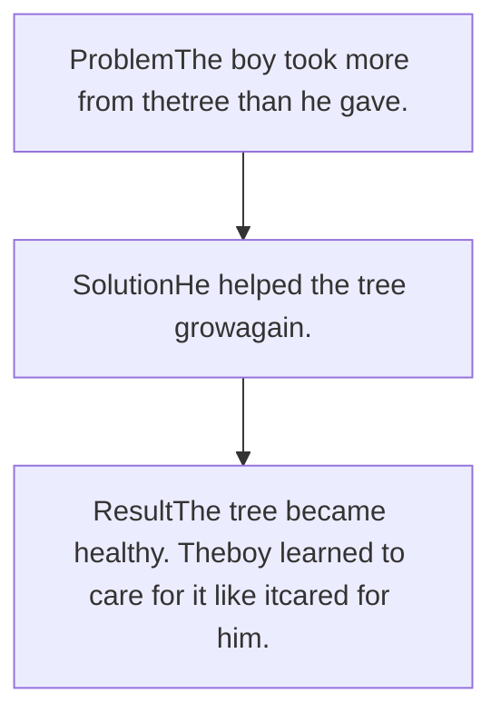

Ministry of Education and Technical Education logo

# English

Illustration of three children reading and playing in a forest

**Primary 5**

2025/2026
**Term 1**

Ministry of Education and Technical Education logo

"تهدي وزارة التربية والتعليم والتعليم الفني هذا الكتاب، بكل الحب إلى الأطفال والأسر في جمهورية مصر العربية."

"THE MINISTRY OF EDUCATION AND TECHNICAL EDUCATION DEDICATES THIS BOOK, WITH LOVE, TO THE CHILDREN AND FAMILIES OF THE ARAB REPUBLIC OF EGYPT."

© 2025 Ministry of Education and Technical Education
All rights reserved. No part of this publication may be reproduced, stored in a retrieval system, or transmitted in any form or by any means—electronic, mechanical, photocopying, recording, or otherwise—without the prior written permission of the copyright holders.

Ministry of Education and Technical Education
New Administrative Capital
Cairo, Egypt

**Name** : [________________________________]
**Class** : [________________________________]
**School** : [________________________________]

<page_number>2</page_number>

# TERM 1 SCOPE AND SEQUENCE

| Unit                         | Vocabulary                                                                                           | Language in Use                                         | Skills                                                                                                                                                                                                                                                                                                                                                                                                               | Life Skill(s)                                                              | Core Value(s)                                  | Integrated Learning Activities |
| ---------------------------- | ---------------------------------------------------------------------------------------------------- | ------------------------------------------------------- | -------------------------------------------------------------------------------------------------------------------------------------------------------------------------------------------------------------------------------------------------------------------------------------------------------------------------------------------------------------------------------------------------------------------- | -------------------------------------------------------------------------- | ---------------------------------------------- | ------------------------------ |
| 1. Food, Nature, and Culture | crocodile, hunt, water weeds, insects, trunk, crown, care for, selfish, shade, branch, recipe, flyer | Adverbs of frequency                                    | Reading: • Texts about Nile River life, Egyptian food, and desert animals. Writing: • Paragraph using sequence words. • Descriptive sentences about foods and animals. Listening: • Dialogs and stories about river life and food culture. • Consonant cluster Speaking: • Describe food and animals. • Practice expressing likes and dislikes using adverbs of frequency.   | Following instructions Describing details Expressing ideas clearly | Appreciation of culture Respect for nature | A restaurant flyer             |
| 2. My Healthy Body           | fit, mental health, stressed, lungs, muscels, organ, blood, vessels, fist, oxygen, nutrients         | Indefinite Articles (a, an) Quantifiers (some, any) | Reading: • Informational texts about the body, healthy habits, and the heart and blood system. Writing: • Reflections on personal health. • Non-fiction texts Listening: • Dialogs and texts about health routines and medical professionals. • One syllable words Speaking: • Talk about daily routines and healthy habits. • Express personal health goals and challenges. | Healthy lifestyle choices Self-awareness                               | Responsibility Respect for self and others | A poster about healthy habits  |

<page_number>3</page_number>

| Unit                   | Vocabulary                                                                                                          | Language in Use                                                                                              | Skills                                                                                                                                                                                                                                                                                                                                                                                                                              | Life Skill(s)                                               | Core Value(s)                                   | Integrated Learning Activities |
| ---------------------- | ------------------------------------------------------------------------------------------------------------------- | ------------------------------------------------------------------------------------------------------------ | ----------------------------------------------------------------------------------------------------------------------------------------------------------------------------------------------------------------------------------------------------------------------------------------------------------------------------------------------------------------------------------------------------------------------------------- | ----------------------------------------------------------- | ----------------------------------------------- | ------------------------------ |
| 3. When Nature Changes | storm, flood, drought, wildfire, heatwave, safely, peaceful, leaped, pond, well, flies                              | The past simple tense in affirmative, negative, and interrogative forms, including the use of Wh- questions. | Reading: • Stories and non-fiction texts on extreme weather events and their effects. Writing: • Descriptions of past events using past simple tense. • A fiction story. Listening: • Conversations and stories about natural disasters and global warming. • Vowel digraph Speaking: • Share personal experiences with weather events. • Ask and answer questions using past simple tense. | Problem solving Coping with change Safety awareness | Responsible management of resources Empathy | A collage about nature         |
| 4. My Community        | restaurant, coffee shop, bakery, supermarket, club, theme park, field, cottage, community center, barn, main square | Correct use of prepositions of time (in, on, at) to indicate specific time frames.                           | Reading: • Informational texts on community places, old vs. new cities, and Egyptian neighborhoods. Writing: • A narrative text in the first person. Listening: • Texts about various community locations and city life. • Trigraph Speaking: • Describe your neighborhood. • Compare places using prepositions of time and descriptive language.                                               | Research skills Communication Observation           | Sense of belonging Respect for community    | A research report              |

<page_number>4</page_number>

| Unit                        | Vocabulary                                                                                                                                                 | Language in Use                                                                                                                             | Skills                                                                                                                                                                                                                                                                                                                                                                 | Life Skill(s)                                                                  | Core Value(s)                                                         | Integrated Learning Activities |
| --------------------------- | ---------------------------------------------------------------------------------------------------------------------------------------------------------- | ------------------------------------------------------------------------------------------------------------------------------------------- | ---------------------------------------------------------------------------------------------------------------------------------------------------------------------------------------------------------------------------------------------------------------------------------------------------------------------------------------------------------------------- | ------------------------------------------------------------------------------ | --------------------------------------------------------------------- | ------------------------------ |
| 5. Our World, Our Resources | sunlight, water, soil, fossil fuel, minerals, wind, natural resources, cotton, electricity, fertile, cargo, digger, give up, cheerfully, path, thick, load | Formation and usage of comparative adjectives.                                                                                              | Reading: • Informational texts about Egypt's natural resources and their uses. Writing: • Object-perspective narratives Listening: • Stories and factual texts about the environment and resource use. • Prefixes Speaking: • Talk about resource use and conservation. • Express comparisons using comparative adjectives.        | • Environmental responsibility • Analytical thinking • Decision making | • Responsible management of resources • Appreciation of resources | A poster about resources       |
| 6. The Talking Earth        | canoe, Earth, Everglades, swamp, Naitonal Park, alligator, owl, shell, scientist, splash                                                                   | Use of expressive sentence structures and tense reflection (present vs. past) to articulate personal insights and narrative interpretation. | Reading: • Literary narrative exploring nature and environmental identity. Writing: • Creative reflections on personal and environmental themes. Listening: • Narrative listening for details and thematic understanding. Speaking: • Express emotions and personal reflections. • Discuss themes of nature, identity, and connection. | Reflection Emotional expression Creative thinking                      | Identity Connection with nature                                   | —                              |

<page_number>5</page_number>

# A MESSAGE FROM
# THE MINISTRY OF EDUCATION AND TECHNICAL EDUCATION

**Welcome to Your English Learning Journey!**

Dear Students, Educators, and Stakeholders,

It is with great pleasure that the Ministry of Education presents the *Primary 5 Framework for Egyptian Learners*. This comprehensive textbook has been meticulously developed to support our young learners in acquiring essential English language skills while honoring and integrating the rich cultural heritage of Egypt.

**Our Vision for English Language Education:**

In today's interconnected world, proficiency in English is a vital skill that opens doors to global opportunities and fosters cross-cultural communication. Our vision is to equip Primary 5 students with a strong foundation in English, enabling them to navigate academic pursuits and future careers with confidence and competence.

**Key Features of the Textbook**

*   **Culturally Relevant Stories:** Each unit features engaging fables inspired by Middle Eastern folklore, designed to resonate with students' cultural backgrounds while imparting valuable moral lessons.
*   **Structured Learning Activities:** The textbook is organized into weekly sessions, each focusing on different aspects of language acquisition:

    *   **Listening and Speaking:** Interactive storytelling, discussions, and role-playing activities enhance listening comprehension and oral communication skills.
    *   **Reading and Phonics:** Phonics exercises and reading activities develop students' ability to decode and comprehend written English.
    *   **Writing and Vocabulary:** Targeted writing exercises and vocabulary-building activities encourage students to express themselves clearly and expand their word knowledge.
    *   **Cultural Integration:** Lessons are intertwined with cultural insights, promoting an appreciation for both the English language and Egyptian traditions.

*   **Assessment and Feedback:** Regular assessments, including quizzes, retelling exercises, and vocabulary matching, provide educators with tools to monitor student progress and tailor instruction to meet individual needs.

**Commitment to Excellence:**

The Ministry of Education and Technical Education is dedicated to providing high-quality educational resources that meet the evolving needs of our students. This textbook embodies our commitment to excellence in English language education, ensuring that every child has the opportunity to succeed academically and personally.

**Join Us in Shaping the Future:**

As we embark on this educational journey, we invite educators, parents, and students to collaborate in fostering a love for the English language and a deep appreciation for our cultural heritage. Together, we can build a brighter future where our young learners thrive in a global society while staying rooted in their rich Egyptian identity.

Best Regards,

The Ministry of Education and Technical Education

<page_number>6</page_number>

# Unit 1 Food, Nature, and Culture

Three children having a picnic in a forest setting

## Learning Outcomes

**Speaking**
* Ask and answer questions about the Nile River and the hot desert
* Use new vocabulary related to life in the Nile River and the hot desert
* Recognize and repeat consonant clusters in common words

**Reading**
* Discuss the moral of a short story
* Identify the sequence of events and the end in a story
* Reorder the steps of an Egyptian food recipe

**Listening**
* Identify new vocabulary related to life in the Nile River
* Answer comprehension questions based on a listening text about life in the Nile River

**Writing**
* Complete sentences using the adverbs of frequency
* Write a recipe using sequence words
* Make a flyer about your favorite restaurant

<page_number>8</page_number>

# Lesson 1 Life Along The Nile

**1 Read and answer the question.**

What kinds of animals and plants live in the Nile River?

**2 Listen, look, and repeat.**

water weeds
insects
The Nile River
hunt
crocodile

**3 Read and complete the text with the words in the box.**

**Crocodiles – Nile – hunt – insects – water weeds**

There are many rivers around the world. The (1) ............................................................ is one of the longest rivers in the world. It is home to many different animals. (2) ................................................. are strong and dangerous. They (3) ........................................................... large animals in or near the water. Small fish in the river eat (4) ................................................................... . Birds eat (5) ............................................... , small fish, and plants near the river.

<page_number>8</page_number>

# Where Life Flows

Lesson 1

4 Listen and read.

**Ahmed and Laila are talking about life in the Nile River.**

**Ahmed**: Look at the small fish in the Nile River! They are so colorful.
**Laila**: Yes! Do you know that small fish eat plants in the water? These are called water weeds.
**Ahmed**: That’s interesting! What about birds—what do they eat?
**Laila**: Birds eat small fish, insects, and even plants near the river.
**Ahmed**: Wow! What about big fish?
**Laila**: They eat smaller fish, insects, and tiny creatures in the water.
**Ahmed**: And crocodiles—what do they eat?
**Laila**: They eat fish, birds, and sometimes larger animals that come near the water.
**Ahmed**: Huge crocodiles are scary! Do any animals hunt them?
**Laila**: Not really—they are the kings of the Nile!
**Ahmed**: It's amazing how all animals in the river find food to survive.
**Laila**: Each animal plays an important role—that’s why we must protect the river.

A view of the Nile River with traditional boats sailing on the water.

5 Listen again and answer.

1. What do small fish look like?
____________________________________________________________________________________________________

2. What do crocodiles eat?
____________________________________________________________________________________________________

3. Which animals eat both plants and insects in the river?
____________________________________________________________________________________________________

4. Why do we need to protect the Nile River?
____________________________________________________________________________________________________

<page_number>9</page_number>

Unit 1

**6 Match the words to the pictures.**

crocodile and rabbit
The Nile River
water weeds
crocodile

1. crocodile
2. The Nile River
3. hunt
4. water weeds

**7 Read and write T (True) or F (False).**

1. Crocodiles are hunted by many animals. ( )
2. The Nile River is not important for both animals and people. ( )
3. Small fish in the Nile River eat water weeds. ( )
4. Crocodiles are the kings of the Nile River. ( )
5. Big fish in the Nile River eat big animals. ( )

**8 Discuss with your classmates.**

1. If you were a small fish, what would be the hardest thing of living in the Nile?
2. Name things that live in the Nile.
3. What can you do to help keep the Nile clean and safe?

teacher and students discussing

**Think** What would happen if people harmed the Nile River? How would that affect animals and humans?

<page_number>10</page_number>

# Lesson 2 Food in the Hot Desert

**1 Read and check (✔).**

What animals do you think live in the desert?

* **a.** Lions, elephants, and giraffes [ ]
* **b.** Camels, snakes, and foxes [ ]
* **c.** Fish, crocodiles, and turtles [ ]

A camel, a fennec fox, and a snake in the desert

**Animals in the Desert**

The desert is hot and dry, but many animals live there. Snakes often eat small animals like rats or lizards. Camels live in the desert, too. They eat plants to stay strong. Lizards eat insects, which give them energy. Some animals hide under rocks to stay cool during the day. Others, like owls, come out at night when it is cooler. Each animal has an important role in the desert. They help nature stay in balance.

**2 Choose the correct answer from a, b, c, or d.**

1. Snakes often eat small animals, like ........................... or lizards.
   **a.** rats **b.** hippos **c.** camels **d.** lions
2. Camels eat ........................... .
   **a.** plants **b.** insects **c.** birds **d.** lizards
3. Insects give lizards ........................... .
   **a.** water **b.** energy **c.** food **d.** home
4. Each animal in the desert has an ........................... role to play.
   **a.** simple **b.** easy **c.** important **d.** hard

**3 Discuss with your classmates.**

What other animals can live in the desert?

**Think** How can humans live in the desert?

Two children discussing

<page_number>11</page_number>

Unit 1

# Language in use

## Adverbs of Frequency
We use **adverbs of frequency** to talk about **how often** something happens.

| always | usually | often | sometimes | rarely | never |
| ------ | ------- | ----- | --------- | ------ | ----- |
| (100%) | (90%)   | (70%) | (50%)     | (20%)  | (0%)  |

The **adverbs** come before the **main verb** like (**eat, play, go**) and after the **verb “to be”** like (**am, is, are**).

**Examples:**
Snakes **never** eat plants.
Lizards are **sometimes** dangerous.

**4 Put the words in the correct order to form sentences.**

1. animals / Desert / food. / rarely / find /
_______________________________________________________________________________________________________________________________________________________________________________________________________________________________________________________________

2. always / Camels / store / bodies. / their / water / in /
_______________________________________________________________________________________________________________________________________________________________________________________________________________________________________________________________

**5 Look and complete with the correct adverb of frequency.**

A camel eating grass
Camels .......................... eat grass.

A snake
Snakes .......................... eat small animals like rats or lizards.

<page_number>12</page_number>

# Lesson 3 Story Time
# The Giving Tree

Illustration of a man and orange tree

**1** 🔍 **Look at the picture and answer.**

**How do you think trees help people?**

**2** 🔍 **Look at the words in bold. Match the words to their meanings.**

* **1 crown** a. the main, thick part of a tree supporting its branches and leaves
* **2 care for** b. caring for oneself only
* **3 shade** c. a part that grows out from a tree’s trunk, where leaves grow
* **4 trunk** d. a dark shadow created when sunlight is blocked by something
* **5 branch** e. to show interest and concern for something
* **6 selfish** f. a special hat worn by kings or queens

**3 Choose the correct answer from a, b, c or d.**

1. The queen wore a shiny gold ........................... at the ceremony.
a. shade b. crown c. branch d. sail

2. We sat under the tree to rest in the ........................... on a hot day.
a. crown b. sail c. shade d. branch

3. Omar was so ........................... . He didn't want to give his toys to anyone.
a. careful b. selfish c. old d. cold

4. A bird built a nest on a high ........................... of the tree.
a. crown b. shade c. sail d. branch

<page_number>13</page_number>

Unit 1
Lesson 3
QR code

**4 Listen and read.**

Once upon a time, there was a boy named Tom who loved a big, strong apple tree in his garden. Tom used the tree for everything. He made **crowns** from its leaves and ate its delicious apples. He rested in its **shade** and climbed its **trunk** with his friends. But Tom never thought about the tree's feelings or needs. He rarely gave it food or water.

A split image showing a healthy apple tree on the left and a withered, leafless tree on the right

Tom traveled to another place. Years passed and Tom came back home.

The tree looked sad. Its leaves **bent**, and its **branches** were weak. When Tom saw the tree, he realized that he had been **selfish**.

Tom started to **care for** the tree, watering it, and protecting it from the sun. Slowly, the tree began to become better.

Tom learned that taking care of something meant giving back, and he and the tree became the best of friends.

Think
**How can we care for those who help us?**

<page_number>14</page_number>

Lesson 3

**5 Read and write T (True) or F (False).**

1. The apple tree gave the boy everything. ( )

2. The boy gave the tree water and food everyday. ( )

3. When Tom came back, the tree was strong and healthy. ( )

**6 Work in pairs. Read the story again and check (✔) the correct answer.**

What is the moral of the story?

a. We should appreciate those who care for us. [ ]

b. We should ignore people who help us. [ ]

**7 Complete the summary using the words in the box.**

**selfish - strong - apples - weak**

Tom had a healthy apple tree. The tree gave Tom (1).................................. and Tom played on it. Tom traveled away and when he came back, the tree was (2).................................. . Tom knew that he was (3)................................... So he decided to take care of the tree. The tree grew (4).................................. again.

**8 Read and think.**

15</page_number>

# Pronunciation

**1 Read and learn.**

A **consonant cluster** is a sequence of two or more consonant sounds without vowels, such as **str-** in **strong** or **bl-** in **black**. They can appear at the beginning, middle, or end of words.

**Examples:** tree, branches, crocodiles, spring

**2 Listen, look, and circle the correct word.**

1. pant - plant, 2. tuck - truck, 3. drink - ink, 4. black - back, 5. bee - tree, 6. crops - cups

**3 Choose a cluster from the box below and fill in the blanks.**

**bl - cr - pl - tr - dr**

__ink   __ack   __uck   __ant   __ops

**4 Read the text and circle the consonant clusters.**

Ahmed climbed the trunk and rested near the branches. He saw a small crocodile beside the stream, and big fish swam past swiftly. Laila smiled and drank from the spring, then watched birds perch near the bank.

<page_number>16</page_number>

# Lesson 4 Writing
## Let's Make a Recipe!

**1** Think and answer.

Do you like Koshari?

A bowl of Koshari

**2** Read the text.

## My Favorite Egyptian Food

**Ingredients**

**Main Ingredients:**
* 2 cups white rice
* 1 cup brown lentils
* 2 cups small pasta
* 1½ cups cooked chickpeas

**Crispy onions:**
* 3 large sliced onions
* 1 cup vegetable oil for frying

**Sauces:**
* Red sauce
* Spicy tomato sauce
* Dakka sauce

Koshari is a tasty Egyptian meal with many simple ingredients in one bowl. <mark>First</mark>, you need to cook rice in a pot with water. In another pot, prepare small pasta. <mark>Then</mark>, boil **lentils** in water. For the red sauce, fry some chopped garlic in oil, add tomato sauce, vinegar, and some spices.

You also need to make crispy onions. <mark>First</mark>, cut them into thin slices. <mark>Next</mark>, fry them in oil until they turn brown and crunchy. <mark>After that</mark>, put the rice in a bowl and add the pasta and lentils on top. <mark>Then</mark>, add some chickpeas.

<mark>Finally</mark>, pour the red sauce all over it, and put the crispy onions on top. There are two more sauces you can add for more **flavor**. One is a spicy tomato sauce, and the other is *Dakka* which is made with garlic and vinegar.

This mix of foods makes Koshari very yummy. Koshari is a traditional Egyptian food.

<page_number>17</page_number>

<page_number>18</page_number>

**Tip!**

When writing a recipe, organize the steps using *sequence words* like:
*First*, ... *Then*, ... *After that*, ..., *Next*,... *Finally*,....

3 **Let's practice sequence words using the Koshari recipe. Number the steps, then add the correct sequence word.**

a. ____________________, make crispy onions: cut them into thin pieces and fry them. [ ]
b. ____________________, pour the red sauce all over it, and put the crispy onions on top. [ ]
c. ____________________, cook rice in a pot and pasta in another pot. Then boil lentils. 1
d. ____________________, add spicy sauce at the end. [ ]
e. ____________________, put the rice in a bowl and add the pasta and lentils on top. [ ]
f. ____________________, fry some chopped garlic in oil and add tomato sauce. [ ]

4 **Write a short paragraph explaining how to make your favorite food.**

*It can be something simple like a sandwich, salad, or difficult like Basbousa.*

**Instructions**

1. **Choose** your favorite food.
2. **Think** about how it's made.
*What happens first? What comes next?*
3. **Use sequencing words** to organize your steps.
4. **Write** (30-40) words showing the steps.
5. **Add a title**: "How to Make (Your food name)"
6. **Glue** or **draw** a picture of your favorite food.

A collection of various food dishes including a sandwich, a salad, a bowl of fruit, and a bowl of Koshari.

<page_number>18</page_number>

Lesson 4

First,

| My Favorite Food                      | Yes   | No    |
| ------------------------------------- | ----- | ----- |
| I chose one favorite food.            | \[no] | \[no] |
| I gave my writing a clear title.      | \[no] | \[no] |
| I used sequencing words.              | \[no] | \[no] |
| I wrote clear and complete sentences. | \[no] | \[no] |
| I checked my spelling.                | \[no] | \[no] |

<page_number>19</page_number>

# Lesson 5 Think and Create A Flyer

**1** 🔍 **Look at the restaurant flyer below.**

Restaurant flyer

| FAST FOOD     | Price | SANDWICH        | Price |
| ------------- | ----- | --------------- | ----- |
| Cheese burger | LE 35 | Grilled chicken | LE 20 |
| Meat pizza    | LE 40 | Sea food        | LE 30 |
| Fried chicken | LE 50 | Mix cheese      | LE 15 |

<page_number>20</page_number>

# Lesson 5

# Let's Make a Flyer!

**2 When you make a flyer, make sure to …**

**Tip!**

## Remember...

1.  **A main heading** is the big title.
2.  **A sub-heading** is the smaller title.
3.  **An image** is a photo or drawing.
4.  **A menu** attracts customers.
5.  **A call to action** is an invitation.

**3 Make your flyer on the next page and then ask a classmate for their feedback. *Did they like it?***

| 1 star  | poor      |
| ------- | --------- |
| 2 stars | fair      |
| 3 stars | good      |
| 4 stars | very good |
| 5 stars | excellent |

<page_number>21</page_number>

Unit 1

# My Restaurant Flyer!

Lesson 5

<page_number>22</page_number>

Unit 1

# Quick Review

**1 Complete the sentences.**

1. The [____________________] is important to people and animals.

2. Small fish eat [____________________] .

3. Lizards eat [____________________] to get energy.

4. [____________________] are dangerous and scary.

5. Crocodiles [____________________] birds and large animals.

**2 Write a paragraph of (30-40) words about your favorite Egyptian dish.**

[____________________________________________________________________________________________________]

[____________________________________________________________________________________________________]

[____________________________________________________________________________________________________]

[____________________________________________________________________________________________________]

River Nile
Water plants
Dragonflies
Crocodile
Crocodile and rabbit

<page_number>23</page_number>

# Self - Assessment

## Now I can ...

**Identify vocabulary about life in the Nile River.**

Water plants Crocodile Nile River

Crocodile and rabbit Dragonflies

*   **I got it** [ ]
*   **I’m not sure** [ ]
*   **I need help** [ ]

**Say these sounds:**

*   **pl** plant
*   **tr** truck - tree
*   **dr** drink
*   **bl** black
*   **cr** crops

*   **I got it** [ ]
*   **I’m not sure** [ ]
*   **I need help** [ ]

**Use adverbs of frequency to talk about how often something happens.**

- Examples:

*   Snakes **never** eat plants.
*   Lizards are **sometimes** dangerous.

*   **I got it** [ ]
*   **I’m not sure** [ ]
*   **I need help** [ ]

<page_number>24</page_number>

Unit 2 My Healthy Body

# Learning Outcomes

**Speaking**
* Ask and answer questions about healthy habits
* Talk about personal healthy habits
* Recognize and repeat one-syllable words

**Listening**
* Identify and understand vocabulary related to the health
* Listen to a dialog and answer comprehension questions

**Reading**
* Answer questions related to a text on healthy habits
* Discuss healthy habits based on the reading text

**Writing**
* Distinguish between countable and uncountable nouns, and apply the correct determiners in context
* Write sentences on how to stay healthy
* Write a paragraph about a healthcare giver

# Sports for Better Health

**1 Read and answer.**

How do you take care of your health?

**2 Listen and read.**

"Fit, Fast, and Feeling Good"

**Mazen:** Mom, why is it important to play **sports**?
**Mom:** Well, sports help us stay healthy and make our bodies stronger.
**Mazen:** Oh! So if I play **football**, will I be stronger?
**Mom:** Yes, it makes your **heart** strong and helps your **muscles** grow. It also **increases energy**.
**Mazen:** What about **swimming**?
**Mom:** Swimming is very good, too! It makes your **lungs** strong. In fact, it helps your whole body.
**Mazen:** Good, but sometimes I get **tired** when I play sports.
**Mom:** That’s normal. Try eating some fruit before you exercise to give you more energy.
**Mazen:** Alright. Sports make us **fit** too, right?
**Mom:** Exactly! **Exercise** helps you lose weight and makes your bones stronger.
**Mazen:** What about our **mental health**? Can sports help us with that?
**Mom:** Absolutely! **Exercising regularly** helps you **sleep better** and **reduces stress**.
**Mazen:** That’s great! I think I will play sports more regularly.
**Mom:** How about going for a walk together?
**Mazen:** Now? Sure! I want to be healthy.

A boy and his mother talking and smiling

**Think** How does playing sports help our body and mind?

<page_number>26</page_number>

Lesson 1

**3 Listen again and answer.**

1. How does <mark>football</mark> make you stronger?
______________________________________________________________________________________________________________________________________________________________________________________________________________________________________________

2. What should you do if you feel <mark>tired</mark> while playing sports?
______________________________________________________________________________________________________________________________________________________________________________________________________________________________________________

3. Why is <mark>exercising regularly</mark> important?
______________________________________________________________________________________________________________________________________________________________________________________________________________________________________________

4. How does <mark>swimming</mark> help the body?
______________________________________________________________________________________________________________________________________________________________________________________________________________________________________________

**4 Match the words to their definitions.**

| 1 fit           | a. how you feel and think                         |
| --------------- | ------------------------------------------------- |
| 2 mental health | b. the parts of your body that help you move      |
| 3 stressed      | c. the organs in your chest that help you breathe |
| 4 lungs         | d. feeling unhappy or tired                       |
| 5 muscles       | e. being healthy and strong because you exercise  |

**5 Read and discuss with your partner.**

1. What sport do you want to play to
make yourself stronger?

2. Why is it important for you to stay
healthy?

Two boys sitting at a desk in a classroom talking to each other

<page_number>27</page_number>

# My Habits: Then and Now

**1 Read and check (✔).**

What is the best way to stay healthy?

* a. Eating chips and burgers. [ ]
* b. Watching TV all day. [ ]
* c. Doing some sports. [ ]

A boy jumping rope

**2 Read the text.**

## Adam's Journey to a Healthier Life

Hello! I’m Adam, and I’d like to share how my **habits** have changed. In the **past**, I **woke up late** on weekends and **didn’t exercise** much. **Now, I wake up early** and **exercise** every morning—it makes me feel strong and happy.

A boy doing sit-ups on a mat

I **used to watch TV all day**, but **now I play football** with friends every Saturday.

Before, I loved chips, burgers, and sweets. **Now, I eat more fruits and vegetables,** which give me important **vitamins.**

My favorite snacks are apples, bananas, and carrots. And I drink **water** instead of **soda.**

My family’s habits changed too—we grill or bake food instead of frying like we used to do in the **past, and we eat dinner early**, followed by a walk. These changes give me more energy and help me feel better. Have you changed your habits too?

**Think** What happens when we replace our unhealthy habits with healthy ones?

<page_number>28</page_number>

Lesson 2

**3 Read and write T (True) or F (False).**

1. Adam exercised a lot in the past. ( )

2. Adam eats more fruits and vegetables now. ( )

3. In the past, Adam woke up early on weekends. ( )

4. Adam's family now eats dinner early and goes for a walk. ( )

A hand holding two signs, one with a green checkmark and one with a red cross

**4 Read and complete the sentences with the words in the box.**

**vitamins – football – bodies – soda**

1. Adam plays ……………………….....………… with his friends every Saturday.

2. Adam drinks a lot of water instead of ……………………….....………… .

3. Fruits and vegetables give us important ……………………….....………… .

4. Healthy habits are important for our ……………………….....………… and minds.

**5 Read, think, and answer.**

1. What does Adam do every morning?

2. What is Adam's favorite snack?

3. How did Adam's family cook their food in the past?

4. What do you think about Adam's new health habits?

A blue thought bubble with a question mark inside

**6 Think and discuss.**

A cartoon teacher

**Work with your classmate.**
**Do you think it’s easy to change**
**your habits? Why or why not?**

Students working together in a classroom

<page_number>29</page_number>

Lesson

Unit 2
a

# Language in use

### Using a/an/some/any

We use **(a)** before *singular countable nouns* starting with a consonant sound.
**Example:** I eat a **b**anana every day.

We use **(an)** before *singular countable nouns* starting with a **vowel** sound.
**Example:** She eats **an e**gg in the morning.

We use **(some)** with *plural countable nouns* or *uncountable nouns* in affirmative sentences.
**Examples:** I have **some** apples. She drank **some** water.

We use **(any)** with *plural countable nouns* or *uncountable nouns* in negative sentences and questions.
**Examples:** There aren't **any** apples left. Do you have **any** water?

----

### 7 Read and correct the mistake.

1. I have **an** watermelon. ( **a** )
2. There is **any** milk in the fridge. ( .................... )
3. She ate **a** apple yesterday. ( .................... )
4. I don't have **some** food at home. ( .................... )

### 8 Choose the correct answer from a, b, c, or d.

1. Is there .................... orange juice left in the fridge?
   **a.** a
   **b.** an
   **c.** any
   **d.** some

2. She bought .................... bottle of water.
   **a.** a
   **b.** an
   **c.** some
   **d.** any

3. Omar will buy .................... apples for the picnic.
   **a.** a
   **b.** some
   **c.** any
   **d.** an

# Lesson 3 Heart and Blood

Lesson 3 icon

Look at the picture and answer the questions icon **Look at the picture and answer the questions.**

Teacher illustration
1. What do you see in the picture?
2. When does the heart beat faster?

Heart illustration

Read the text icon **Read the text.**

## Our Body's Super Pump!

We have an amazing body. The **heart** is one of the most important **organs** of our body. It is about the size of your **fist**. The heart’s job is to **pump blood** to all parts of the body.

Blood carries **oxygen** and **nutrients** to every cell. It also takes away waste like **carbon dioxide**. The heart pumps blood through **blood vessels**, which are like small tubes.

The heart is a strong **muscle** that keeps us alive. Too much **stress** can **hurt** your heart, so it’s important to keep it healthy. You can take care of your heart by eating good food, sleeping well, and drinking a lot of water.

Also, **exercise** helps your heart pump better and keeps you from getting sick.

If you follow these tips, your heart will stay strong. It may be small, but it is very powerful!

Think icon **Think** How do food, water, sleep, and exercise help our hearts?

<page_number>31</page_number>

<page_number>32</page_number>

Unit 2
Lesson 3

**Match the words to their definitions.**

| organ         | a. tubes that carry blood through the body                  |
| ------------- | ----------------------------------------------------------- |
| blood vessels | b. substances that give us energy and help our bodies grow. |
| fist          | c. a body part that does a job                              |
| oxygen        | d. a gas that we breathe                                    |
| nutrients     | e. a hand when it is tightly closed                         |

**Read and write T (True) or F (False).**

1. The heart is about the size of your fist. ( )
2. Blood carries waste products like carbon dioxide. ( )
3. Water is bad for the heart. ( )
4. Blood vessels are like large tubes. ( )

Check and cross signs

**Read, think, and answer.**

1. What does the heart pump into the body?
2. Where is the heart located in our bodies?
3. How can we keep our heart healthy?

Question mark

**Work in groups. Explain.**

**How do good habits protect our hearts?**
**Share your ideas with the class.**

____________________________________________________________________________________________________
____________________________________________________________________________________________________
____________________________________________________________________________________________________

<page_number>32</page_number>

# Pronunciation Lesson 3

1 **Read and learn.**

* A **syllable** is a word part with **one vowel sound**. It can have one or more vowel letters but only one vowel sound.
* Words like *bread* (5 letters) and *pot* (3 letters) look different but both have one syllable because they only have one vowel sound.

**Examples:** arm, jump, feed, bread

**Tip!**

**Clap It Out!**
One clap for each **vowel sound**.
BA - NA - NA
Clap Clap Clap
Three claps!

2 **Circle the word that has one syllable.**

1. basket pencil apple **run**
2. **tree** finger banana rabbit
3. **fish** mother elephant lesson
4. **jump** eraser happy jacket
5. hungry **hat** yellow sofa

3 **Listen and put the sounds in order. Then, write the word.**

leaf
f – l – ea
leaf

feeding
d – ee – f
feed

pot
t – o – p
pot

flag
f – l – g – a
flag

<page_number>33</page_number>

# Lesson 4 Writing Life Savers in Action

**1 Think and answer.**

Who are the people in our community that help us take care of our health? How do they help us?

**2 Read and review your answers.**

## Healthcare Heroes

**Healthcare workers**—like doctors, nurses, pharmacists, and paramedics are real-life heroes who spend their lives helping others. They work day and night to keep people healthy and treat illnesses. **Doctors** use their knowledge and skills to check patients, **diagnose** diseases, and provide treatments. Nurses often work around the clock to give support and care for patients.

**Pharmacists** play a very important role, too. They make sure patients receive the correct medicine and give advice on how to use it safely. **Paramedics** respond quickly in emergencies. They give help on the spot and take patients safely to hospitals.

Healthcare workers also help us live healthier lives as they encourage us to eat healthy meals, stay active, play sports, and stop harmful habits. These heroes work long hours with kindness. We should thank them by caring for our health and showing them respect. Healthcare workers are really our everyday heroes!

A group of healthcare workers including doctors and nurses standing together

**Think** How do different healthcare heroes work together to protect us?

<page_number>34</page_number>

# Lesson 4

**3 Choose the correct answer from a, b, c or d.**

1. To work **around the clock** means ……………………….....………… .
   a. to work in a room with a clock
   b. to work for long hours without much rest
   c. to work while watching a clock
   d. all workers must wear a watch

2. To give help **on the spot** means ……………………….....………… .
   a. to help immediately
   b. to help after a long time
   c. to help only if asked
   d. to help with advice on medicine

3. To **diagnose** means ……………………….....………… .
   a. to treat patients
   b. to identify the cause of a problem or illness
   c. to identify the emergency
   d. to transport patients

**4 Think and answer. How do you take care of your family when they are sick?**

1. Who are the healthcare workers mentioned as everyday heroes?

   .....................................................................................................................................

2. What do doctors do to help patients stay healthy?

   .....................................................................................................................................

3. When do paramedics provide urgent help to patients?

   .....................................................................................................................................

4. Why should we thank healthcare workers, according to the text?

   .....................................................................................................................................

A boy taking care of a sick child

<page_number>35</page_number>

Unit 2

Lesson 4

**Tip!**
When you write a non-fiction text, ask yourself:
Is the information true?
Did I make anything up?
Is my source reliable?

**Non-Fiction writing should include:**
An introductory sentence, like *"My neighbor, Selim, is a doctor at our local hospital."*
Details that are all true, like *"He wears a white coat and carries a stethoscope around his neck."*
Adjectives, like *"white"*, *"big"*, *"kind"*.
A closing sentence, like *"The work is tiring, but he’s proud to be a doctor."*

**5 Choose a healthcare person and write about him/her.**
1. Where do they work?
2. How do they help us?
3. Is their work hard? Why?
4. How can we thank them?

**6 Write your text on the following page. Then, exchange it with a classmate and ask for their feedback. Did they like it?**

1 star= poor
2 stars= fair
3 stars= good
4 stars= very good
5 stars= excellent

✰✰✰✰✰
....................................................................................................

<page_number>36</page_number>

# Lesson 4

**Title:** ......................................................................................................................

**Introduction: Which healthcare worker did you choose?**

................................................................................................................................................................................................................................................................................................................................................................................................................................................................................................................................................................................................................................................................................................................................................

# Lesson 5 Think and Create A Poster

**1** Create a poster about six healthy habits

## Stay Healthy!

*   **1** Wash your hands before and after eating
*   **2** Eat fruits and vegetables regularly
*   **3** Drink enough water daily
*   **4** Exercise regularly
*   **5** Sleep early and get enough rest
*   **6** Brush your teeth daily with toothpaste

**Tip!**
The Elements of a Good Poster are...
1. A clear Title (to grab the attention)
2. Organized Steps (to explain)
3. Photos or drawings (to illustrate)

**2** Now, work in groups to make your own poster about: Healthy Habits

<page_number>38</page_number>

Unit 2

Quick Review

**1 Choose the correct answer from a, b, c or d.**

1. **To be fit means to be healthy and** .................................... .
   a. tired
   b. active
   c. smart
   d. nervous

2. .................................... **are the parts of your body that help you move.**
   a. Heart
   b. Ears
   c. Skin
   d. Muscles

3. **Lungs are the organs in your chest that help you** .................................... .
   a. think
   b. move
   c. breathe
   d. eat

4. **Mental health is how** .................................... .
   a. you feel and think
   b. well your body moves
   c. strong your muscles are
   d. how clear your vision is

5. **Stressed is when you feel unhappy or** .................................... .
   a. happy
   b. pleased
   c. relaxed
   d. tired

**2 Read and complete with a/an/some/any.**

1. I want to buy .................................... grapes.

2. There isn't .................................... cheese in the fridge.

3. I bought .................................... green notebook.

4. They played with .................................... orange ball.

**3 Write three habits that keep your heart healthy and strong.**

1. .................................................................................................................................................................................................................................................................................................................................................................................................................................................................................................................................

Unit 2

Self - Assessment

# Now I can ...

**Identify words about health.**

fit – mental health – stressed – lungs – muscles

* [ ] I got it
* [ ] I’m not sure
* [ ] I need help

Two children, one holding their head and one with a lung diagram on their shirt

**Say one-syllable words.**

arm – jump – meet – bread – leaf – feed – pot – flag

* [ ] I got it
* [ ] I’m not sure
* [ ] I need help

A boy clapping his hands, with the text BA-NA-NA below him

**Use a-an/some-any.**

- **Examples:**
    - She eats **an** egg in the morning.
    - Do you have **any** water?

* [ ] I got it
* [ ] I’m not sure
* [ ] I need help

An egg on a plate of rice

<page_number>40</page_number>

# Unit 3 When Nature Changes

Three children in a park, one looking through binoculars, one holding a weather chart, and one drawing on a paper with a recycling symbol.

## Learning Outcomes

**Speaking**
* Describe different weather conditions
* Talk about past events using the past simple tense
* Recognize and repeat vowel digraph in common words

**Reading**
* Answer comprehension questions on extreme weather conditions
* Identify elements (characters and moral) in a fictional story

**Listening**
* Answer questions based on conversations about environmental changes
* Identify vocabulary related to weather in a listening text

**Writing**
* Complete sentences using the past simple tense correctly
* Write a fiction story

# Lesson 1 Weather Wonders and Warnings!

**1** magnifying glass icon **Look at the picture and answer.**

teacher Is it safe to go outside in this weather? Why? stormy weather

**2** headphones icon **Listen, look, and repeat.**

thunderstorm
**thunderstorm**

sandstorm
**sandstorm**

flood
**flood**

drought
**drought**

wildfire
**wildfire**

heat wave
**heat wave**

QR code

**3** book icon **Read, think, and match.**

**1** A wildfire ... | **a.** children are afraid of the lightning.
**2** In a thunderstorm, ... | **b.** is when there’s too much water covering dry land.
**3** A sandstorm ... | **c.** is a severe wind that carries sand and dust through the air making it hard to breathe.
**4** A flood ... | **d.** burns through forests and homes.
**5** In a heat wave, ... | **e.** happens when there is no rain for a long time.
**6** A drought ... | **f.** the temperature is dangerously high for days.

<page_number>42</page_number>

# When Nature Strikes!

**Lesson 1**

Listen and read.

**Mazen and Dina are talking about extreme weather.**

**Mazen**: Dina, did you hear about the **flood** in our city last week? It was terrible.
**Dina**: Yes, Mazen! I saw it on the news. The water covered the streets, and many cars got **stuck**. It looked scary.
**Mazen**: Yes, my uncle’s house was **damaged**. The water flooded his living room, and he had to stay with us for a few days.
**Dina**: That's so sad. I hope he’s okay now. Floods are terrible. And now there’s a **drought** – **no rain** in China for months! Farmers can’t grow crops because there's no water.
**Mazen**: Yes, droughts are awful! The land gets so dry that animals can’t find water. And I heard that a **wildfire** is spreading in the forest in the U.S.A.
**Dina**: Oh no! Is it close to the mountains?
**Mazen**: Yes, and it **spreads** quickly because it's dry there, and the winds are so strong. Sadly, many trees **burned** down, and animals lost their homes.
**Dina**: What a pity! Let’s learn more about how we can stay safe and help our planet.

A flooded street with cars partially submerged in water.

**5 Answer the following questions about the text.**

1. What happened in Mazen and Dina’s city last week?
..............................................................................................................................................................................................................................................
2. How did the flood affect Mazen’s uncle?
..............................................................................................................................................................................................................................................
3. Why can’t farmers grow food in the US?
..............................................................................................................................................................................................................................................
4. What can Mazen and Dina do to help the planet?
..............................................................................................................................................................................................................................................

**Think** How do weather changes affect people, animals, and places we know?

<page_number>43</page_number>

<page_number>44</page_number>

Unit 3 Lesson 1

**6** magnifying glass **Complete the word that describes the picture.**

sandstorm flood drought

1. s____________________ 2. f____________________ 3. d____________________

**7 Read and circle the correct word.**

1. A lot of trees burned down in a **wildfire/drought**.
2. During a **heat wave/flood**, the weather is very hot.
3. A **thunderstorm/drought** can prevent farmers from growing food.

**8 Complete the sentences using the words in the box.**

**damaged – spread – planet – news – stuck**

1. I was ____________________ in my car during the flood. I couldn’t move.
2. The wildfire ____________________ quickly in the forest.
3. I heard on the ____________________ that there was a bad storm in the village.
4. Medhat’s house was ____________________ after the storm hit it.
5. To save our ____________________, we must keep it clean.

**9 Work with your partner. Read the example and describe the pictures.**

girl speaking "In Picture (1), there is a heat wave. The man is feeling very hot."

man in heat
wildfire
boy in drought

<page_number>44</page_number>

# Lesson 2 Extreme Weather in Ancient Egypt

1 Look and answer.

A cartoon teacher asking a question next to a picture of the pyramids

**Do you think the weather was different in Ancient Egypt?**

2 Read the text.

## The Weather in Ancient Egypt

**Ancient Egypt** had **weather** that made farming possible, even in the desert. The Nile River gave water and rich soil, which helped crops grow. But sometimes, the weather also brought problems like floods, droughts, and sandstorms.

**Floods:** The Nile River **flooded** every year. The water brought **rich soil** to the land, which helped crops grow. But sometimes, the floods were too strong and **damaged** farms. **To stop this**, the Ancient Egyptians built canals and **basins** to control the water and spread it over their fields.

A boat on the Nile River

**Droughts:** **Droughts** happened when there was **not enough rain**. The Nile’s water became low, and the **land became dry**. Crops could not grow. **To solve this**, the Ancient Egyptians made irrigation systems to bring water to their fields.

**Sandstorms:** **Sandstorms**, called *Khamsin*, brought **strong, hot winds with sand**. It was **hard to see and breathe**. People stayed inside to stay safe. **They built their homes with thick mud bricks** to protect themselves from the wind and sand.

The Ancient Egyptians didn’t have modern machines, but they found **smart** ways to survive. **They worked hard**, used simple tools, and protected themselves from heat, sand, and floods.

**Think** How does weather affect the way people live, both in the past and now?

<page_number>45</page_number>

Unit 3

**3 Choose the correct answer from a, b, c or d.**

1. The floods brought water and .................... to the land.
a. sand     b. rich soil     c. rocks     d. heat

2. Droughts made the Nile’s water .................... .
a. soil     b. spread        c. high      d. low

3. The .................... protected the Ancient Egyptians from sandstorms.
a. mud bricks   b. wood      c. pyramids  d. metal

4. The Ancient Egyptians found smart ways to .................... .
a. damage       b. breathe   c. grow      d. survive

**4 Read, think, and answer.**

1. What did the Ancient Egyptians use to bring water to their crops during droughts?

2. What did the Ancient Egyptians do to stop the flood damage?

3. Describe the weather in Ancient Egypt.

**5 Work in pairs. Discuss and role-play.**

Boy speaking
When there is a heat wave, I have cool drinks. What do you do?

Girl speaking
I stay in the shade and wear a hat! I, also, splash water on my face to cool down. What do you do during a thunderstorm?

<page_number>46</page_number>

# Lesson 2

## Language in use

### Past Simple
We use the **past simple** to talk about finished actions or events in the past.
**Example:** In Ancient Egypt, the Nile River **flooded** every year.

We use **“didn't”** + **the infinitive** form of the verb to make <u>negative</u> sentences in the past simple.
**Example:** The Ancient Egyptians **didn’t have** modern tools to help them.

But with verb **"to be"**, we put **“not”** after **“was/were”**.
**Example:** Droughts happened when there **was not** enough rain.

We use **“Did ...?”** or **“Wh-word + did ...?”** + **the infinitive** form of the verb to make the **question** form.
**Example:** **What did** the Ancient Egyptians **do** when the river flooded?

But with verb **"to be"**, we use **“Was/Were ...?”** or **“Wh-word + was/were ...?”**.
**Example:** **Were** there sandstorms in the past?

**6 Read and write the correct form of the word(s) between brackets.**
1. They      (visit) the zoo last weekend.
2. I      (am) so excited about my trip two days ago.
3.      (Do) the teacher give us homework last Monday?
4. Why didn’t you      (went) to school yesterday?

**7 Re-write the following sentences in the negative form.**
1. Malik watched TV early last night.     
2. She saw a nice animal yesterday.     
3. They were at the club a week ago.     

<page_number>47</page_number>

Unit 3

# Lesson 3 Story Time
## The Two Frogs

**1** 🔍 **Look at the pictures and answer.**

A teacher asking a question about weather changes

**How do changes in weather affect our daily lives?**

**2** 📖 **Read, look, and number.**

1. A pond is an area of water, usually smaller than a lake.
2. A well is a deep hole dug in the ground to find water.
3. Flies are small insects with two thin, small wings.

A well
A pond
Two flies

**3** **Match the words to their meanings.**

1 **safely** a. to jump high and far in one big movement
2 **leap** b. protected from danger

<page_number>48</page_number>

# Lesson 3

**4 Listen and read.**

**Once upon a time,** in a small and quiet village, there were **two frogs who were best friends.** They lived together in a small pond near the edge of the village. The pond was their home, and they loved it very much. Every day, they had fun catching flies, swimming in the cool water, and resting under the warm sun.

One summer, **the weather became extremely hot.** The sun was strong, and the pond started to dry up. The frogs got worried. They knew they couldn’t stay in the pond any longer because there wasn’t enough water for them. They decided to leave the pond and look for a new home where they could live **safely.**

The two frogs **leaped** through fields and grass, looking for another pond. **After a long time, they saw a deep well.** One of the frogs said, “This well looks like a great place for us to live! The water is cool, and it’s very deep. We can swim here all day.”

The other frog thought for a moment and said, “The water is nice now, but what if it dries up one day? If that happens, we will get stuck at the bottom of the well, and we won’t be able to get out.”

The first frog thought about what his friend said, then agreed. **They decided not to live in the well.** Instead, they kept leaping and searching for a safe home.

**Think**
How can thinking before making a choice help us stay safe?

Two frogs sitting on a lily pad in a pond

<page_number>49</page_number>

Unit 3

5 Read and write T (True) or F (False).

1. The two frogs lived together in a pond. ( )
2. The two frogs had a lot of fun catching fish. ( )
3. There was enough water in the pond in the summer. ( )
4. The two frogs decided to live in the well. ( )
5. The story tells us to think before we make a decision. ( )

6 Complete the summary with the words in the box.

**deep - well - home**

Once, there were two frogs who couldn’t live in a pond any longer. So, they decided to look for a new (1) . After a long time, they saw a (2) well. One of the frogs said, “This (3) looks like a great place for us to live! But the other frog thought it wasn’t safe. So, they searched for a better home.

7 Read, think, and answer.

1. Where was the pond?
2. Where did the two frogs go to find a new home?
3. Why did the two frogs decide not to live in the well?

8 Discuss in groups.

If you were one of the two frogs, what would you do?
*Share a time when you thought carefully before making a decision.*

<page_number>50</page_number>

# Lesson 3

Pronunciation

**1 Read and learn.**

A <mark>vowel digraph</mark> is when two vowels appear together and make just one sound.

**Examples:**
**leap:** in "leap," the 'ea' makes the long 'e' sound.
**flood:** In "flood," the 'oo' makes a short 'u' sound.
**boat:** In "boat," the 'oa' makes a long 'o' sound.

**2 Listen and circle the words with vowel digraphs.**

read cup thumb book hot goat
feet well hear foot frog

**3 Circle the vowel diagraph in the following sentences.**

1. I like to eat green peas.
2. We read two books last week.
3. The gazelle leaped over the small stream.
4. The heavy flood covered the roads.

**4 Fill in the blanks.**

meet - boat - weak - floods

1. The [____________________] sailed across the lake.
2. It's nice to [____________________] my teacher at the break.
3. The [____________________] made the plants [____________________].

<page_number>51</page_number>

# Lesson 4 Writing Once Upon My Imagination

**1 Think and answer.**

Do you think gentle whispers might change things?

**Lily 's flowers get sunshine!**

Once upon a time, in a cozy little house, lived a girl named Lily. One sunny morning, Lily looked out her window and saw something strange. Big, fluffy clouds were floating upside down! "Oh no!" she cried. "How will my flowers get sunshine if the clouds are upside down?"

Lily thought hard. She remembered her grandma saying that sometimes, a gentle whisper could fix things. So, Lily opened her window and whispered, "Please, dear clouds, turn right side up!"

Slowly and magically, the clouds began to flip. One by one, they turned over, showing their bright, sunny sides. Lily clapped her hands with joy. The sun shone brightly, and the flowers smiled.

Lily knew that even big problems could be solved with a little bit of kindness and a gentle whisper.

## Fiction

Fiction story is a made-up story created from the imagination, not based on real things that happened.

## Plot

* **Beginning** —Meet the characters and setting
* **Problem** —Something goes wrong
* **Middle** —The character tries to fix it
* **Climax** —The most exciting part
* **Ending** —The problem is solved

<page_number>52</page_number>

# Lesson 4

**Title:** __________________________________________________________________

**Beginning:** (Introducing Ziad and the setting)

One day, a boy named Ziad found something strange near his house.
___________________________________________________________________________
___________________________________________________________________________

**Problem:** (Describe the problem or challenge)

But then, something unexpected happened that changed everything.
___________________________________________________________________________
___________________________________________________________________________

**Middle:** (Write what Ziad tried to do)

Ziad tried different ways to fix it, but nothing seemed to work at first.
___________________________________________________________________________
___________________________________________________________________________

**Climax:** (Make up something exciting) *What happened????*

Just when it seemed impossible, something big happened.
___________________________________________________________________________
___________________________________________________________________________

**Ending:** (What did Ziad learn in the end?)

In the end, Ziad learned that...
___________________________________________________________________________
___________________________________________________________________________

**Think**

Imagine an impossible thing like a red cat with purple wings.

Where would this cat go?

<page_number>53</page_number>

# Lesson 5 Think and Create
## A Collage

1 Read below to make your own collage.

**First**
Find and cut out photos of many different weather conditions.

**Then**
Glue them together. (the pictures are allowed to overlap)

Collage

2 Now, make your own *collage* about "Nature's Different Moods".

**Ask a Friend**

1. What do you think of my collage?
2. Which picture or part do you like the most? Why?
3. What is one thing you would add or change?

Two boys holding their collages

<page_number>54</page_number>

Unit 3

# Quick Review

**1 Look and write.**

1 2 3

.................................................... .................................................... ....................................................

4 5 6

.................................................... .................................................... ....................................................

**2 Complete the text using the past tense of the verbs in the box.**

go - enjoy - are - celebrate - is - have

Last November, I had a lot of things to do. On Tuesday, November 2nd, I .................... dinner at Grandpa’s house. The food .................... delicious. On Saturday, November 6th, I .................... to a nice concert. Two days later, I .................... myself at Mariam’s party. Yesterday, my family and I .................... my birthday. We .................... so happy.

**3 Read and answer.**

One summer, the weather became very hot. The frogs got <mark>worried</mark> because the pond was dry. They decided to look for a new home to live in safely.

1. Where and when does the story happen?

2. What does the word “<mark>worried</mark>” mean?

3. What did the frogs decide to do because the pond was dry?

<page_number>55</page_number>

<page_number>Unit 3</page_number>

Self - Assessment

# Now I can...

**Identify vocabulary about extreme weather.**

Lightning storm
Dust storm
Flooded street
Dry cracked earth
Forest fire
Hot sun

**I got it** [ ] **I’m not sure** [ ] **I need help** [ ]

**Say these sounds.**

A **vowel digraph** is when two vowels appear together and make just one sound.

**leaped**           **flood**     **boat**

**I got it** [ ] **I’m not sure** [ ] **I need help** [ ]

**Talk about how to write fiction.**

**Fiction story** is making up a story that is **not real**.

**I got it** [ ] **I’m not sure** [ ] **I need help** [ ]

<page_number>56</page_number>

Review 1

# Review 1

**1 Read and sort the words below into their categories.**

**storm – crocodile – lungs – heat wave – muscles – water weeds**

| My Body | Extreme Weather | The Nile River |
| ------- | --------------- | -------------- |

**2 Choose the correct answer from a, b, c or d.**

1. The .................... systems brought water to crops in Ancient Egypt.
   a. mud brick   b. sandstorm   c. irrigation   d. wind
2. Exercising and sleeping enough are good for our .................... .
   a. mental health   b. snack   c. medicine   d. knowledge
3. Some animals, like crocodiles, .................... to get food.
   a. play   b. keep   c. sail   d. hunt
4. I saw a deep .................... that was full of water last week.
   a. tool   b. well   c. frog   d. sun

**3 Listen and fill in the missing letters.**

truck
-- uck

flag
-- ag

bread
br -- d

plant
-- ant

<page_number>57</page_number>

<page_number>58</page_number> Review 1

**4** Read and write the correct form of the word(s) between brackets.

1. Adel eats ………………………………… **(a)** apple every day.

2. I don’t go to the club. I ………………………………… **(always)** go there.

3. My sister didn’t ………………………………… **(went)** to the bakery shop yesterday.

4. Hala ………………………………… **(never)** plays tennis. She likes playing it.

5. I didn’t buy ………………………………… **(some)** toys today.

6. ………………………………… **(Was)** you at school last week?

**5** Re-write the sentences using the instructions between brackets.

1. He doesn’t watch TV at night. **(use “never”)**

.......................................................................................................................................................................................................................................................

2. I drank some milk yesterday. **(change to a negative statement)**

.......................................................................................................................................................................................................................................................

3. Yes, there was a new city built in Egypt last year. **(change to a question)**

.......................................................................................................................................................................................................................................................

4. He never sleeps early. **(use "always")**

.......................................................................................................................................................................................................................................................

5. Bananas are not good for my health. **(change to a positive statement)**

.......................................................................................................................................................................................................................................................

**6** Read the text and answer the questions.

Extreme weather is very different from the usual weather we see every day. It can be much stronger and more dangerous. Examples of extreme weather include heavy storms, hot heat waves, strong sandstorms, big floods, and long <u>droughts.</u> These weather events can damage houses, roads, and farms. People and animals may suffer when extreme weather happens. That’s why it’s important to learn about these events and how to stay safe during them. They can happen anywhere in the world.

<page_number>58</page_number>

# Review 1

**A. Choose the correct answer from a, b, c or d:**

1. Extreme weather can ..................... homes and farms.
a. help b. damage c. live d. stay

2. The underlined word “<u>droughts</u>” means a long time without ..................... .
a. food b. home c. rain d. air

**B. Answer the following questions:**

3. What is extreme weather?
............................................................................................................................................................................................................................................

4. List two types of extreme weather mentioned in the text.
............................................................................................................................................................................................................................................

5. Summarize the text in one sentence.
............................................................................................................................................................................................................................................

**7** Write a fiction story of about (30-40) words about an impossible thing.

I imagine..........................................................................................................................................................................................................

..................................................................................................................................................................................................................................................

..................................................................................................................................................................................................................................................

..................................................................................................................................................................................................................................................

..................................................................................................................................................................................................................................................

..................................................................................................................................................................................................................................................

..................................................................................................................................................................................................................................................

<page_number>59</page_number>

# Review 1

## Self - Assessment

## Now I can ...

**Identify vocabulary about life in the Nile River.**

Images of water hyacinth, a crocodile and rabbit, a crocodile, dragonflies, and the Nile River

*   [ ] **I got it**
*   [ ] **I’m not sure**
*   [ ] **I need help**

**Identify vocabulary about health.**

**fit – mental health – stressed – lungs – muscles**

*   [ ] **I got it**
*   [ ] **I’m not sure**
*   [ ] **I need help**

**Identify vocabulary about extreme weather.**

Images of drought, wildfire, sun, lightning, sandstorm, and flood

*   [ ] **I got it**
*   [ ] **I’m not sure**
*   [ ] **I need help**

**Say these sounds:**

**pl** plant **tr** truck - tree **dr** drink **bl** black **cr** crops

*   [ ] **I got it**
*   [ ] **I’m not sure**
*   [ ] **I need help**

**Say one-syllable words.**

**arm – jump – meet – bread – leaf – feed – pot – flag**

*   [ ] **I got it**
*   [ ] **I’m not sure**
*   [ ] **I need help**

**Say these sounds:**

**leaped** **flood** **boat**

<page_number>60</page_number>
