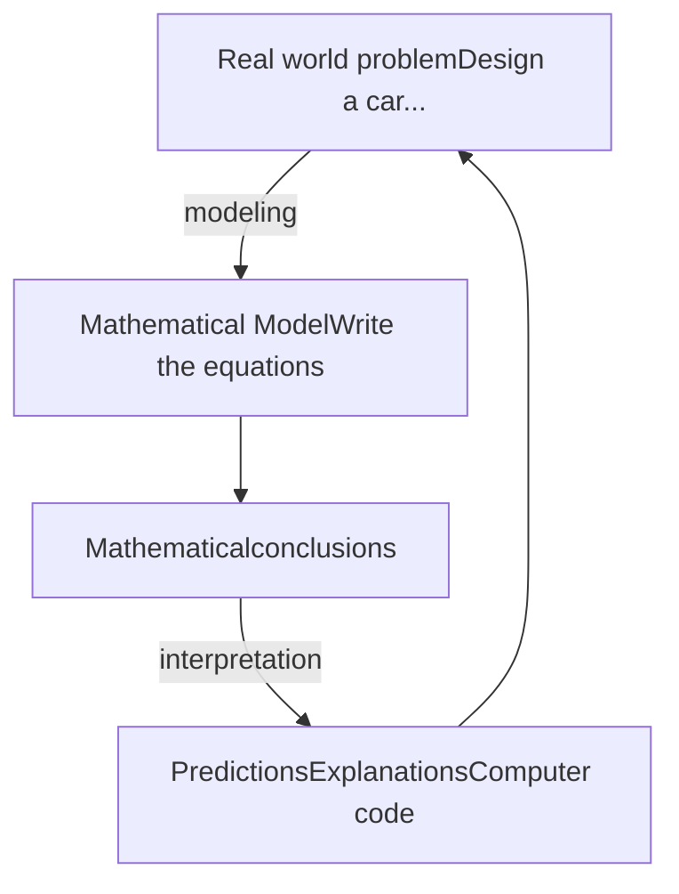

Cairo University logo
Faculty logo

# Math 1 (MA111)
# Fall 2019
# Lecture # 1


Cairo University logo
Faculty logo

# Engineering need for mathematics



Dr. Ahmad Moursy <page_number>2</page_number>


Cairo University logo

# Lecture 1

## Numbers
## Fundamental Concepts

1.1 The real numbers; the real number line

1.2 Integer exponents of real numbers

1.3 Radicals and Rational exponents

Dr. Ahmad Moursy <page_number>3</page_number>


Cairo University logo
# 1.1 The real numbers; the number line
Cairo University globe logo

* The natural number: N = {1, 2, 3, 4, ...}.
* The whole numbers: Z<sup>+</sup> = {0, 1, 2, 3, 4, ...}.
* The integers: Z = {..., -3, -2, -1, 0, 1, 2, 3, ...}.
* The rational numbers: Q = {x| x = n/m, m ≠ 0}.
* The irrational numbers Q’ like e, π, √5
* The real numbers: R = Q ∪ Q’ (constants)

Notice that for any two real numbers a and b
(1) we define unique numbers a+b and ab

```description
Diagram showing the terms 'First term' and 'Second term' pointing to 'a' and 'b' in 'a+b', and 'First factor' and 'Second factor' pointing to 'a' and 'b' in 'ab'.
```

(2) a-b = a + (-b) and a/b = a.(1/b), b ≠ 0.


Cairo University logo
# REAL NUMBERS

Venn diagram showing the classification of real numbers into Rationals (containing Integers, Whole, and Natural numbers) and Irrationals

Spiral of Theodorus showing square roots of integers

Dr. Ahmad Moursy <page_number>5</page_number>


Cairo University logo
Faculty logo

# Geometric representation of real numbers; the number line

Every real number is represented by a point on a horizontal straight line called the number line, and conversely, every point on the number line represents one and only one real number

Number line diagram showing positive and negative numbers relative to zero

## Ordering of real numbers:

* We say that a < b if b-a is a positive real number or equivalently, a precedes b on the number line.
* $a \leq b$ if a < b or a = b.

Dr. Ahmad Moursy <page_number>6</page_number>


Cairo University logo
Cairo University globe logo

# Some Remarks

* 1- If the **decimal part** “after the decimal point” in the **decimal representation** of a number **consists** of **[no digits (like 2) <u>or</u> finite number of digits (like 11.562) <u>or</u> infinite number of digits with repeated period]** then the number can be written in the **rational** form.
**<u>But</u>**, if the **decimal part <u>consists</u>** of **infinite number of digits <u>without</u> a repeated period** then the number is **<u>irrational</u>**.

**Example:** 0.9999999999... **= 1 ???**
**Solution:** Let p = 0. 9999999999... , then 10 p = 9.9999999999...
then 10 p = 9 + p, then 9p = 9. Thus, **p = 1**. Therefore, **0.999999... = 1**.

* 4- The sum “difference” of two integers is an integer? → **Yes**
* 5- The sum “difference” of two rationals is a rational ? → **Yes**
* 6- The sum “difference” of two reals is a real ? → **Yes**
* 7- The sum of two irrationals is an irrational? → **Not true for all.**


Cairo University logo
Faculty logo

# 1.2 Integer exponents of real numbers

If <span style="color: red">a</span> is any real number and <span style="color: red">n</span> is any positive integer then we define:

$$a^n = \underbrace{a \cdot a \cdot \dots \cdot a}_{n\text{-times}}, \quad a^0 = 1, \quad a^{-n} = \frac{1}{a^n}$$

## Laws of exponents

$$(i) a^m \cdot a^n = a^{m+n} \quad (ii) (a^m)^n = a^{mn} \quad (iii) \frac{a^m}{a^n} = a^{m-n}$$

$$(iv) (ab)^n = a^n b^n \quad (v) (\frac{a}{b})^n = \frac{a^n}{b^n}$$

Dr. Ahmad Moursy <page_number>8</page_number>


Cairo University logo
# 1.3 Radicals and Rational exponents
Cairo University logo

If **a** is any nonnegative real number and **m**, **n** are any positive integers then we define:

$$\sqrt[n]{a} = a^{\frac{1}{n}}, \quad a^{\frac{m}{n}} = \sqrt[n]{a^m} = (\sqrt[n]{a})^m$$

## Laws of radicals

$$(i) \sqrt[n]{a^n} = a \quad \quad \quad \quad (ii) \sqrt[m]{\sqrt[n]{a}} = \sqrt[mn]{a}$$
$$(iii) \sqrt[n]{ab} = \sqrt[n]{a} \cdot \sqrt[n]{b} \quad \quad \quad \quad (iv) \sqrt[n]{\frac{a}{b}} = \frac{\sqrt[n]{a}}{\sqrt[n]{b}}$$

Dr. Ahmad Moursy <page_number>9</page_number>


Cairo University logo
Faculty logo

# Techniques of solving equations and inequalities

* 1.4 Introduction
* 1.5 Solving linear equations
* 1.6 Solving quadratic equations
* 1.7 Solving other types of equations
* 1.8 Solutions of inequalities
* 1.9 Equations and inequalities involving absolute value

Teacher pointing at a green board

Dr. Ahmad Moursy <page_number>10</page_number>


Cairo University logo
Faculty logo

# 1.4 Introduction

**What is the equation?**

It is a statement in which two algebraic expressions are equal.

**Examples of equations:**

* a- 2x+4x = 6x True for all values of x
* b- 2x+1 = 5
* c- x<sup>2</sup> + 2x - 3 = 0

Dr. Ahmad Moursy <page_number>11</page_number>


Cairo University logo
Cartoon characters
University emblem

# What is the solution of an equation?

It is the set of values of the variable/variables which make the equation a true statement.

## Examples of equations:

| 2x+4x = 6x               | 2x+1 = 5                  |
| ------------------------ | ------------------------- |
| True for all values of x | True for some values of x |
|                          | (x = 2 only)              |
| Identity                 | Conditional equation      |


Dr. Ahmad Moursy <page_number>12</page_number>


Cairo University logo
Teacher pointing at a board
University emblem

# How to find solutions of an equation?

Use the following rules to simplify the algebraic expressions that appear in both sides of the given equation:

1. Add or subtract the same expression to both sides of the equation
2. Multiply or divide both sides by a nonzero expression
3. Interchange both sides of the equation

(Applying the above rules produces an equivalent equation)

Dr. Ahmad Moursy <page_number>15</page_number>


Cairo University logo
Faculty logo

# 1.5 Solving linear equations

Standard form of a linear equation:
$$ax + b = c$$

It has only one solution in the form:
$$x = \frac{c - b}{a}$$

**Example:** Solve the equation: $2x + 1 = 7$

**Solution:** $2x + 1 = 7 \implies 2x = 6 \implies x = 3$

Dr. Ahmad Moursy <page_number>14</page_number>


Cairo University logo Faculty logo

*Standard form of a quadratic equation:*

$$ax^2 + bx + c = 0$$

*It has TWO solutions obtained by one of the following two methods:*

<u>*Method 1:*</u> *By factorizing*

<u>*Method 2:*</u> *By using the standard quadratic formula*

Dr. Ahmad Moursy <page_number>15</page_number>


Cairo University logo
Faculty logo

# 1.6 Solving quadratic equations

**Method 1:** By factorizing, as in the following example:

**Example:** Solve the equation: $x^2 - x - 12 = 0$

**Solution:** $x^2 - x - 12 = (x - 4)(x + 3) = 0 \Rightarrow$
$(x - 4) = 0 \Rightarrow x = 4$ **or** $(x + 3) = 0 \Rightarrow x = -3$

Hence, the equation has two solutions x = - 3 and x = 4.

Dr. Ahmad Moursy <page_number>16</page_number>


Cairo University logo
Faculty logo

# Method 2: By using the standard quadratic formula:

$$x_1 = \frac{-b - \sqrt{b^2 - 4ac}}{2a} \quad \text{and} \quad x_2 = \frac{-b + \sqrt{b^2 - 4ac}}{2a}$$

# **Example: Solve the equation:** $$x^2 - x - 12 = 0$$

# **Solution:** $$a = 1, \text{ } b = -1, \text{ } c = -12 \text{ Hence, we have:}$$

$$x_1 = \frac{-b - \sqrt{b^2 - 4ac}}{2a}$$
$$= \frac{1 - \sqrt{1 - 4(1)(-12)}}{2(1)}$$
$$= \frac{1 - \sqrt{49}}{2} = \frac{1 - 7}{2}$$
$$= \frac{-6}{2} = -3$$

$$\text{and}$$

$$x_2 = \frac{-b + \sqrt{b^2 - 4ac}}{2a}$$
$$= \frac{1 + \sqrt{1 - 4(1)(-12)}}{2(1)}$$
$$= \frac{1 + \sqrt{49}}{2} = \frac{1 + 7}{2}$$
$$= \frac{8}{2} = 4$$

Dr. Ahmad Moursy <page_number>17</page_number>


Cairo University logo
# 1.7 Solving other types of equations

**Example:** Solve each of the following equations:

1. $(x - 2)^2 = 12$

2. $(x - 1)^6 = 64$

3. $(x + 5)^3 = -27$

A group of people sitting around a table in a meeting

Dr. Ahmad Moursy <page_number>18</page_number>


Cairo University logo Faculty of Engineering logo

# 1.8 Solution of inequalities

**What is the interval?**

It is any portion of the number line

**Bounded interval (finite)**
if it corresponds to
line segment on
the number line

**unbounded interval (infinite)**
if it corresponds to a ray on
the number line

```description
A diagram showing the definition of an interval, with two red arrows pointing from the text "It is any portion of the number line" to the two types of intervals: "Bounded interval (finite)" and "unbounded interval (infinite)".
```

Dr. Ahmad Moursy <page_number>19</page_number>


Cairo University logo

# Types of intervals

| Notation          | Set description | Type                        | Picture              |          |
| ----------------- | --------------- | --------------------------- | -------------------- | -------- |
| \*\*Finite:\*\*   | (a, b)          | {x\|a < x < b}              | Open                 | \[image] |
|                   | \[a, b]         | {x\|a ≤ x ≤ b}              | Closed               | \[image] |
|                   | \[a, b)         | {x\|a ≤ x < b}              | Half-open            | \[image] |
|                   | (a, b]          | {x\|a < x ≤ b}              | Half-open            | \[image] |
| \*\*Infinite:\*\* | (a, ∞)          | {x\|x > a}                  | Open                 | \[image] |
|                   | \[a, ∞)         | {x\|x ≥ a}                  | Closed               | \[image] |
|                   | (−∞, b)         | {x\|x < b}                  | Open                 | \[image] |
|                   | (−∞, b]         | {x\|x ≤ b}                  | Closed               | \[image] |
|                   | (−∞, ∞)         | ℝ (set of all real numbers) | Both open and closed | \[image] |


Dr. Ahmad Moursy <page_number>20</page_number>


Cairo University logo
University emblem

# 1.8 Solution of inequalities

**What is the inequality?**
It is a statement that two (or many) algebraic expressions are related to each other by one (or more than one) of the symbols <, >, or ≤ ≥.

**What is the solution of an inequality?**
It is the set of all values (<mark>usually an interval</mark>) of the variable that makes the inequality a true statement (satisfy the inequality).

Dr. Ahmad Moursy <page_number>21</page_number>


Cairo University logo
Faculty logo

# How to find solutions of an inequality?

Use the following rules to simplify the given inequality:

1. Add or subtract the same expression to both sides of the inequality
2. Multiply or divide both sides by a nonzero positive expression
3. Multiply or divide both sides by a nonzero negative expression and reverse the inequality sign
4. Interchange both sides of the inequality and reverse the inequality sign

(Applying the above rules produces an equivalent inequality)

Dr. Ahmad Moursy <page_number>22</page_number>


Cairo University logo
Faculty logo

*Solve each of the following inequalities:*

1. $2x - 1 \leq 7$

2. $5(x + 1) < 2(4 - 3x) + 2x$

3. $2x < 6 - x \leq 3x + 2$

4. $x^2 - x - 2 > 0$

5. $\frac{5x - 2}{x - 1} \leq 4$

Illustration of a group of people in a meeting

Dr. Ahmad Moursy <page_number>23</page_number>


Cairo University logo
Faculty logo

# 1.9 Equations and inequalities involving absolute value

## (a) Equations involving absolute value

An equation of the form:

$$|u| = k \implies$$

<mark>u = ±k, if k > 0</mark> <mark>u = 0, if k = 0</mark> <mark>no solution if k < 0</mark>

An equation of the form:

$$|u| = |v| \implies u = ±v$$

Dr. Ahmad Moursy <page_number>24</page_number>


Cairo University logo
Faculty logo

**Example:** *Solve each of the following equations:*

1. $|4x - 3| = 5$

2. $|x^2 - 6x| = 12 - 7x$

3. $|2x - 3| = |x - 6|$

Dr. Ahmad Moursy <page_number>25</page_number>


Cairo University logo
Faculty logo

# (b) Inequalities involving absolute value

Remember that:

$$|u| < k \implies -k < u < k$$

$$|u| > k \implies u > k \text{ or } u < -k$$

Dr. Ahmad Moursy <page_number>26</page_number>


Cairo University logo
University emblem

**Example:** *Solve each of the following inequalities:*

1. $|2x - 3| < 5$

2. $|x^2 - 3| > 1$

3. $\frac{|x - 4|}{|x - 1|} \geq 2$

Dr. Ahmad Moursy <page_number>27</page_number>


Cairo University logo Cairo University logo

**Remark**: We will be in need for the following remarks while solving some inequalities:

**#1**: if $-a < x < a \Rightarrow 0 \le x^2 < a^2$
Like: $-2 < x < 2 \Rightarrow 0 \le x^2 < 4$

**#2**: if $-a < x < b \Rightarrow 0 \le x^2 < \text{maximum of } "a^2 \text{ or } b^2"$
Like: $-2 < x < 3 \Rightarrow 0 \le x^2 < 9 \quad \& \quad -5 < x < 4 \Rightarrow 0 \le x^2 < 25$

**#3**: if $x < y$ multiplying by a constant "$c$"
$\Rightarrow cx < cy$ if $c > 0 \quad \text{While} \quad cx > cy$ if $c < 0$

**#4**: Knowing that the outputs of "$\sqrt{\cdot}$" & "$|.|$" must be "$\ge 0$", then, one can see that:
$\sqrt{x^2} = |x| \text{ not } "x" \quad \& \quad \sqrt{25} = 5 \text{ not } "\pm 5"$

Dr. Ahmad Moursy <page_number>28</page_number>


Cairo University logo
Faculty logo

# Important formulas

$$A^2 - B^2 = (A + B)(A - B)$$
$$A^3 + B^3 = (A + B)(A^2 - AB + B^2)$$
$$A^3 - B^3 = (A - B)(A^2 + AB + B^2)$$
$$(A + B)^2 = A^2 + 2AB + B^2$$
$$(A - B)^2 = A^2 - 2AB + B^2$$
$$(A + B)^3 = A^3 + 3A^2B + 3AB^2 + B^3$$
$$(A - B)^3 = A^3 - 3A^2B + 3AB^2 - B^3$$

<page_number>29</page_number>


Cairo University logo
Faculty logo

# Thank you

Dr. Ahmad Moursy <page_number>30</page_number>
