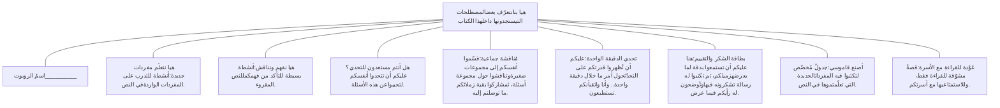

شعار وزارة التربية والتعليم

# اللغة العربية
**الصف الخامس الابتدائي**
**الفصل الدراسي الثاني**

## تأليف
**د. هانم أحمد عبد الفتاح**
دكتوراة في علوم اللغة والثقافة

**د. جبريل أنور حميدة**
دكتوراة في المناهج وطرق التدريس

## مراجعة
**أ.د. حسن شحاتة**
أستاذ المناهج وطرق التدريس

**أ.د. محمد المرسي**
أستاذ المناهج وعضو مجمع اللغة العربية

**أ.د. إيمان هريدي**
عميد كلية الدراسات العليا للتربية


أستاذ المناهج وطرق التدريس المساعد

**الإدارة المركزية لتطوير المناهج**
**د. إسماعيل عبدالعاطي**
**د. كمال عوض الله**
**د. سعيد عبد الحميد**
**أ. سلوى عبدالله**

## شارك في التأليف والتنفيذ
**قطاع المحتوى**
**بمؤسسة سلاح التلميذ للطبع والنشر**

## إشراف عام
**د. أكرم حسن**
**مساعد الوزير لشئون تطوير المناهج التعليمية**
**والمشرف على الإدارة المركزية لتطوير المناهج**

**الاسم:**     
**الفصل:**     
**المدرسة:**     

شعار سلاح التلميذ
شعار الإدارة المركزية لتطوير المناهج

٢٠٢٥/٢٠٢٦م


# مقدمة

صورة لفتاة تحمل كتباً

إلى الأطفال بجمهورية مصر العربية.. إلى مُعلمي ومُعلمات مصر.. إلى كل مَنْ يُعَلِّم ويَتَعَلَّم على أرض مصر الحبيبة، تم تصميم هذا الكتاب؛ ليكون عوناً حقيقياً لكم جميعاً.

## أولاً: الجانب التربوي:
حرصنا على أن يتضمن هذا الكتاب - وعلى مدى الأعوام الدراسية الستة - مجموعةً مُنتقاةً من القِيَم الأخلاقية والمهارات الحياتية التي تدعم الأُسَر المصرية في تنشئة أبنائهم وبناتهم؛ فقد تضمن هذا الكتاب قيمة الصدق، والتعاطف، والاحترام، وحب العائلة، والاعتزاز بلُغَتِنا وهُوِيَّتِنا، والتعاون المجتمعي، وأخلاقيات استخدام الإنترنت، والإيجابية، وحب الأسرة، وحسن استقبال الضيوف، والتشجيع للمشاركة، والحرص على أن تكون سيرتنا الذاتية بين الناس سيرة حسنة، في محاولة صادقة لإحياء دور العائلة المصرية العريقة والروابط الأُسرية والمجتمعية التي لطالما تَمَيَّز بها مجتمعنا المصري العريق. وفي السياق نفسه، وحرصاً على جعل هذا الكتاب مدخلاً لتوطيد العلاقات الإيجابية بين الأُسَر المصرية وأطفالها؛ أضفنا في نهاية كل وحدة دراسية قصة للقراءة فقط تحت عنوان: «عودة للقراءة» مع الأسرة. نَذْكُرُوا أن هدف هذه القصة ليس اجتياز أي اختبار، وإنما هدفها أن تقرءوها مع أطفالكم قبل النوم أو في يوم الإجازة؛ لِخَلْقِ وقت إيجابي بعيداً عن أي ضغوط.

لقد حاولنا أن نجعل المجتمع المصري الثري بتنوعه مُمَثَّلاً بمختلف أشكاله وسماته، وأن يرى كل طفل أو طفلة نفسه أو نفسها أو مَنْ يشبههما موجوداً بشكل أو بآخر.. آملين أن يكون هذا الكتاب أداة عون لكل مُرَبٍّ ومُرَبِّيَة في مصرنا الحبيبة.

## ثانياً: الجانب التعليمي واللغوي:
في مرحلة إعداد الكتاب تم الرجوع إلى الأبحاث العلمية والممارسات الناجحة، وحرصنا على الاسترشاد بآراء السادة المعلمين حول المشكلات التي تواجههم، كما حرصنا على تخفيف العبء عنهم من خلال تعزيز استقلالية المتعلم، فراعينا استخدام المفردات البسيطة، سهلة الفهم، والملائمة للمرحلة العمرية للأطفال، ومن عالمهم واهتماماتهم، وذلك دون تفريط في الحصيلة اللغوية التي يجب أن يتعلمها الأطفال.

ولأننا في جميع مراحل تأليف الكتاب ومنذ اللحظة الأولى، كان ميثاقنا أن نضع المُتَعَلِّم في قلب العملية التعليمية ومحورها، فقد حرصنا بقدر الإمكان على مخاطبة الأطفال بشكل مباشر، وجعلهم البطل الرئيس للكتاب. كما أضفنا في كل درس جزءاً خاصاً بـ «كلماتي الجديدة.. أصنع قاموسي» إيماناً منا بالفروق الفردية التي هي جزء من عملية التعلم.

كما اجتهدنا أن يكون هذا الكتاب وافياً في الشرح والتدريبات، يستطيع المُتَعَلِّم الاعتماد عليه تماماً في الاستذكار؛ حيث تم تضمين الكلمات الجديدة بألوان مميزة ليُشير على المُتَعَلِّم ملاحظتها وفهمها، وتيسيراً على المُتَعَلِّم تم تقسيم الدروس إلى أقسام واضحة، مثل: الاستماع، والقراءة، والقواعد النحوية، والقواعد الإملائية، والخط العربي، والكتابة، والنصوص الشعرية. وقد ركزنا على معالجة الأخطاء الإملائية الشائعة حتى يتفاداها الأطفال. كما تم تضمين نصوص الاستماع في آخر الكتاب للرجوع إليها عند الحاجة.

وفيما يخص مهارات اللغة، ولتنشئة جيل من أطفال مصر قادرين على التعبير عن أنفسهم باستخدام لغتهم بإتقان، مُعتزين بها وبتاريخها، قادرين على الاختلاف والاتفاق باحترام؛ وضعنا العديد من التدريبات؛ لتنمية مهارات اللغة الأربع: الاستماع والتحدث والقراءة والكتابة، بالإضافة إلى مهارات العرض وإبداء الرأي في حديثه مع الآخرين بشكل موضوعي ومهذب، ولتطبيق هذا تم تضمين «بطاقة الشكر والتقييم» التي صُمِّمَت بشكل علمي لعرض الرأي من خلال ثلاث مراحل؛ تبدأ بشكر الزميل على العرض، ثم ذِكْر الإيجابيات، والانتقال إلى تحديد النقاط المقترح تطويرها. كما تم الحرص على تنوع الأنشطة من خلال الأنشطة الفردية، والثنائية، ثم العمل في مجموعات مع تحديد الأدوار في العرض والنقاش.

آملين من كل قلوبنا، أن يساعد هذا الكتاب في تربية روح «حُبِّ اللغة العربية والاعتزاز بها» بينكم، وأن يكون هذا الكتاب خطوة إيجابية في رحلتكم في التعلم.

**المؤلفون**


**من المهم أن تقرأ هذه الصفحة قبل الرجوع للدراسة**

Robot character

**مرحبًا يا أصدقائي**
هل تذكرونني؟
لقد قضيتُ معكم الفصل الدراسي الأول كاملًا، وسأكملُ معكم الرحلة حتى نهاية العام.
ولكن تذكروا إن وجدتُموني فاقرءوا إرشاداتي جيدًا.




# الفهرس

صورة لفتاة تحمل كتباً

## الوحدة الأولى: الاختيار والمسئولية

* الدرس الأول (الاستماع): سطح ينير الحي ٧
* الدرس الثاني (القراءة): أخلاقيات استخدام الإنترنت ٩
* القواعد النحوية: المفعول المطلق ١٥
* القواعد الإملائية: الهمزة المتطرفة على الواو ١٧
* التحدث: استخدام الإنترنت مسئولية ١٨
* الكتابة: كتابة لوحة إرشادية ١٩
* قيم نفسك: درس أخلاقيات استخدام الإنترنت ٢٣
* الدرس الثالث (القراءة): أي الأنواع تُفَضِّل؟ ٢٤
* القواعد النحوية: الاسم المجرور (المفرد - جمع التكسير - جمع المؤنث السالم) ٣٠
* القواعد الإملائية: تطبيقات على الهمزة المتطرفة على الواو ٣٢
* التحدث: أنا إيجابي ٣٣
* الكتابة: تطبيقات على كتابة لوحة إرشادية ٣٤
* قيم نفسك: درس أي الأنواع تُفَضِّل؟ ٣٨
* الدرس الرابع (النص الشعري): الصحة عنوان الحياة ٣٩
* قيم نفسك: درس الصحة عنوان الحياة ٤٥
* تقييم الوحدة الأولى ٤٦
* عودة للقراءة مع الأسرة: القرار الشجاع ٤٨

## الوحدة الثانية: أخلاقيات التواصل

* الدرس الأول (الاستماع): مفاجأة لأختي ٥١
* الدرس الثاني (القراءة): هل أنت مستمع جيد؟ ٥٣
* القواعد النحوية: الاسم المجرور (المثنى - جمع المذكر السالم) ٥٩
* القواعد الإملائية: الهمزة المتطرفة على الياء ٦١
* التحدث: عندما أستمع باحترام ٦٢
* الكتابة: كتابة إعلان ٦٣
* قيم نفسك: درس هل أنت مستمع جيد؟ ٦٧


٦٨ الدرس الثالث (القراءة): في مدرستنا ضيف جديد
٧٤ القواعد النحوية: المضاف والمضاف إليه
٧٦ القواعد الإملائية: تطبيقات على الهمزة المتطرفة على الياء
٧٧ التحدث: أرحب بزميلي الجديد
٧٨ الكتابة: تطبيقات على كتابة إعلان
٨٢ قيم نفسك: درس: في مدرستنا ضيف جديد
٨٣ الدرس الرابع (النص الشعري): هيا نغني
٨٩ قيم نفسك: درس: هيا نغني
٩٠ تقييم الوحدة الثانية
٩٢ عودة للقراءة مع الأسرة: الحوار يصنع الحل

# الوحدة الثالثة: أنا وصورتي في أعين الآخرين

٩٥ الدرس الأول (الاستماع): الشجاعة تبدأ بخطوة
٩٧ الدرس الثاني (القراءة): شيء، يخصنا ولا نستطيع رؤيته
١٠٣ القواعد النحوية: المضاف إليه (المفرد - جمع التكسير - جمع المؤنث السالم)
١٠٥ القواعد الإملائية: تنوين الهمزة المتطرفة
١٠٦ التحدث: الصدق ينجينا
١٠٧ الكتابة: تطبيقات على كتابة لوحة إرشادية
١١١ قيم نفسك: درس: شيء، يخصنا ولا نستطيع رؤيته
١١٢ الدرس الثالث (القراءة): هل أضفت شيئًا جيدًا لنفسك وللآخرين اليوم؟
١١٨ القواعد النحوية: المضاف إليه (المثنى - جمع المذكر السالم)
١٢١ القواعد الإملائية: تطبيقات على الهمزة المتطرفة
١٢٣ التحدث: فكرتي الإيجابية
١٢٤ الكتابة: تطبيقات على كتابة إعلان
١٢٨ قيم نفسك: درس: هل أضفت شيئًا جيدًا لنفسك وللآخرين اليوم؟
١٢٩ الدرس الرابع (النص الشعري): مسئوليتي أمانة
١٣٥ قيم نفسك: درس: مسئوليتي أمانة
١٣٦ تقييم الوحدة الثالثة
١٣٨ عودة للقراءة مع الأسرة: مَن أكون في نظرهم؟
١٤٠ نصوص استماع الوحدات
١٤٣ فقرات استماع تقييمات الوحدات


# الوحدة الأولى
## الاختيار والمسؤولية

رسم توضيحي لطفل يفكر، وطفل آخر يجلس حزيناً، وطفل ثالث يركض

<page_number>٦</page_number>


# الدرس الأول: الاستماع

## سَطْحُ يُنِيرُ الْحَيَّ

**هل لديك مكتبة في بيتك؟ وما نوع الْكُتُبِ التي تُحِبُّ قراءتها؟**

صورة توضيحية لطفل يرتدي سماعات

صورة توضيحية لرجل مسن يعطي كتاباً لطفل في مكتبة

صورة توضيحية لطفل يتحدث مع رجل في غرفة معيشة

**الأهداف:** في نهايةِ الدَّرسِ يستطيعُ التلميذُ أن:
* يَعْرِفَ أَهَمِّيَّةَ تَبَادُلِ الْمَعْرِفَةِ وَمُسَاعَدَةِ الْآخَرِينَ.
* يُجِيبَ عَنْ أَسْئِلَةٍ بِتَفَاصِيلَ وَارِدَةٍ فِي النَّصِّ الْمَسْمُوعِ.
* يُرَتِّبَ الْفِكَرَ الْفَرْعِيَّةَ وَفْقَ وُرُودِهَا فِي النَّصِّ الْمَسْمُوعِ.
* يَتَنَاقَشَ مَعَ زُمَلَائِهِ حَوْلَ فِكَرٍ وَارِدَةٍ فِي النَّصِّ الْمَسْمُوعِ.
* يُوَظِّفَ مَا وَرَدَ فِي النَّصِّ الْمَسْمُوعِ فِي مَوَاقِفَ حَيَاتِيَّةٍ.

<page_number>7</page_number>


# تَدْرِيبَات

## سَطْحُ يُنِيرُ الْحَيَّ

**أَسْتَمِعُ إِلَى النَّصِّ، ثُمَّ أُجِيبُ:**

١. **أَضَعُ عَلَامَةَ (✓) أَمَامَ الْعِبَارَةِ الصَّحِيحَةِ، وَعَلَامَةَ (✗) أَمَامَ الْعِبَارَةِ الْخَطَأِ:**
*(نص الاستماع في آخر الكتاب)*

( ) (أ) كَرِيمٌ يَشْتَرِي الْكُتُبَ وَلَا يَقْرَؤُهَا.
( ) (ب) سَاعَدَ الْأَبُ (كَرِيمَ) عَلَى تَنْفِيذِ فِكْرَتِهِ.
( ) (ج) وَجَدَتِ اللَّافِتَةُ الَّتِي كَتَبَهَا كَرِيمٌ قَبُولًا وَتَشْجِيعًا مِنَ الْجِيرَانِ.
( ) (د) شَارَكَ الْأَصْدِقَاءُ فِي تَجْهِيزِ الْمَكْتَبَةِ عَلَى السَّطْحِ.

٢. **أُجِيبُ عَنِ الْأَسْئِلَةِ الْآتِيَةِ شَفَوِيًّا:**

(أ) مَا الْمُشْكِلَةُ الَّتِي لَاحَظَهَا كَرِيمٌ فِي مَكْتَبَتِهِ وَمَكْتَبَةِ جَدِّهِ؟
(ب) مَا الْحَلُّ الَّذِي اقْتَرَحَهُ؟
(ج) كَيْفَ سَاهَمَ وَالِدُ كَرِيمٍ وَأَصْدِقَاؤُهُ فِي تَنْفِيذِ فِكْرَتِهِ؟ وَمَا أَثَرُ هَذَا التَّعَاوُنِ؟

٣. **أَتَأَمَّلُ، وَأُفَكِّرُ:**

(أ) مَا الْفِكْرَةُ الرَّئِيسَةُ الَّتِي يَدُورُ حَوْلَهَا النَّصُّ؟
(ب) مَا الْقِيمَةُ الَّتِي تَعَلَّمْتَهَا مِنْ تَصَرُّفِ كَرِيمٍ؟
(ج) مَا دَلَالَةُ عِبَارَةِ «سَطْحٌ صَغِيرٌ ... صَنَعَ فَرْقًا كَبِيرًا» فِي نِهَايَةِ النَّصِّ؟
(د) اذْكُرْ مَوْقِفًا شَخْصِيًّا شَارَكْتَ فِيهِ فِي عَمَلٍ نَافِعٍ لِخِدْمَةِ الْآخَرِينَ.

٤. **أَتَعَاوَنُ مَعَ زُمَلَائِي:**

**أَقْتَرِحُ ثَلَاثَ مُبَادَرَاتٍ يُمْكِنُ تَنْفِيذُهَا فِي الْمَدْرَسَةِ لِخِدْمَةِ الْمُجْتَمَعِ:**

| الْمُبَادَرَة | كَيْفَ أُنَفِّذُهَا؟ | النَّتِيجَةُ الْمُتَوَقَّعَةُ |
| ------------- | -------------------- | ----------------------------- |
|               |                      |                               |
|               |                      |                               |
|               |                      |                               |


روبوت

**تَذَكَّرْ يَا صَدِيقِي**
* أَنَّ الْمُبَادَرَةَ لَا تَحْتَاجُ مَكَانًا كَبِيرًا أَوْ إِمْكَانِيَّاتٍ ضَخْمَةً لِتُحْدِثَ أَثَرًا كَبِيرًا، وَأَنَّ الْفِكْرَةَ الصَّغِيرَةَ الَّتِي تَبْدَأُ بِهَا الْيَوْمَ قَدْ تُضِيءُ حَيًّا كَامِلًا غَدًا.

<page_number>٨</page_number>


# الدرس الثاني: القراءة
# أخلاقيات استخدام الإنترنت

فتاة تحمل كتباً

ما المواقع أو التطبيقات التي تفضل استخدامها على الإنترنت؟ ولماذا؟

رسم توضيحي لصبي يشير بإبهامه

## الأهداف
في نهاية هذا الدرس يستطيع التلميذ أن:

* يتعرف أهمية التكنولوجيا في حياتنا.
* يتعرف الاستخدام الصحيح للإنترنت.
* يستنتج المغزى العام من النص المقروء.
* يقرأ النص قراءة جهرية صحيحة.
* يستنتج الفكرة الرئيسة للنص المقروء.
* يستخدم المفردات الجديدة في سياقات متنوعة.
* يحدد الفكر الفرعية للنص المقروء.
* يتحدث عن موضوع محدد مستخدماً أدوات ربط مناسبة.
* يوظف التنغيم المناسب حسب المعنى.
* يستخلص القيم الواردة في النص.
* يكتب كلمات بها همزة متطرفة على الواو بشكل صحيح.
* يكتب لوحة إرشادية مراعياً عناصرها.
* يكتب جملة بخط النسخ والرقعة محاكياً نموذجاً.
* يتعرف المفعول المطلق وأنواعه.

<page_number>9</page_number>


# أَخْلَاقِيَّاتُ اسْتِخْدَامِ الْإِنْتَرْنَتِ

هَلْ سَبَقَ لَكَ اسْتِخْدَامُ شَبَكَةِ الْإِنْتَرْنَتِ؟ وَمَا أَكْثَرُ شَيْءٍ تَفْعَلُهُ أَنْتَ وَأَفْرَادُ أُسْرَتِكَ عَلَى شَبَكَةِ الْإِنْتَرْنَتِ؟

لَقَدْ وَصَلَ عَدَدُ مُسْتَخْدِمِي شَبَكَةِ الْإِنْتَرْنَتِ فِي عَامِ ٢٠٢٥ إِلَى حَوَالَيْ ٦ مِلْيَارَاتِ مُسْتَخْدِمٍ<sup>(*)</sup>، أَيْ ثُلُثَيْ سُكَّانِ الْعَالَمِ تَقْرِيبًا.

لَا شَكَّ أَنَّ شَبَكَةَ الْإِنْتَرْنَتِ مُفِيدَةٌ جِدًّا؛ فَهِيَ تُسَاعِدُنَا عَلَى الْبَحْثِ عَنِ الْمَعْلُومَاتِ، وَالتَّوَاصُلِ مَعَ الْأَصْدِقَاءِ وَتَعَرُّفِ ثَقَافَاتٍ مُخْتَلِفَةٍ، لَكِنَّ هُنَاكَ مَنْ يَرَى أَنَّ لَهَا أَخْطَارًا كَثِيرَةً، وَأَنَّهَا ضَارَّةٌ.

## فَأَيُّ الرَّأْيَيْنِ صَحِيحٌ مِنْ وِجْهَةِ نَظَرِكُمْ؟

فِي الْحَقِيقَةِ كِلَا الرَّأْيَيْنِ صَحِيحٌ؛ لِأَنَّ شَبَكَةَ الْإِنْتَرْنَتِ هِيَ أَدَاةٌ تُنَفِّذُ مَا نَطْلُبُهُ مِنْهَا؛ لِذَلِكَ نَحْنُ نُقَرِّرُ إِذَا كَانَتْ مُفِيدَةً أَمْ ضَارَّةً. وَالسِّرُّ فِي طَرِيقَةِ اسْتِخْدَامِهَا.

إِنَّ شَبَكَةَ الْإِنْتَرْنَتِ كَأَيِّ وَسِيلَةٍ أُخْرَى، لَهَا أَخْلَاقِيَّاتٌ لَا بُدَّ أَنْ نَلْتَزِمَ بِهَا؛ حَتَّى نَسْتَخْدِمَهَا اسْتِخْدَامًا آمِنًا.

هَيَّا بِنَا نَتَعَرَّفُ أَخْلَاقِيَّاتِ اسْتِخْدَامِ الْإِنْتَرْنَتِ، وَأَنْتُمْ أَيْضًا فَكِّرُوا فِي أَخْلَاقِيَّاتٍ أُخْرَى تُضِيفُونَهَا لِهَذِهِ الْأَخْلَاقِيَّاتِ.

(*) مَصْدَرُ الْمَعْلُومَاتِ: https://www.statista.com/statistics <page_number>١٠</page_number>


# أَفْعَلُ:
* أَفَكِّرُ قَبْلَ أَنْ أَضْغَطَ عَلَى أَيِّ رَابِطٍ.
* أُخَصِّصُ وَقْتًا لِاسْتِخْدَامِ الْإِنْتَرْنَتِ (مَثَلًا بَعْدَ الْوَاجِبَاتِ فَقَطْ) وَلِوَقْتٍ مُحَدَّدٍ.
* أُفَكِّرُ فِي مَشَاعِرِ الْآخَرِينَ قَبْلَ كِتَابَةِ أَيِّ شَيْءٍ.
* أَعْلَمُ أَنَّ أَيَّ شَيْءٍ أَكْتُبُهُ قَدْ يُعَرِّضُنِي لِلْمُسَاءَلَةِ.
* أُخْبِرُ أُسْرَتِي أَوْ مُعَلِّمِي عَنْ أَيِّ مُحَاوَلَاتٍ غَرِيبَةٍ لِلتَّوَاصُلِ مَعِي.
* أَذْكُرُ مَصْدَرَ الْمَعْلُومَاتِ بِوُضُوحٍ إِذَا اسْتَخْدَمْتُهَا فِي بَحْثٍ أَوْ مَوْضُوعٍ.

# لَا أَفْعَلُ:
* لَا أُشَارِكُ أَبَدًا كَلِمَةَ السِّرِّ الْخَاصَّةَ بِي.
* لَا أُشَارِكُ أَيَّ مَعْلُومَاتٍ شَخْصِيَّةٍ عَنِّي أَوْ عَنْ أُسْرَتِي مَعَ أَيِّ شَخْصٍ عَلَى الْإِنْتَرْنَتِ.
* لَا أَكْتُبُ أَيَّ مَعْلُومَاتٍ أَوْ أُشَارِكُهَا دُونَ التَّأَكُّدِ مِنْ صِحَّتِهَا أَوَّلًا.
* لَا أَسْتَخْدِمُ أَبَدًا الْإِنْتَرْنَتَ لِلْإِسَاءَةِ لِلْآخَرِينَ.
* لَا أَدْخُلُ أَيَّ مَنْصَّةٍ إِلَّا بِمُوَافَقَةٍ وَتَحْتَ إِشْرَافِ أَحَدِ الْكِبَارِ فِي أُسْرَتِي.

تَذَكَّرُوا نَحْنُ وَحْدَنَا مَنْ نُقَرِّرُ دَائِمًا هَلْ سَنُحْسِنُ اسْتِخْدَامَ الْإِنْتَرْنَتِ أَمْ نَجْعَلُهَا وَسِيلَةً لِإِيذَائِنَا أَوْ إِيذَاءِ الْآخَرِينَ، أَنْتُمْ أَصْحَابُ الْقَرَارِ أَصْدِقَائِي.

## الْمُفْرَدَاتُ الْجَدِيدَةُ:
* **شَبَكَةُ الْإِنْتَرْنَتِ:** الشَّبَكَةُ الْعَالَمِيَّةُ لِلْمَعْلُومَاتِ.
* **أَخْلَاقِيَّاتٌ:** سُلُوكِيَّاتٌ وَقِيَمٌ.
* **مَنْصَّةٌ:** مَوْقِعٌ إِلكْتُرُونِيٌّ.
* **الْمُسَاءَلَةُ:** الْمُحَاسَبَةُ.
* **الْمُضَادُّ:** الْإِعْفَاءُ.
* **وَسِيلَةٌ:** أَدَاةٌ أَوْ طَرِيقَةٌ.
* **الْجَمْعُ:** وَسَائِلٌ.

Illustration of a boy using a laptop
Illustration of a boy looking at a screen with warning icons


# الوحدة الأولى: الاحترام والمسؤولية

## تدريبات: أخلاقيات استخدام الإنترنت

### هَيَّا نَتَعَلَّمُ مُفْرَدَاتٍ جَدِيدَةً

**1. أَخْتَارُ الْمَعْنَى الْمُنَاسِبَ لِلْكَلِمَةِ الْمُلَوَّنَةِ:**

(أ) أَبْحَثُ عَنْ مَعْلُومَاتٍ فِي <mark>الإنترنت</mark>. (الْقَنَوَاتُ الْفَضَائِيَّةُ - الْبَرِيدُ السَّرِيعُ - شَبَكَةُ الْمَعْلُومَاتِ الْعَالَمِيَّةِ - الْهَاتِفُ الْمَحْمُولُ)
(ب) تَقَدَّمْتُ بِطَلَبٍ لِلِالْتِحَاقِ بِالْمُسَابَقَةِ مِنْ خِلَالِ <mark>مِنَصَّةِ</mark> مَرْكَزِ الشَّبَابِ. (إِعْلَانٌ - مَوْقِعٌ - لَوْحَةٌ - رَابِطٌ)
(ج) الْإِسَاءَةُ لِلْآخَرِينَ تُعَرِّضُكَ <mark>لِلْمُسَاءَلَةِ</mark>. (لِلْمُحَاسَبَةِ - لِلْمُنَاقَشَةِ - لِلْمُشَاجَرَةِ - لِلتَّجَاهُلِ)
(د) يَجِبُ أَنْ نَسْتَخْدِمَ التِّكْنُولُوجِيَا <mark>وَسِيلَةً</mark> لِلْبِنَاءِ لَا الْهَدْمِ. (أَدَاةً - نَتِيجَةً - غَايَةً - سَبَبًا)

**2. أَضَعُ الْكَلِمَةَ الْمُنَاسِبَةَ فِي مَكَانِهَا الصَّحِيحِ:**

(مِنَصَّةٌ - مُسَاءَلَةٌ - أَخْلَاقِيَّاتٌ - وَسِيلَةٌ)

(أ) يَسْتَخْدِمُ التَّلَامِيذُ ........................ تَعْلِيمِيَّةً لِمُشَاهَدَةِ الدُّرُوسِ.
(ب) كُلُّ مُجْتَمَعٍ لَهُ ........................ تَحْكُمُ سُلُوكَ أَفْرَادِهِ.
(ج) الْإِنْتَرْنِت ........................ لِدِرَاسَةِ الْبَرْمَجَةِ.
(د) مَنْ يُسِيءُ لِلْآخَرِينَ عَبْرَ الْإِنْتَرْنِت يَتَعَرَّضُ لِـ ........................ قَانُونِيَّةٍ.

> **جَرِّب**
> - أَنْ تُوَظِّفَ الْكَلِمَةَ الْجَدِيدَةَ فِي جُمْلَةٍ مِنْ حَيَاتِكَ الْيَوْمِيَّةِ لِتَبْقَى فِي ذَاكِرَتِكَ.

**3. أُوَظِّفُ الْكَلِمَاتِ التَّالِيَةَ فِي جُمَلٍ مِنْ عِنْدِي:**

(أ) الْمُسَاءَلَةُ: ....................................................................................
(ب) أَخْلَاقِيَّاتٌ: ....................................................................................
(ج) وَسِيلَةٌ: ....................................................................................
(د) الْإِنْتَرْنِت: ....................................................................................

**4. أُكْمِلُ الْكَلِمَاتِ الْآتِيَةَ فِي صُوَرِهَا الْمُخْتَلِفَةِ:**

صَدَقَ [ ] [ ] [ ] [ ] صَادِقٌ
وَصَلَ [ ] [ ] [ ] [ ] [ ]

> **عَائِلَةُ الْكَلِمَةِ**
> هِيَ الْكَلِمَاتُ الَّتِي تَتَكَوَّنُ مِنَ الْجِذْرِ نَفْسِهِ، مِثْلَ: (مَلْعَبٌ - لَاعِبٌ - لُعْبَةٌ) مِنَ الْجِذْرِ (لَعِبَ).

<page_number>12</page_number>


الدرس الثاني: أخلاقيات استخدام الإنترنت

# هَيَّا نُفَكِّرُ وَنُنَاقِشُ

**٥. أَقْرَأُ النَّصَّ قِرَاءَةً صَامِتَةً، ثُمَّ أَضَعُ عَلَامَةَ (✓) أَوْ عَلَامَةَ (✗) أَمَامَ مَا يَلِي:**

( ) (أ) عَدَدُ مُسْتَخْدِمِي الْإِنْتَرْنَتِ فِي تَزَايُدٍ مُسْتَمِرٍّ.
( ) (ب) تَتَوَقَّفُ فَائِدَةُ الْإِنْتَرْنَتِ أَوْ ضَرَرُهُ عَلَى طَبِيعَةِ اسْتِخْدَامِنَا لَهُ.
( ) (ج) مِنْ قَوَاعِدِ الِاسْتِخْدَامِ الْآمِنِ لِلْإِنْتَرْنَتِ الْحِفَاظُ عَلَى سِرِّيَّةِ كَلِمَةِ الْمُرُورِ.
( ) (د) مُشَارَكَةُ الْمَعْلُومَاتِ الشَّخْصِيَّةِ عَلَى الْإِنْتَرْنَتِ أَمْرٌ آمِنٌ فِي كُلِّ الْحَالَاتِ.

**٦. أَخْتَارُ الْإِجَابَةَ الصَّحِيحَةَ مِمَّا بَيْنَ الْقَوْسَيْنِ:**

(أ) يَسْتَخْدِمُ الْإِنْسَانُ الْإِنْتَرْنَتَ بِوَصْفِهِ .................... لِلتَّعَلُّمِ وَالتَّوَاصُلِ. (أَسَاسًا - وَسِيلَةً - شَرْطًا - خُطْوَةً)
(ب) يَجِبُ عَلَى مَنْ يَسْتَخْدِمُ الْإِنْتَرْنَتَ .................... الْآخَرِينَ. (كَسْبَ - احْتِرَامَ - مُشَارَكَةَ - إِفَادَةَ)
(ج) لَا نُشَارِكُ مَعْلُومَاتِنَا الشَّخْصِيَّةَ؛ لِأَنَّهَا .................... (عَامَّةٌ - سِرِّيَّةٌ - بَسِيطَةٌ - مَعْرُوفَةٌ)
(د) قَبْلَ أَنْ تَفْتَحَ أَيَّ رَابِطٍ كُنْ .................... فِي تَصَرُّفِكَ. (سَرِيعًا - مُنْتَبِهًا - شُجَاعًا - مُتَرَدِّدًا)

**٧. أَسْتَخْرِجُ مِنَ النَّصِّ:**

(أ) جُمْلَةً تَدُلُّ عَلَى احْتِرَامِ مَشَاعِرِ الْآخَرِينَ. ....................................................................
(ب) عِبَارَةً تَدُلُّ عَلَى أَهَمِّيَّةِ التَّفْكِيرِ قَبْلَ التَّصَرُّفِ. ....................................................................
(ج) كَلِمَةً تَدُلُّ عَلَى الْمَسْئُولِيَّةِ. ....................................................................

# هَلْ أَنْتُمْ مُسْتَعِدُّونَ لِلتَّحَدِّي؟

**٨. أُجِيبُ عَمَّا يَلِي:**

(أ) مَا الْفِكْرَةُ الرَّئِيسَةُ الَّتِي يَدُورُ حَوْلَهَا النَّصُّ؟
(ب) مَا السُّلُوكِيَّاتُ الَّتِي تَرَاهَا صَحِيحَةً عِنْدَ اسْتِخْدَامِ الْإِنْتَرْنَتِ؟
(ج) كَيْفَ يُمْكِنُ أَنْ تَجْعَلَ اسْتِخْدَامَكَ لِلْإِنْتَرْنَتِ آمِنًا وَمُفِيدًا؟
(د) مَا رَأْيُكَ فِي الْعِبَارَةِ: «أَنْتَ صَاحِبُ الْقَرَارِ»؟ فَسِّرْ إِجَابَتَكَ.

روبوت يحمل لوحة مكتوب عليها: عِنْدَمَا تَسْتَخْدِمُ الْإِنْتَرْنَتَ، تَذَكَّرْ أَنَّ كُلَّ نَقْرَةٍ تَحْمِلُ مَسْئُولِيَّةً. أَنْتَ مَنْ يَخْتَارُ أَنْ تَكُونَ مُؤَثِّرًا إِيجَابِيًّا أَوْ مَصْدَرًا لِلْأَذَى.

**٩. أُفَكِّرُ، وَأُطَبِّقُ:**

(أ) مَاذَا تَفْعَلُ إِذَا أَرْسَلَ لَكَ شَخْصٌ لَا تَعْرِفُهُ رِسَالَةً؟
(ب) كَيْفَ تَتَصَرَّفُ عِنْدَمَا تَرَى تَعْلِيقًا يُسِيءُ لِزَمِيلِكَ؟
(ج) مَا أَوَّلُ خُطْوَةٍ تَقُومُ بِهَا قَبْلَ نَشْرِ صُورَةٍ أَوْ مَعْلُومَةٍ؟
(د) كَيْفَ تَجْعَلُ اسْتِخْدَامَكَ لِلْإِنْتَرْنَتِ مُفِيدًا كُلَّ يَوْمٍ؟

<page_number>١٣</page_number>


# الوحدة الأولى: الاحترام والمسؤولية

## القراءة والأداء
**١٠. أَقْرَأُ الْفِقْرَةَ الْأُولَى مِنَ الدَّرْسِ بِصَوْتٍ وَاضِحٍ، مُرَاعِيًا تَوْزِيعَ النَّظَرِ عَلَى الْمُسْتَمِعِينَ وَمُسْتَخْدِمًا لُغَةَ الْجَسَدِ؛ لِتَوْضِيحِ كَيْفِيَّةِ التَّعَامُلِ مَعَ الْمُشْكِلَاتِ.**
* رَاعِ وُضُوحَ الصَّوْتِ، وَالْوَقَفَاتِ الْمُنَاسِبَةَ بَيْنَ الْجُمَلِ، وَتَغْيِيرَ النَّغَمَةِ بَيْنَ التَّعْلِيمَاتِ الْإِيجَابِيَّةِ وَالسَّلْبِيَّةِ.

## أُفَكِّرُ وَأُعَبِّرُ
**١١. أَذْكُرُ مَوْقِفًا شَخْصِيًّا اسْتَخْدَمْتُ فِيهِ الْإِنْتَرْنَتَ بِطَرِيقَةٍ صَحِيحَةٍ، وَأُبَيِّنُ كَيْفَ شَعَرْتُ عِنْدَمَا الْتَزَمْتُ بِالْأَمَانِ وَالِاحْتِرَامِ فِي هَذَا الْمَوْقِفِ.**

## مُنَاقَشَةٌ جَمَاعِيَّةٌ
**١٢. أَتَنَاقَشُ مَعَ زُمَلَائِي فِيمَا يَلِي:**
(أ) مَا أَكْثَرُ سُلُوكٍ خَطَأً تَرَاهُ بَيْنَ أَقْرَانِكَ فِي اسْتِخْدَامِ الْإِنْتَرْنَتِ؟
(ب) مَا الْحُلُولُ الَّتِي يُمْكِنُ أَنْ تُسَاعِدَ فِي نَشْرِ الِاسْتِخْدَامِ الْآمِنِ فِي مَدْرَسَتِكَ؟
(ج) كَيْفَ يُمْكِنُ أَنْ نَسْتَفِيدَ مِنَ الْإِنْتَرْنَتِ دُونَ أَنْ نُضَيِّعَ الْوَقْتَ؟
* تَعَلَّمْ أَنَّ الْمُشَارَكَةَ فِي النِّقَاشِ لَيْسَتْ مُجَرَّدَ إِجَابَةٍ، بَلْ هِيَ اسْتِمَاعٌ جَيِّدٌ، ثُمَّ إِضَافَةُ فِكْرَةٍ جَدِيدَةٍ أَوْ مِثَالٍ وَاقِعِيٍّ.

## الْقِرَاءَةُ الْمُتَحَرِّرَةُ
**١٣. أَقْرَأُ الْفِقْرَةَ التَّالِيَةَ:**
فِي أَحَدِ الْأَيَّامِ وَصَلَتْنِي رِسَالَةٌ غَرِيبَةٌ عَبْرَ بَرِيدِي الْإِلِكْتِرُونِيِّ.. لَمْ أَعْرِفِ الْمُرْسِلَ، فَتَذَكَّرْتُ نَصِيحَةَ مُعَلِّمِي عَنْ أَخْلَاقِيَّاتِ اسْتِخْدَامِ الْإِنْتَرْنَتِ: «لَا تَفْتَحْ أَيَّ رِسَالَةٍ مِنْ شَخْصٍ مَجْهُولٍ». أَخْبَرْتُ وَالِدِي بِالْأَمْرِ، فَشَكَرَنِي وَقَالَ: «هَذَا تَصَرُّفٌ ذَكِيٌّ وَمَسْئُولٌ وَقَدِ اسْتَخْدَمْتَ الْإِنْتَرْنَتَ كَوَسِيلَةٍ نَافِعَةٍ وَآمِنَةٍ». بَعْدَهَا تَعَلَّمْتُ كَيْفَ أُحَدِّدُ الرَّسَائِلَ الْآمِنَةَ، وَكَيْفَ أَسْتَخْدِمُ الْإِنْتَرْنَتَ بِثِقَةٍ وَوَعْيٍ.
(أ) أَسْتَخْرِجُ مِنَ الْفِقْرَةِ: (١) مُرَادِفَ (سُلُوكِيَّاتٍ): (٢) مُضَادَّ (الْخَطِرَةِ):
(ب) أَضَعُ عَلَامَةَ (✓) أَوْ عَلَامَةَ (✗) أَمَامَ مَا يَلِي:
(١) فَتَحْتُ الرِّسَالَةَ فَوْرًا دُونَ تَفْكِيرٍ. ( )
(٢) تَصَرَّفْتُ بِحَذَرٍ عِنْدَمَا رَأَيْتُ الرِّسَالَةَ الْغَرِيبَةَ. ( )
(٣) سَاعَدَنِي وَالِدِي فِي التَّصَرُّفِ السَّلِيمِ. ( )
(ج) أُجِيبُ: (١) أَسْتَخْرِجُ كَلِمَةً تَدُلُّ عَلَى (الْوَعْيِ وَالِانْتِبَاهِ).
(٢) مَا الْقِيمَةُ الَّتِي تَعَلَّمْتُهَا مِنَ الْفِقْرَةِ؟

<page_number>١٤</page_number>


الدرس الثاني: أخلاقيات استخدام الإنترنت

# القَوَاعِدُ النَّحْوِيَّةُ
# الْمَفْعُولُ الْمُطْلَقُ

**أولاً** أَقْرَأُ الْجُمَلَ الْآتِيَةَ:

| (ب)                                 | (أ)                        |
| ----------------------------------- | -------------------------- |
| ضَحِكَ الطِّفْلُ ضَحِكًا جَمِيلًا.  | ضَحِكَ الطِّفْلُ ضَحِكًا.  |
| نَزَلَ الْمَطَرُ نُزُولًا شَدِيدًا. | نَزَلَ الْمَطَرُ نُزُولًا. |


**ثانياً** أُلاحِظُ
* الْكَلِمَاتُ الْمُلَوَّنَةُ <mark>بِالْأَزْرَقِ</mark> أَفْعَالٌ.
* كُلُّ كَلِمَةٍ مُلَوَّنَةٍ <mark>بِالْأَحْمَرِ</mark> فِي الْمَجْمُوعَتَيْنِ هِيَ اسْمٌ مَنْصُوبٌ مَأْخُوذٌ مِنْ لَفْظِ الْفِعْلِ الَّذِي يَسْبِقُهُ.
* فِي الْمَجْمُوعَةِ (أ) جَاءَتِ الْكَلِمَاتُ الْمُلَوَّنَةُ <mark>بِالْأَحْمَرِ</mark> دُونَ وَصْفٍ؛ لِتُؤَكِّدَ الْفِعْلَ.
* فِي الْمَجْمُوعَةِ (ب) جَاءَتِ الْكَلِمَاتُ الْمُلَوَّنَةُ <mark>بِالْأَحْمَرِ</mark> مَوْصُوفَةً بِصِفَةٍ؛ لِتُبَيِّنَ نَوْعَ الْفِعْلِ.

**ثالثاً** أَسْتَنْتِجُ
* الْمَفْعُولُ الْمُطْلَقُ: اسْمٌ مَنْصُوبٌ مَأْخُوذٌ مِنْ لَفْظِ الْفِعْلِ الَّذِي يَسْبِقُهُ.
مِنْ أَنْوَاعِ الْمَفْعُولِ الْمُطْلَقِ:
1. الْمَفْعُولُ الْمُطْلَقُ <mark>الْمُؤَكِّدُ لِلْفِعْلِ</mark> (لَا تَأْتِي بَعْدَهُ صِفَةٌ).
2. الْمَفْعُولُ الْمُطْلَقُ <mark>الْمُبَيِّنُ لِلنَّوْعِ</mark> (تَأْتِي بَعْدَهُ صِفَةٌ).

أَخْتَارُ الْإِجَابَةَ الصَّحِيحَةَ:
(أ) سَاعَدْتُ أَخِي مُسَاعَدَةً كَبِيرَةً.
* الْمَفْعُولُ الْمُطْلَقُ فِي الْجُمْلَةِ السَّابِقَةِ هُوَ كَلِمَةُ: (أَخِي - مُسَاعَدَةً - كَبِيرَةً)
(ب) جَهَّزَتْ أُمِّي الطَّعَامَ تَجْهِيزًا.
* الْمَفْعُولُ الْمُطْلَقُ فِي الْجُمْلَةِ السَّابِقَةِ هُوَ كَلِمَةُ: (جَهَّزَتْ - الطَّعَامَ - تَجْهِيزًا)
(ج) فَرِحَ أَبِي بِنَجَاحِي فَرَحًا.
* نَوْعُ الْمَفْعُولِ الْمُطْلَقِ فِي الْجُمْلَةِ السَّابِقَةِ: (مُؤَكِّدٌ لِلْفِعْلِ - مُبَيِّنٌ لِلنَّوْعِ)

<page_number>10</page_number>


الوحدة الأولى: الاحترام والمسؤولية

# ٢ أُحَدِّدُ الْمَفْعُولَ الْمُطْلَقَ، وَأُبَيِّنُ نَوْعَهُ كَالْمِثَالِ:

| الْجُمْلَة                                     | الْمَفْعُولُ الْمُطْلَقُ | نَوْعُ الْمَفْعُولِ الْمُطْلَقِ |
| ---------------------------------------------- | ------------------------ | ------------------------------- |
| (أ) فَرِحَ التِّلْمِيذُ بِتَفَوُّقِهِ فَرَحًا. | فَرَحًا                  | مُؤكِّد للفعل                   |
| (ب) تَعَاوَنَ التَّلَامِيذُ تَعَاوُنًا.        |                          |                                 |
| (ج) رَتَّبْتُ غُرْفَتِي تَرْتِيبًا جَيِّدًا.   |                          |                                 |


# ٣ أَسْتَخْدِمُ الْأَسْمَاءَ الْآتِيَةَ فِي جُمَلٍ مِنْ إِنْشَائِي وَفْقَ الْمَطْلُوبِ بَيْنَ الْقَوْسَيْنِ:
(أ) اسْتِمَاع: (مَفْعُولٌ مُطْلَقٌ مُؤَكِّدٌ لِلْفِعْلِ) __________________________________________________
(ب) انْطِلَاق: (مَفْعُولٌ مُطْلَقٌ مُبَيِّنٌ لِلنَّوْعِ) __________________________________________________
(ج) اسْتِخْدَام: (مَفْعُولٌ مُطْلَقٌ مُؤَكِّدٌ لِلْفِعْلِ) __________________________________________________

# ٤ أَعْرِبُ مَا تَحْتَهُ خَطٌّ:
(أ) قَرَأَ التِّلْمِيذُ الدَّرْسَ قِرَاءَةً. __________________________________________________
(ب) كَتَبَ التِّلْمِيذُ قِصَّةً جَمِيلَةً. __________________________________________________
(ج) ذَهَبْنَا إِلَى جَدِّي مَسَاءً. __________________________________________________
(د) أَجْتَهِدُ فِي الْمُذَاكَرَةِ؛ رَغْبَةً فِي النَّجَاحِ. __________________________________________________

# ٥ أَقْرَأُ الْفِقْرَةَ التَّالِيَةَ، ثُمَّ أُجِيبُ:
تَفَوَّقَ أَخِي فِي الْاِمْتِحَانِ تَفَوُّقًا مُبْهِرًا؛ فَقَرَّرْتُ أَنْ أُقَدِّمَ لَهُ هَدِيَّةً جَمِيلَةً. أَنَا أَعْلَمُ أَنَّهُ يُحِبُّ الْعُطُورَ، فَاشْتَرَيْتُ لَهُ زُجَاجَةً مِنَ الْعِطْرِ الَّذِي يُفَضِّلُهُ، فَرِحَ أَخِي بِالْهَدِيَّةِ، وَشَكَرَنِي شُكْرًا كَثِيرًا.

(أ) أَعْرِبُ مَا تَحْتَهُ خَطٌّ فِي الْفِقْرَةِ السَّابِقَةِ:
(١) هَدِيَّةً: ____________________ (٢) الْعِطْرِ: ____________________

(ب) أَسْتَخْرِجُ مِنَ الْفِقْرَةِ:
(١) مَفْعُولًا مُطْلَقًا مُؤَكِّدًا لِلْفِعْلِ: ____________________ (٢) مَفْعُولًا مُطْلَقًا مُبَيِّنًا لِلنَّوْعِ: ____________________

(ج) أُعِيدُ كِتَابَةَ الْجُمْلَةِ بِحَيْثُ تَشْتَمِلُ عَلَى مَفْعُولٍ مُطْلَقٍ مُبَيِّنٍ لِلنَّوْعِ:
• فَرِحَ أَخِي بِالْهَدِيَّةِ. __________________________________________________

<page_number>١٦</page_number>


<page_number>47</page_number>

الدرس الثاني: أخلاقيات استخدام الإنترنت

# القواعد الإملائية
## الْهَمْزَةُ الْمُتَطَرِّفَةُ عَلَى الْوَاوِ

**أولاً أَقْرَأُ الْأَمْثِلَةَ الْآتِيَةَ:**
* التَّبَاطُؤُ يُعَطِّلُنَا عَنْ إِنْجَازِ مَهَامِنَا.
* لُؤْلُؤُ الْبَحْرِ يَلْمَعُ كَالنُّجُومِ.
* التَّكَافُؤُ بَيْنَ الْمُتَسَابِقَيْنِ مُهِمٌّ.

**ثانياً أُلاحِظُ**
* فِي الْكَلِمَاتِ (التَّبَاطُؤُ - لُؤْلُؤُ - التَّكَافُؤُ) جَاءَتِ الْهَمْزَةُ فِي آخِرِ الْكَلِمَةِ.
* الْحَرْفُ الَّذِي قَبْلَ الْهَمْزَةِ فِي كُلِّ كَلِمَةٍ مَضْمُومٌ؛ لِذَلِكَ كُتِبَتِ الْهَمْزَةُ عَلَى وَاوٍ (ؤ).

**ثالثاً أَسْتَنْتِجُ**
* تُكْتَبُ (الْهَمْزَةُ) الْمُتَطَرِّفَةُ عَلَى وَاوٍ هَكَذَا (ؤُ) إِذَا كَانَ الْحَرْفُ الَّذِي قَبْلَهَا مَضْمُومًا.

**١ أَضَعُ دَائِرَةً حَوْلَ الْكَلِمَةِ الَّتِي كُتِبَتْ فِيهَا الْهَمْزَةُ الْمُتَطَرِّفَةُ عَلَى وَاوٍ:**
(أ) هُدُوءٌ - ضَوْءٌ - امْرُؤٌ - سَمَاءٌ.
(ب) يُكَافِئُ - كُفْءٌ - مُكَافَأَةٌ - تَلُؤُّ.
(ج) رَجَاءٌ - يَجْرُؤُ - دُعَاءٌ - بِنَاءٌ.
(د) تَنَبُّؤٌ - مُتَبَاطِئٌ - بُطْءٌ - بَطِيءٌ.

**٢ أُكْمِلُ بِالشَّكْلِ الْمُنَاسِبِ لِلْهَمْزَةِ الْمُتَطَرِّفَةِ فِيمَا يَلِي:**
(أ) لَا يَجْرُؤُ التِّلْمِيذُ الْمُهَذَّبُ عَلَى الْإِسَاءَةِ عَبْرَ الْإِنْتَرْنَتِ.
(ب) اعْتَادَ الْمُعَلِّمُ عَلَى التَّهَيُّؤِ لِشَرْحِ الدَّرْسِ الْجَدِيدِ.
(ج) التَّعَاوُنُ بَيْنَ الْمَجْمُوعَاتِ يُحَقِّقُ التَّكَافُؤَ فِي الْفُرَصِ.
(د) لَا بُدَّ مِنَ الْعَمَلِ بِجِدٍّ دُونَ أَيِّ تَبَاطُؤٍ أَوْ تَأْخِيرٍ.

**٣ أُصَوِّبُ الْخَطَأَ الْإِمْلَائِيَّ فِي الْجُمَلِ التَّالِيَةِ:**
(أ) تُسَاعِدُ هَيْئَةُ الْأَرْصَادِ الْجَوِّيَّةِ فِي التَّنَبُّؤِ بِحَالَةِ الطَّقْسِ.
(ب) لَمْ يَجْرُأْ كَرِيمٌ عَلَى السِّبَاحَةِ حَتَّى شَجَّعَهُ أَبُوهُ.
(ج) يَصْعُبُ التَّنَبُّؤُ بِنَتَائِجِ الْمُبَارَيَاتِ.


# الوحدة الأولى: الاحترام والمسؤولية

## أتحدَّثُ بطلاقة

### تحدِّي الدقيقة الواحدة
**استخدامُ الإنترنت مسؤولية**

استخدامُ الإنترنت أصبحَ ضرورةً مُلِحَّةً، ولكن يجبُ علينا أن نَحرصَ على الأمانِ والاحترامِ في هذا العالمِ الرَّقمي.
* تحدَّث لِمُدَّةِ دقيقةٍ واحدةٍ عن: كيفَ تستخدمُ الإنترنت استخدامًا مسؤولًا، مُبيِّنًا ما تقومُ به لِتُحافظَ على أمانِكَ واحترامِكَ للآخرين، يُمكِنُكَ الاستفادةُ مِنَ الأسئلةِ التاليةِ:
1. ما أكثرُ المواقعِ أو التطبيقاتِ التي تستخدمُها؟
2. ما السلوكياتُ التي تُراعيها عندَ التَّعاملِ مع الآخرينَ عبرَ الإنترنت؟
3. كيفَ تتصرَّفُ إذا أرسلَ لكَ شَخصٌ غريبٌ رسالةً؟
4. كيفَ تستخدمُ الإنترنت في التَّعلُّمِ والتَّطويرِ الشَّخصيِّ؟

ملاحظة: عند التحدث عليك بالإرشادات التالية: استخدام صوتاً واضحاً ونبرة تُعبر عن المعنى. تذكر ترتيب أفكارك: (مقدمة - تفاصيل - خاتمة). استخدم يديك وإشارات وجهك في موضعها المناسب.

## أطوِّرُ أدائي
أستطلعُ رأيَ زُمَلائي مِن خِلالِ النِّقاطِ الآتيةِ؛ لأطوِّرَ أدائي:

|                                                      | سأحاول مرة أخرى | حققت الهدف | أظهرت تفوقًا |
| ---------------------------------------------------- | --------------- | ---------- | ------------ |
| بَدأتُ حَديثي بِمُقدِّمةٍ عَنِ المَوقِفِ             |                 |            |              |
| سَردتُ الأحداثَ بِترتيبٍ واضحٍ (بداية - وسط - نهاية) |                 |            |              |
| استخدمتُ كَلِماتٍ تُعبرُ عَنِ الامتنانِ والتَّقديرِ  |                 |            |              |
| تحدَّثتُ بِصوتٍ واضحٍ ونبرةٍ مُناسِبةٍ               |                 |            |              |
| عَبَّرتُ بِإيماءاتٍ وحركاتِ وَجهٍ مُلائمةٍ           |                 |            |              |


## أُعبِّرُ عَن نَفسي
* صِف مَشهَدًا قَصيرًا لِمَوقِفٍ بِهِ ضِحكٌ جَميلٌ.
* استخدِم نَبرةَ صَوتِكَ لِتُعَبِّرَ عَن مَشاعِر (سَعادة - انزعاج - رِضا).

## أُحسِّنُ خَطِّي
أكتُبُ ما يَلي بِخَطِّ النَّسخِ مَرَّةً، وَبِخَطِّ الرُّقعةِ مَرَّةً أُخرى:
* مِنَ الحُروفِ المُفرَّقةِ في خَطِّ النَّسخِ: ص
* مِنَ الحُروفِ المُفرَّقةِ في خَطِّ الرُّقعةِ: ص

استخدم الإنترنت بحرص.

<page_number>18</page_number>


الدرس الثاني: أخلاقيات استخدام الإنترنت

# هَيَّا نَكْتُبُ وَنُبْدِعُ

## كِتَابَةُ لَوْحَةٍ إِرْشَادِيَّةٍ | الْإِنْتَرْنَتُ مَسْئُولِيَّتُنَا

الْإِنْتَرْنَتُ عَالَمٌ وَاسِعٌ يَضُمُّ فُرَصًا لِلتَّعَلُّمِ وَالتَّوَاصُلِ، لَكِنَّهُ يَحْتَاجُ إِلَى وَعْيٍ وَانْضِبَاطٍ فِي اسْتِخْدَامِهِ. اكْتُبْ لَوْحَةً إِرْشَادِيَّةً لِتُوَجِّهَ زُمَلَاءَكَ إِلَى السُّلُوكِ الْآمِنِ وَالْمَسْئُولِ أَثْنَاءَ اسْتِخْدَامِ الْإِنْتَرْنَتِ فِي الْمَدْرَسَةِ أَوْ فِي الْمَنْزِلِ.

### الْإِنْتَرْنَتُ مَسْئُولِيَّتُنَا

أَصْدِقَائِي الْأَعِزَّاءُ، الْإِنْتَرْنَتُ وَسِيلَةٌ نَافِعَةٌ إِذَا أَحْسَنَّا اسْتِخْدَامَهَا، فَالْتَزِمُوا بِالتَّعْلِيمَاتِ التَّالِيَةِ عِنْدَ دُخُولِكُمْ إِلَى الشَّبَكَةِ:

1. احْفَظْ بَيَانَاتِكَ الشَّخْصِيَّةَ وَلَا تُشَارِكْهَا مَعَ أَحَدٍ.
2. لَا تَضْغَطْ عَلَى أَيِّ رَابِطٍ أَوْ تُشَارِكْ أَيَّ مَنْشُورٍ إِلَّا بَعْدَ التَّأَكُّدِ مِنْهُ.
3. اسْتَخْدِمْ كَلِمَاتٍ مُهَذَّبَةً عِنْدَ التَّعْلِيقِ أَوِ الرَّدِّ عَلَى الْآخَرِينَ.
4. اسْتَعِنْ بِوَالِدَيْكَ أَوْ مُعَلِّمِكَ إِذَا وَاجَهْتَ مَوْقِفًا غَرِيبًا.
5. احْتَرِمْ حُقُوقَ الْآخَرِينَ، وَلَا تَنْسَ ذِكْرَ الْمَصْدَرِ عِنْدَ النَّقْلِ.

وَاعْلَمُوا أَنَّ اسْتِخْدَامَ الْإِنْتَرْنَتِ بِذَكَاءٍ يُحَافِظُ عَلَى أَمَانِكُمْ، وَيَجْعَلُ عَالَمَنَا الرَّقْمِيَّ أَفْضَلَ.

روبوت يحمل لوحة إرشادية

مِمَّا سَبَقَ لَاحِظْ أَنَّ عَنَاصِرَ اللَّوْحَةِ الْإِرْشَادِيَّةِ هِيَ:

رسم توضيحي لعناصر اللوحة الإرشادية

<page_number>19</page_number>


# الوحدة الأولى: الاختيار والمسؤولية

## تطبيق كتابي

### لَوْحَةٌ إِرْشَادِيَّةٌ وَقْتِي عَلَى الْإِنْتَرْنِتِ مِنَ الذَّهَبِ

«الْإِنْتَرْنِتُ وَسِيلَةٌ رَائِعَةٌ لِلتَّعَلُّمِ وَالْمَعْرِفَةِ، لَكِنَّهُ قَدْ يُضَيِّعُ الْوَقْتَ إِذَا لَمْ نَسْتَخْدِمْهُ بِحِكْمَةٍ. عَلَيْنَا أَنْ نُحْسِنَ اسْتِخْدَامَ وَقْتِنَا وَنَسْتَفِيدَ مِنَ الشَّبَكَةِ فِيمَا يَنْفَعُنَا».

* اكْتُبْ لَوْحَةً إِرْشَادِيَّةً تُوَجِّهُ فِيهَا زُمَلَاءَكَ إِلَى الِاسْتِخْدَامِ الْمُنَظَّمِ وَالْمُفِيدِ لِلْإِنْتَرْنِتِ، فِي حُدُودِ (٥٠ - ١٠٠) كَلِمَةٍ، مُسْتَعِينًا بِالْأَفْكَارِ التَّالِيَةِ:

1. أَهَمِّيَّةُ تَنْظِيمِ الْوَقْتِ عِنْدَ اسْتِخْدَامِ الْإِنْتَرْنِتِ.
2. أَمْثِلَةٌ عَلَى اسْتِخْدَامِ الْإِنْتَرْنِتِ فِي التَّعَلُّمِ وَالْبَحْثِ.
3. اقْتِرَاحُ طُرُقٍ لِتَحْدِيدِ وَقْتٍ مُنَاسِبٍ لِلتَّصَفُّحِ.
4. أَثَرُ الِاسْتِخْدَامِ الْمُتَوَازِنِ لِلْإِنْتَرْنِتِ عَلَى التَّفَوُّقِ الدِّرَاسِيِّ.
5. دَعْوَةُ الزُّمَلَاءِ لِلِاسْتِفَادَةِ مِنَ الْإِنْتَرْنِتِ فِي الْخَيْرِ.

روبوت يحمل ملاحظة

```description
ملاحظة لاصقة صفراء بجانب الروبوت تحتوي على تعليمات:
- ابدأ كل نقطة بفعل أمر واضح: احذر - لا تشارك - فكر - استخدم - راجع.
- خذ صيغة المخاطب، واجعل الجملة قصيرة وتنتهي بعلامة ترقيم مناسبة.
- احسب الكلمات بعد الانتهاء على أن تكون في حدود (٥٠-١٠٠) كلمة.
```

مخطط هيكلي للكتابة

<page_number>٢٠</page_number>


الدرس الثاني: آداب استخدام الإنترنت

# أُقَيِّمُ كِتَابَتِي

بَعْدَ الانْتِهَاءِ مِنْ كِتَابَةِ اللَّوْحَةِ الْإِرْشَادِيَّةِ، أُقَيِّمُ عَمَلِي وَفْقَ الْبُنُودِ التَّالِيَةِ:

| البند                                                           | سَأُحَاوِلُ مَرَّةً أُخْرَى | حَقَّقْتُ الْهَدَفَ | أَظْهَرْتُ تَفَوُّقًا |
| --------------------------------------------------------------- | --------------------------- | ------------------- | --------------------- |
| 1. وَضَعْتُ عُنْوَانًا وَاضِحًا وَجَاذِبًا.                     |                             |                     |                       |
| 2. كَتَبْتُ مُقَدِّمَةً قَصِيرَةً تُوَضِّحُ الْهَدَفَ.          |                             |                     |                       |
| 3. قَدَّمْتُ تَعْلِيمَاتٍ مُرَقَّمَةً.                          |                             |                     |                       |
| 4. بَدَأْتُ كُلَّ بَنْدٍ بِفِعْلٍ (أَمْرٍ - نَهْيٍ).            |                             |                     |                       |
| 5. خَصَّصْتُ لِكُلِّ بَنْدٍ فِكْرَةً قَابِلَةً لِلتَّنْفِيذِ.   |                             |                     |                       |
| 6. اسْتَخْدَمْتُ مُفْرَدَاتٍ تُعَبِّرُ عَنْ هَدَفِ اللَّوْحَةِ. |                             |                     |                       |
| 7. رَاعَيْتُ سَلَامَةَ الْإِمْلَاءِ وَعَلَامَاتِ التَّرْقِيمِ.  |                             |                     |                       |
| 8. كَتَبْتُ خُلَاصَةً تَحْفِيزِيَّةً قَصِيرَةً.                 |                             |                     |                       |


# هَيَّا نَعْرِضُ مَا كَتَبْنَا عَرْضًا شَفَهِيًّا

بَعْدَ الانْتِهَاءِ مِنْ كِتَابَةِ اللَّوْحَةِ أُرَاجِعُ الْجُمَلَ مَعَ مُعَلِّمِي؛ لِلتَّأَكُّدِ مِنْ صِحَّتِهَا، ثُمَّ أَتَدَرَّبُ عَلَيْهَا جَيِّدًا، ثُمَّ أَعْرِضُ عَلَى زُمَلَائِي مَا كَتَبْتُ بِصَوْتٍ وَاضِحٍ.

# هَيَّا نَتَنَاقَشُ حَوْلَ الْعَرْضِ

عِنْدَمَا تُشَاهِدُ عَرْضَ زُمَلَائِكَ تَذَكَّرْ هَذِهِ النِّقَاطَ:
1. كُنْ مُشَجِّعًا.
2. قَدِّرْ جُهْدَ زَمِيلِكَ فِي التَّحْضِيرِ.
3. عَبِّرْ عَنْ رَأْيِكَ بِأُسْلُوبٍ لَطِيفٍ.
4. فَكِّرْ فِي إِضَافَةِ نَصِيحَةٍ مُفِيدَةٍ لِتَحْسِينِ الْعَرْضِ.

اسْتَخْدِمْ **بِطَاقَةَ الشُّكْرِ وَالتَّقْيِيمِ**؛ لِتُقَدِّمَ لِزَمِيلِكَ مُلَاحَظَاتِكَ الْإِيجَابِيَّةَ وَنَصَائِحَكَ الْمُفِيدَةَ.

**بِطَاقَةُ الشُّكْرِ وَالتَّقْيِيمِ**

صَدِيقِي الْعَزِيزُ
قَدَّمْتَ عَرْضًا يَحْمِلُ الْكَثِيرَ مِنَ الْإِبْدَاعِ، كَمَا أَنَّكَ تَطَوَّرْتَ كَثِيرًا عَنْ عَرْضِكَ السَّابِقِ:
لَقَدْ أَبْدَعْتَ فِي     
وَأَقْتَرِحُ عَلَيْكَ أَنْ     
وَخِتَامًا فَقَدْ أَحْسَنْتَ، وَأَتَمَنَّى لَكَ الْمَزِيدَ مِنَ النَّجَاحِ وَالتَّطَوُّرِ.

<page_number>31</page_number>


# الوحدة الأولى: الاحترام والمسؤولية

## أَصْنَعُ قَامُوسِي

أَكْتُبُ الْكَلِمَاتِ الَّتِي تَعَلَّمْتُهَا فِي دَرْسِ (أَخْلَاقِيَّاتُ اسْتِخْدَامِ الْإِنْتَرْنِت) بِاسْتِخْدَامِ الْبِطَاقَةِ التَّالِيَةِ:

**قَامُوسِي الصَّغِيرُ**

إطار فارغ لكتابة الكلمات

**تَذَكَّرْ يَا صَدِيقِي**
هَذَا قَامُوسُكَ أَنْتَ، وَهَذِهِ كَلِمَاتُكَ أَنْتَ، اكْتُبِ الْكَلِمَاتِ الَّتِي تُرِيدُ تَذَكُّرَهَا، سَوَاءً مِنَ الْمُفْرَدَاتِ الْجَدِيدَةِ الْمُلَوَّنَةِ أَمْ أَيِّ كَلِمَةٍ أُخْرَى، وَقَدْ تَخْتَلِفُ كَلِمَاتُكَ عَنْ كَلِمَاتِ زَمِيلِكَ.

## أُقَيِّمُ ذَاتِي

أُقَيِّمُ نَفْسِي فِيمَا تَعَلَّمْتُ بِاسْتِخْدَامِ الْبِطَاقَةِ التَّالِيَةِ:

|                                                                                                              | سَأُحَاوِلُ مَرَّةً أُخْرَى | حَقَّقْتُ الْهَدَفَ | أَظْهَرْتُ تَقَدُّمًا |
| ------------------------------------------------------------------------------------------------------------ | --------------------------- | ------------------- | --------------------- |
| (1) قَرَأْتُ النَّصَّ جَهْرًا بِطَلَاقَةٍ وَتَنْغِيمٍ.                                                       |                             |                     |                       |
| (2) حَدَّدْتُ الْفِكْرَةَ الرَّئِيسَةَ وَالْفِكَرَ الْفَرْعِيَّةَ لِلنَّصِّ.                                 |                             |                     |                       |
| (3) تَعَرَّفْتُ مَعَانِيَ كَلِمَاتٍ جَدِيدَةٍ.                                                               |                             |                     |                       |
| (4) مَيَّزْتُ بَيْنَ السُّلُوكِ الْإِيجَابِيِّ وَالسَّلْبِيِّ فِي اسْتِخْدَامِ الْإِنْتَرْنِت.               |                             |                     |                       |
| (5) تَعَرَّفْتُ الْمَفْعُولَ الْمُطْلَقَ وَأَنْوَاعَهُ.                                                      |                             |                     |                       |
| (6) كَتَبْتُ كَلِمَاتٍ تَنْتَهِي بِهَمْزَةٍ عَلَى الْوَاوِ كِتَابَةً صَحِيحَةً.                              |                             |                     |                       |
| (7) تَحَدَّثْتُ عَنِ الِاسْتِخْدَامِ الْمَسْئُولِ لِلْإِنْتَرْنِت بِثِقَةٍ وَتَنْظِيمٍ.                      |                             |                     |                       |
| (8) كَتَبْتُ لَوْحَةً إِرْشَادِيَّةً قَصِيرَةً عَنِ الِاسْتِخْدَامِ الصَّحِيحِ وَالْمُفِيدِ لِلْإِنْتَرْنِت. |                             |                     |                       |


<page_number>٣٢</page_number>


الدرس الثاني: أخلاقيات استخدام الإنترنت

# قَيِّم نَفْسَك

**أولاً: التعبير الكتابي:** أَكْتُبُ لَوْحَةً إِرْشَادِيَّةً حَوْلَ اسْتِخْدَامِ الْإِنْتَرْنَتِ فِي التَّعْلِيمِ فِي حُدُودِ (٥٠ - ١٠٠) كَلِمَةٍ، عَلَى أَنْ تَتَضَمَّنَ: عُنْوَانًا وَاضِحًا، وَمُقَدِّمَةً قَصِيرَةً، وَتَعْلِيمَاتٍ، وَخَاتِمَةً تَحْفِيزِيَّةً.

________________________________________________________________________________________________________________________________________________________________________________________________________________________________________________________________________________________________________________________________________________________________________________________________________________________________________________________________________________________________________________________________________________________________________________________________________________________________________________________________________________________________________________________________________________________________________________________________________________


# الدرس الثالث: القراءة

## أَيُّ الأَنْوَاعِ تُفَضِّلُ؟

هل تعرف شخصاً يحاول دائماً إيجاد حلول لكل ما يراه خطأ؟ صفه بكلمة واحدة.

رسم توضيحي يظهر طفلاً يكنس الشارع وطفلاً آخر يجمع القمامة

*   يستنتج المغزى العام من النص المقروء.
*   يقرأ النص قراءة جهرية صحيحة.
*   يستخدم المفردات الجديدة في سياقات متنوعة.
*   يستنتج الفكرة الرئيسة للنص المقروء.
*   يحدد الفكر الفرعية للنص المقروء.
*   يوظف التنغيم المناسب حسب المعنى.

## الأهداف
في نهاية هذا الدرس يستطيع التلميذ أن:

*   يستخلص القيم الواردة في النص.
*   يكتب لوحة إرشادية مراعياً عناصرها.
*   يكتب كلمة بها همزة متطرفة على الياء بشكل صحيح.
*   يكتب جملة بخط النسخ والرقعة محاكياً نموذجاً.
*   يتعرف الاسم المجرور وعلامة جره.

<page_number>٢٤</page_number>


# أَيُّ الْأَنْوَاعِ تُفَضِّلُ؟

كَانَتْ هُنَاكَ سَيِّدَةٌ تَمْتَلِكُ مَحَلًّا صَغِيرًا لِبَيْعِ الزُّهُورِ، وَفِي صَبَاحِ أَحَدِ الْأَيَّامِ، وَبَيْنَمَا كَانَتْ ذَاهِبَةً إِلَى مَحَلِّهَا كَعَادَتِهَا، لَاحَظَتْ أَنَّ بَعْضَ أَوْرَاقِ الشَّجَرِ لَمْ يَعُدْ لَوْنُهَا <mark>زَاهِيًا</mark> كَمَا كَانَ فِي السَّابِقِ.

كَانَتْ هَذِهِ السَّيِّدَةُ قَوِيَّةَ <mark>الْمُلَاحَظَةِ</mark>، لَكِنَّهَا لَمْ تَكْتَفِ بِالْمُلَاحَظَةِ، بَلْ بَذَلَتْ كُلَّ طَاقَتِهَا فِي إِيجَادِ حَلٍّ. بَدَأَتْ تُفَكِّرُ: «كَيْفَ أَسْتَطِيعُ أَنْ <mark>أُعِيدَ</mark> أَوْرَاقَ الشَّجَرِ زَاهِيَةً كَمَا كَانَتْ؟».

وَبَعْدَ قِرَاءَةٍ وَبَحْثٍ عَرَفَتِ الْعِلَاجَ الْمُنَاسِبَ، وَأَثْنَاءَ عَوْدَتِهَا اشْتَرَتِ الْمَادَّةَ الَّتِي تُعَالِجُ هَذِهِ الْمُشْكِلَةَ، وَوَضَعَتْ مِنْهَا عَلَى الشَّجَرِ بِحِرْصٍ.

وَمَعَ مُرُورِ الْأَيَّامِ عَادَتْ أَوْرَاقُ الشَّجَرِ زَاهِيَةً مِنْ جَدِيدٍ.

<page_number>٢٥</page_number>


فِي الْحَقِيقَةِ هَذِهِ السَّيِّدَةُ تُمَثِّلُ نَوْعًا مُهِمًّا مِنَ النَّاسِ، وَهُوَ النَّوْعُ الَّذِي يُلَاحِظُ الْمُشْكِلَةَ، ثُمَّ يُرَكِّزُ فِي إِيجَادِ حَلٍّ لَهَا.

عَلَى الْجَانِبِ الْآخَرِ هُنَاكَ نَوْعٌ آخَرُ يُلَاحِظُ الْمُشْكِلَةَ، وَلَا يَفْعَلُ شَيْئًا غَيْرَ أَنَّهُ يَشْكُو وَيَنْتَقِدُ، وَإِنْ كَانَ هُوَ سَبَبَ الْمُشْكِلَةِ يَضَعُ كُلَّ مَجْهُودِهِ فِي إِيجَادِ **الْأَعْذَارِ** لِنَفْسِهِ.

وَهُنَاكَ نَوْعٌ ثَالِثٌ يَرَى الْمُشْكِلَةَ وَيَتَجَاهَلُهَا تَمَامًا وَلَا يَفْعَلُ أَيَّ شَيْءٍ.

النَّوْعُ الْأَوَّلُ هُوَ النَّوْعُ **الْإِيجَابِيُّ** الَّذِي يُسَاعِدُ نَفْسَهُ وَالْآخَرِينَ.

أَمَّا النَّوْعُ الثَّانِي فَلَا يَسْتَطِيعُ مُسَاعَدَةَ نَفْسِهِ وَلَا الْآخَرِينَ.

وَلِلْأَسَفِ فِي كَثِيرٍ مِنَ الْأَحْيَانِ يَبْتَعِدُ الْآخَرُونَ عَنْ مُسَاعَدَتِهِ؛ لِأَنَّ أَيَّ حَلٍّ يُقَدَّمُ لَهُ يَقُولُ: هَذَا غَيْرُ مُنَاسِبٍ.

وَأَمَّا النَّوْعُ الثَّالِثُ، فَيَتَسَبَّبُ بِصَمْتِهِ فِي زِيَادَةِ الْمُشْكِلَةِ.

لِذَلِكَ عَلَيْنَا جَمِيعًا أَنْ نَكُونَ مِنَ النَّوْعِ الْأَوَّلِ: نُلَاحِظُ وَنُفَكِّرُ وَنَعْمَلُ؛ لِنَصْنَعَ فَرْقًا حَقِيقِيًّا فِي حَيَاتِنَا وَحَيَاةِ الْآخَرِينَ. وَأَنْتُمْ يَا أَصْدِقَائِي، أَيُّ نَوْعٍ تُفَضِّلُونَ؟

محل الزهور

**الْمُفْرَدَاتُ الْجَدِيدَةُ:**
* زَاهِيًا: صَافِيًا مُشْرِقًا.
* أَعِيدُ: أَرْجِعُ.
* الْمُلَاحَظَةُ: الْاِنْتِبَاهُ، وَالْمُضَادُّ: الْغَفْلَةُ.
* الْأَعْذَارُ: الْمُبَرِّرَاتُ وَالْحُجَجُ، وَالْمُفْرَدُ: الْعُذْرُ.
* الْإِيجَابِيُّ: الْفَعَّالُ وَالْمُبَادِرُ، وَالْمُضَادُّ: السَّلْبِيُّ.

<page_number>٢٦</page_number>


# الدرس الثالث: أي الأنواع تُفَضِّلُ؟

## تدريبات

## هَيَّا نَتَعَلَّمُ مُفْرَدَاتٍ جَدِيدَةً

**1. أَخْتَارُ الْمُرَادِفَ الصَّوَابَ لِلْكَلِمَةِ الْمُلَوَّنَةِ مِمَّا بَيْنَ الْقَوْسَيْنِ:**

(أ) التِّلْمِيذُ الْمُتَفَوِّقُ يَكُونُ شَدِيدَ <mark>الْمُلَاحَظَةِ</mark>. (الْبُنْيَانِ - الِانْتِبَاهِ - النَّظَرِ - التَّحَمُّلِ)

(ب) لَا تُقَدِّمْ <mark>الْأَعْذَارَ</mark> بَلِ ابْحَثْ عَنِ الْحُلُولِ. (الْحُجَجِ - الْمُبَرِّرَاتِ - النَّصَائِحِ - الْأَسْبَابِ)

(ج) صَدِيقِي <mark>إِيجَابِيٌّ</mark> يُشَارِكُ زُمَلَاءَهُ فِي حَلِّ الْمُشْكِلَاتِ. (مُخْتَلِفًا - مُمَيَّزًا - لَطِيفًا - صَافِيًا)

(د) بَدَا الْبُسْتَانُ <mark>زَاهِيًا</mark> بِالْأَلْوَانِ الْجَمِيلَةِ. (مُلَوَّنًا - مُشْرِقًا - مُمَيَّزًا - مُخْتَلِفًا)

(هـ) أَتَمَنَّى أَنْ <mark>تُعِيدَ</mark> الْمَدْرَسَةُ نَشَاطَ الْكَشَّافَةِ مَرَّةً أُخْرَى. (تُرْجِعَ - تُجَهِّزَ - تُلْغِيَ - تَتْرُكَ)

**2. أَسْتَخْرِجُ الْجِذْرَ لِلْكَلِمَاتِ الْآتِيَةِ:**

(الْمُلَاحَظَةُ - أَعْذَار - الْمُشْكِلَة - تَغَيَّر - سَاعَدَ)

( .................... - .................... - .................... - .................... - .................... )

**3. أُعِيدُ قِرَاءَةَ النَّصِّ، ثُمَّ أَبْحَثُ عَنْ:**

(أ) كَلِمَةٍ مَعْنَاهَا (الِانْتِبَاهِ).

(ب) كَلِمَةٍ مُضَادُّهَا (السَّلْبِيُّ).

(ج) كَلِمَةٍ مُفْرَدُهَا (الْعُذْرِ).

**4. أَضَعُ الْكَلِمَاتِ الْآتِيَةَ فِي جُمَلٍ مِنْ إِنْشَائِي:**

(أُعِيدُ - أَعْذَار - زَاهِيًا - الْمُلَاحَظَة - إِيجَابِيّ)

* ....................................................................................................

* ....................................................................................................

* ....................................................................................................

<page_number>27</page_number>

```description
A small yellow sticky note graphic on the left side of the page contains the following text:
"لِمَعْرِفَةِ الْجِذْرِ
• احْذِفِ الزَّوَائِدَ (تَاءَ التَّأْنِيثِ،
وَفَكَّ الشِّدَّةِ).
• ارْجِعْ إِلَى الْفِعْلِ الْمَاضِي
الثُّلَاثِي، مِثَال:


```


الوحدة الأولى: الاحترام والمسؤولية

## هَيَّا نَفْهَمُ وَنُنَاقِشُ

**٥. أَقْرَأُ النَّصَّ قِرَاءَةً صَامِتَةً، ثُمَّ أَضَعُ عَلَامَةَ (✓) أَوْ عَلَامَةَ (✗) أَمَامَ مَا يَلِي:**

( ) تَجَاهَلَتِ السَّيِّدَةُ مُشْكِلَةَ أَوْرَاقِ الشَّجَرِ.
( ) بَحَثَتِ السَّيِّدَةُ عَنْ سَبَبِ تَغَيُّرِ لَوْنِ الْأَوْرَاقِ.
( ) الشَّخْصُ الْإِيجَابِيُّ يَشْكُو كَثِيرًا مِنْ كُلِّ شَيْءٍ.
( ) الْخُطْوَةُ الْأُولَى لِحَلِّ أَيِّ مُشْكِلَةٍ هُوَ الْمُلَاحَظَةُ.

## هَلْ أَنْتُمْ مُسْتَعِدُّونَ لِلتَّحَدِّي؟

**٦. أَمَامِي مَوَاقِفُ لِأَشْخَاصٍ وَاجَهُوا مُشْكِلَةً، أَضَعُ (✓) أَمَامَ التَّصَرُّفِ الْأَكْثَرِ إِيجَابِيَّةً، ثُمَّ أُعَلِّلُ:**

( ) طَالِبٌ رَأَى الْقُمَامَةَ فِي فِنَاءِ الْمَدْرَسَةِ، فَكَتَبَ مَنْشُورًا يَشْكُو فِيهِ مِنَ الْإِهْمَالِ.
( ) طَالِبَةٌ رَأَتِ الْمُشْكِلَةَ نَفْسَهَا، فَجَمَعَتْ زُمَلَاءَهَا، وَنَظَّمَتْ حَمْلَةَ تَنْظِيفٍ.
( ) تِلْمِيذٌ تَجَاهَلَ الْمَوْقِفَ تَمَامًا، وَمَضَى فِي طَرِيقِهِ.
( ) مَجْمُوعَةٌ مِنَ الْأَصْدِقَاءِ انْتَظَرُوا الْإِدَارَةَ لِتَتَصَرَّفَ دُونَ أَيِّ مُبَادَرَةٍ.

**التَّعْلِيلُ:**
____________________________________________________________________________________________________

## أَبْتَكِرُ

**٧. أَسْتَلْهِمُ فِكْرَتِي مِنَ النَّصِّ، ثُمَّ أَمْلَأُ بِطَاقَةَ الْفِكْرَةِ:**

| اسْمُ الْمُبَادَرَةِ | الْهَدَفُ | الْوَسِيلَةُ | خُطُوَاتُ التَّنْفِيذ |
| -------------------- | --------- | ------------ | --------------------- |
|                      |           |              |                       |
|                      |           |              |                       |
|                      |           |              |                       |


* اجْعَلْ فِكْرَتَكَ بَسِيطَةً وَقَابِلَةً لِلتَّنْفِيذِ فِي مَدْرَسَتِكَ.
* لَا تَكْتَفِ بِمُلَاحَظَةِ الْمُشْكِلَةِ، بَلْ قَدِّمِ الْحَلَّ بِنَفْسِكَ كَمَا فَعَلَتِ السَّيِّدَةُ فِي النَّصِّ.

<page_number>٢٨</page_number>


**الدرس الثالث:** أي الأنواع تفضل؟

**القراءة والأداء**
٨. **أقرأ الفقرة الأولى من الدرس بصوت عالٍ، مُراعيًا توزيع النظر على المستمعين ومُستخدمًا لغة الجسد؛ لتوضيح كيفية التعامل مع المشكلات.**

*   **لغة الجسد:** حركات يقوم بها المتحدث، مثل حركة اليدين، الرأس، تعبيرات الوجه؛ وذلك للتعبير عن فكرة أو شعور معين.

**أفكر وأعبر**
٩. **أعرض شفهيًا على زملائي أمثلة لتصرفات إيجابية قمتُ بها أو شاهدتُها.**

**مناقشة جماعية**
١٠. **في مجموعات صغيرة نتناقش فيما يلي:**
(أ) ما السلوك الذي يُميز السيدة في النص عن النوعين الآخرين من الناس؟
(ب) كيف يمكن أن نكون أشخاصًا إيجابيين في مواقف الحياة اليومية؟
(ج) ما أثر الشكوى الدائمة فيمن حولنا؟

١١. **الآن ألخص ما تعلمته من الدرس في نقاط مختصرة:**

**ملخص ما تعلمته**
*   حدد الفكر المهمة.
*   اكتبها بجمل قصيرة وواضحة.
*   رتب الجمل بشكل مترابط.

**القراءة المتحررة**
١٢. **أقرأ الفقرة التالية:**
"بعد انتهاء الحفل المدرسي لاحظ التلاميذ أن ساحة المدرسة غير مرتبة، بدأت مجموعة من التلاميذ تنتقد هذه الفوضى، بينما اقترحت مجموعة أخرى دعوة الأصدقاء لتنظيف الساحة وإعادة تنظيمها. بعد ساعات قليلة أصبحت الساحة أجمل من قبل، وشكرهم المعلم على إيجابيتهم."

(أ) أستخرج من الفقرة: (١) معنى (مبادرتهم): ________ (٢) مضاد (غفل): ________
(ب) أضع علامة (✓) أو علامة (✗) أمام ما يلي:
١. المشكلة التي لاحظها التلاميذ هي انتهاء الحفل المدرسي. ( )
٢. انتقاد المشكلة هو الذي يؤدي إلى حلها. ( )
(ج) أجيب: من هي المجموعة التي يمكن وصفها بأنها إيجابية؟

<page_number>٣٩</page_number>


# الوحدة الأولى: الاحترام والمسؤولية

## القَوَاعِدُ النَّحْوِيَّةُ
### الاسْمُ الْمَجْرُورُ (الْمُفْرَدُ - جَمْعُ التَّكْسِيرِ - جَمْعُ الْمُؤَنَّثِ السَّالِمِ)

**أولاً أَقْرَأُ الْجُمَلَ الْآتِيَةَ:**

| (أ)                                        | (ب)                                            | (ج)                                                  |
| ------------------------------------------ | ---------------------------------------------- | ---------------------------------------------------- |
| كَتَبْتُ فِي الدَّفْتَرِ مَا لَاحَظْتُهُ.  | اسْتَفَدْنَا مِنَ الْحُلُولِ الْمُقْتَرَحَةِ.  | قَسَّمَ الْمُعَلِّمُ الطُّلَّابَ إِلَى مَجْمُوعَاتٍ. |
| تَحَدَّثْنَا عَنِ التَّصَرُّفِ الصَّحِيحِ. | شَارَكْنَا فِي الْأَعْمَالِ التَّطَوُّعِيَّةِ. | احْتَفَلْنَا بِالْفَائِزَاتِ فِي الصَّفِّ.           |


**ثانياً أُلَاحِظُ**

1. الْكَلِمَاتُ الْمُلَوَّنَةُ فِي الْمَجْمُوعَةِ (أ) أَسْمَاءٌ نَوْعُهَا (مُفْرَدٌ).
2. الْكَلِمَاتُ الْمُلَوَّنَةُ فِي الْمَجْمُوعَةِ (ب) أَسْمَاءٌ نَوْعُهَا (جَمْعُ تَكْسِيرٍ).
3. الْكَلِمَاتُ الْمُلَوَّنَةُ فِي الْمَجْمُوعَةِ (ج) أَسْمَاءٌ نَوْعُهَا (جَمْعُ مُؤَنَّثٍ سَالِمٍ).
4. الْحَرَكَةُ الَّتِي ظَهَرَتْ عَلَى آخِرِ الْكَلِمَاتِ الْمُلَوَّنَةِ بِالْأَزْرَقِ هِيَ الْكَسْرَةُ؛ لِأَنَّهَا مَجْرُورَةٌ.

**ثالثاً أَسْتَنْتِجُ**

* الِاسْمُ الَّذِي يُسْبَقُ بِحَرْفِ جَرٍّ يُعْرَبُ اسْمًا مَجْرُورًا.
* عَلَامَةُ جَرِّ الِاسْمِ الْمَجْرُورِ (الْمُفْرَدِ - جَمْعِ التَّكْسِيرِ - جَمْعِ الْمُؤَنَّثِ السَّالِمِ) هِيَ الْكَسْرَةُ.

**أَخْتَارُ الْإِجَابَةَ الصَّحِيحَةَ مِمَّا بَيْنَ الْقَوْسَيْنِ:**

(أ) أَتَعَلَّمُ مِنَ (الْمُشْكِلَاتِ - الْإِشْكَالَاتِ - الْمُشْكِلَاتِ) الَّتِي أَتَعَرَّضُ لَهَا.
(ب) أَسْتَمِعُ إِلَى (شَرْحِ - شَرْحٍ - شَرْحِ) الْمُعَلِّمَةِ.
(ج) تَحَدَّثْنَا عَنْ (أَسْبَابٍ - أَسْبَابٍ - أَسْبَابِ) الْمُشْكِلَةِ.
(د) وَضَعْتُ الْكِتَابَ عَلَى (الرَّفِّ - الرَّفِّ - الرَّفِّ).
(هـ) شَارَكْنَا فِي (الْأَعْمَالِ - الْأَعْمَالِ - الْأَعْمَالِ) التَّطَوُّعِيَّةِ.
(و) انْطَلَقَ الْجُنْدِيُّ كَـ (الْأَسَدِ - الْأَسَدِ - الْأَسَدِ).
(ز) قَرَأْنَا عَنِ (الْأَنْوَاعِ - الْأَنْوَاعِ - الْأَنْوَاعِ) الثَّلَاثَةِ مِنَ النَّاسِ.

<page_number>30</page_number>


# الدرس الثالث: أي الأنواع تفضل؟

## ٢ أَضْبِطُ آخِرَ الْكَلِمَاتِ الْمُلَوَّنَةِ فِي الْجُمَلِ التَّالِيَةِ:
(أ) أَخْرَجْتُ الْقَلَمَ مِنَ <mark>الْحَقِيبَةِ</mark>.
(ب) نَظَّمْتُ اللُّعَبَ عَلَى <mark>الْأَرْفُفِ</mark>.
(ج) تَحَدَّثْنَا إِلَى <mark>الطَّالِبَاتِ</mark> الْمُتَفَوِّقَاتِ.
(د) بَحَثْنَا عَنْ حَلٍّ <mark>لِلْمُشْكِلَةِ</mark> الَّتِي وَاجَهَتْنَا.

## ٣ أَعْرِبُ الْكَلِمَاتِ الْمُلَوَّنَةِ كَالْمِثَالِ:
(أ) اسْتَفَدْتُ كَثِيرًا مِنَ <mark>التَّجَارِبِ</mark> السَّابِقَةِ. (اسم مجرور، وعلامة جره الكسرة)
(ب) أَسْتَمِعُ إِلَى <mark>كَلِمَاتِ</mark> الْمُعَلِّمِ بِاهْتِمَامٍ.
(ج) ابْتَعِدْ عَنِ <mark>الْكَسَلِ</mark>، وَابْدَأِ الْعَمَلَ بِجِدٍّ.
(د) أُحِبُّ الْمُشَارَكَةَ فِي <mark>الْأَنْشِطَةِ</mark> الْمَدْرَسِيَّةِ.

## ٤ أَضَعُ الْكَلِمَاتِ الْآتِيَةَ فِي جُمَلٍ مِنْ إِنْشَائِي بِحَيْثُ تَكُونُ أَسْمَاءً مَجْرُورَةً، وَأَضْبِطُ آخِرَهَا:
(أ) الْمَوْقِفُ: __________________________________________________
(ب) الْأَعْذَارُ: __________________________________________________
(ج) الْحُلُولُ: __________________________________________________
(د) الطَّالِبَاتُ: __________________________________________________
(هـ) الصَّفُّ: __________________________________________________

## ٥ أَقْرَأُ الْفِقْرَةَ الْآتِيَةَ، ثُمَّ أُجِيبُ:
«يُوَاجِهُ الشَّخْصُ الْإِيجَابِيُّ التَّحَدِّيَاتِ، وَلَا يَقِفُ عِنْدَ مَرْحَلَةِ الْمُلَاحَظَةِ فَقَطْ؛ فَهُوَ عِنْدَمَا يُلَاحِظُ <mark>الْمُشْكِلَاتِ</mark> يَبْحَثُ وَيُفَكِّرُ، وَيَبْحَثُ عَنِ الْحُلُولِ الْمُنَاسِبَةِ».

(أ) أَسْتَخْرِجُ مِنَ الْفِقْرَةِ مَا يَلِي:
١) فَاعِلًا: __________________ • عَلَامَةُ رَفْعِهِ: __________________
٢) حَرْفُ جَرٍّ: __________________
٣) اسْمًا مَجْرُورًا: __________________ • عَلَامَةُ جَرِّهِ: __________________
٤) حَرْفُ عَطْفٍ: __________________
٥) ضَمِيرًا: __________________ • حُدِّدْ نَوْعَهُ: __________________
٦) ظَرْفًا: __________________

(ب) أَخْتَارُ: كَلِمَةُ (الْمُشْكِلَاتِ) مَفْعُولٌ بِهِ مَنْصُوبٌ وَعَلَامَةُ نَصْبِهِ: (الْفَتْحَةُ - الْكَسْرَةُ - الضَّمَّةُ)
(ج) أُدْخِلُ كَلِمَةَ (التَّلَامِيذُ) فِي جُمْلَةٍ بِحَيْثُ تَكُونُ اسْمًا مَجْرُورًا، وَأَضْبِطُ آخِرَهُ: __________________________________________________

<page_number>٣١</page_number>


الوحدة الأولى: الاحترام والمسؤولية

# القَوَاعِدُ الإِمْلائِيَّةُ
## تَطْبِيقَاتٌ عَلَى الْهَمْزَةِ الْمُتَطَرِّفَةِ عَلَى الْوَاوِ

**تَذَكَّر**
* تَكْتُبُ الْهَمْزَةُ الْمُتَطَرِّفَةُ عَلَى وَاوٍ (ؤُ) إِذَا كَانَ الْحَرْفُ الَّذِي قَبْلَهَا مَضْمُومًا.
* أَمْثِلَةٌ: يَجْرُؤُ - تَكَافُؤُ - تَهَيُّؤُ - تَبَاطُؤُ - لُؤْلُؤُ.
* انْتَبِهْ إِلَى نُطْقِ الضَّمَّةِ قَبْلَ الْهَمْزَةِ؛ لِتَعْرِفَ مَوْضِعَهَا الصَّحِيحَ فِي الْكَلِمَةِ.

**1 أَخْتَارُ الْكَلِمَةَ الصَّحِيحَةَ إِمْلائِيًّا فِيمَا يَأْتِي:**
(أ) تَحْرُضُ عَلَى (تَكَافُئ - تَكَافُؤُ) الْفُرَصِ بَيْنَ الطُّلابِ.
(ب) لا (يَجْرُؤُ - يَجْرُؤْ) اللَّصُّ عَلَى مُوَاجَهَةِ النَّاسِ.
(ج) (التَّبَاطُؤُ - التَّبَاطُؤْ) فِي بِنَاءِ الدَّوْلَةِ يَضُرُّ بِمَصَالِحِهَا.

**2 أَكْمِلُ الْكَلِمَاتِ الْمُلَوَّنَةَ بِالرَّسْمِ الْمُنَاسِبِ لِلْهَمْزَةِ الْمُتَطَرِّفَةِ:**
(أ) هَذَا الْعِقْدُ مَصْنُوعٌ مِنْ حَبَّاتِ اللُّؤْلُـ...
(ب) تَأَخَّرَ الْمَشْرُوعُ؛ بِسَبَبِ تَبَاطُـ... بَعْضِ الْعُمَّالِ.
(ج) مِنَ الشُّعَرَاءِ الْقُدَمَاءِ شَاعِرٌ اسْمُهُ امْرُ... الْقَيْسِ.

**3 أَصَوِّبُ الْخَطَأَ فِي كِتَابَةِ الْهَمْزَةِ بِالْكَلِمَاتِ الْمُلَوَّنَةِ:**
(أ) اللَّجْؤُ إِلَى الْكَذِبِ عَلَى الْإِنْتَرْنِتِ خَطَأٌ كَبِيرٌ. ____________________
(ب) التَّبَاطُؤِ فِي أَدَاءِ الْوَاجِبِ غَيْرُ مَقْبُولٍ. ____________________
(ج) التَّكَافُؤُ بَيْنَ الطُّلابِ يَزِيدُ رُوحَ الْعَدَالَةِ. ____________________
(د) عَلَيْنَا التَّهَيُّا لِلشِّتَاءِ بِالْمَلابِسِ الثَّقِيلَةِ. ____________________

**4 أُعَبِّرُ عَنْ كُلِّ صُورَةٍ بِجُمْلَةٍ مُسْتَخْدِمًا كَلِمَاتٍ بِهَا هَمْزَةٌ مُتَطَرِّفَةٌ عَلَى الْوَاوِ:**

صورة طائر في قفص
صورة جندي في الميدان

```description
مربع نص أصفر يحتوي على ملاحظة تعليمية: "إِذَا وَجَدْتَ الْحَرْفَ قَبْلَ الْهَمْزَةِ مَضْمُومًا فَاكْتُبِ الْهَمْزَةَ عَلَى وَاوٍ (ؤُ)."
```

<page_number>33</page_number>


الدرس الثالث: أنا أبدأ بنفسي

# أَتَحَدَّثُ بِطَلاقَةٍ

## تَحَدِّي الدَّقيقَةِ الواحِدَةِ
**أنا إيجابيٌّ**

«الشَّخْصُ الإيجابيُّ هُوَ الَّذي يُبادِرُ بِالْحَلِّ، وَلا يَكْتَفي بِالشَّكْوى، وَلا يَنْتَظِرُ الآخَرينَ».

* تَحَدَّثْ لِمُدَّةِ دَقيقَةٍ واحِدَةٍ عَنْ مَوْقِفٍ تَصَرَّفْتَ فيهِ بِطَريقَةٍ إيجابِيَّةٍ عِنْدَما واجَهْتَ مُشْكِلَةً أَوْ تَحَدِّيًا، اشْرَحْ ما فَعَلْتَ، وَما تَعَلَّمْتَهُ مِنْ هَذا الْمَوْقِفِ، مُراعِيًا الإِرْشاداتِ التّالِيَةَ:
1. اسْتَخْدِمْ صَوْتًا واضِحًا وَنَبْرَةً تُعَبِّرُ عَنِ الثِّقَةِ.
2. انْظُرْ إِلى زُمَلائِكَ أَثْناءَ الْحَديثِ.
3. رَتِّبْ أَفْكارَكَ: مُقَدِّمَةٌ - تَفاصيلُ - خاتِمَةٌ.
4. اسْتَخْدِمْ إيماءاتٍ مُناسِبَةً بِوَجْهِكَ وَيَدَيْكَ.
5. لا تَتَحَدَّثْ بِسُرْعَةٍ، وَخُذْ نَفَسًا قَبْلَ الانْتِقالِ إِلى فِكْرَةٍ جَديدَةٍ.

## أُطَوِّرُ أَدائي
أَسْتَطْلِعُ رَأْيَ زُمَلائي مِنْ خِلالِ النِّقاطِ الآتِيَةِ؛ لِأُطَوِّرَ أَدائي:

|                                                                               | سأحاول مرة أخرى | حققت الهدف | أظهرت تفوقاً |
| ----------------------------------------------------------------------------- | --------------- | ---------- | ------------ |
| 1. بَدَأْتُ حَديثي بِمُقَدِّمَةٍ تُوَضِّحُ الْمَوْقِفَ.                       |                 |            |              |
| 2. عَرَضْتُ أَفْكاري بِتَرْتيبٍ مَنْطِقِيٍّ (مُقَدِّمَة - تَفاصيل - خاتِمَة). |                 |            |              |
| 3. اسْتَخْدَمْتُ كَلِماتٍ تُعَبِّرُ عَنِ الإيجابِيَّةِ وَالْمَسْؤُولِيَّةِ.   |                 |            |              |
| 4. تَحَدَّثْتُ بِصَوْتٍ واضِحٍ وَنَبْرَةٍ مُناسِبَةٍ.                         |                 |            |              |
| 5. عَبَّرْتُ بِإيماءاتٍ وَحَرَكاتِ وَجْهٍ مُلائِمَةٍ.                         |                 |            |              |


## أُعَبِّرُ عَنْ نَفْسي
* أَصِفُ مَشْهَدًا قَصِيرًا لِمَوْقِفٍ بِهِ ضَحِكٌ جَميلٌ.
* اسْتَخْدِمْ نَبْرَةَ صَوْتِي لِأُعَبِّرَ عَنْ مَشاعِرَ (<mark>سَعادَةٍ</mark> - <mark>انْزِعاجٍ</mark> - <mark>رِضا</mark>).

## أَحْسِنُ خَطِّي
أَكْتُبُ ما يَلي بِخَطِّ النَّسْخِ مَرَّةً، وَبِخَطِّ الرُّقْعَةِ مَرَّةً أُخْرى:
* مِنَ الْحُروفِ الَّتي تَرْتَكِزُ عَلى السَّطْرِ في خَطِّ النَّسْخِ: د - ا
* مِنَ الْحُروفِ الَّتي تَرْتَكِزُ عَلى السَّطْرِ في خَطِّ الرُّقْعَةِ: ر - ا - ر

كُنْ مُبادِرًا وَابْدَأْ بِنَفْسِكَ.

<page_number>33</page_number>


# الوحدة الأولى: الاحترام والمسؤولية

## هَيَّا نَكْتُبُ وَنُبْدِعُ

**تَطْبِيقَاتٌ عَلَى كِتَابَةِ لَوْحَةٍ إِرْشَادِيَّةٍ** **فَكِّرْ بِإِيجَابِيَّةٍ**

تَذَكَّرْ أَنَّ الْعَنَاصِرَ الْأَسَاسِيَّةَ لِلَّوْحَةِ الْإِرْشَادِيَّةِ هِيَ:

رسم توضيحي لقلم رصاص يمثل عناصر اللوحة الإرشادية: العنوان، المقدمة، التعليمات، الخلاصة، بجانبه روبوت

*   **الْعُنْوَانُ**: قَصِيرٌ وَجَاذِبٌ، يَدُلُّ عَلَى الْمَوْضُوعِ مُبَاشَرَةً.
*   **الْمُقَدِّمَةُ**: تَمْهِيدٌ بَسِيطٌ يُوَضِّحُ الْهَدَفَ مِنَ اللَّوْحَةِ.
*   **التَّعْلِيمَاتُ**: تَكُونُ فِي هَيْئَةِ بُنُودٍ، كُلُّ بَنْدٍ يُعَبِّرُ عَنْ طَلَبٍ وَاحِدٍ قَابِلٍ لِلتَّنْفِيذِ.
*   **الْخُلَاصَةُ**: عِبَارَةٌ تَحْفِيزِيَّةٌ أَوْ تَأْكِيدٌ نِهَائِيٌّ لِمَا طُلِبَ فِي اللَّوْحَةِ.

## تَطْبِيقٌ كِتَابِيٌّ

**لَوْحَةٌ إِرْشَادِيَّةٌ** **فَكِّرْ بِإِيجَابِيَّةٍ**

«الْإِيجَابِيَّةُ وَالْمُبَادَرَةُ مِنَ الصِّفَاتِ الْجَمِيلَةِ الَّتِي تَجْعَلُ الْإِنْسَانَ مُؤَثِّرًا فِي مُجْتَمَعِهِ؛ فَالشَّخْصُ الْإِيجَابِيُّ لَا يَكْتَفِي بِالْمُلَاحَظَةِ، بَلْ يَبْدَأُ بِالْعَمَلِ وَيُسَاعِدُ غَيْرَهُ عَلَى النَّجَاحِ».

*   اكْتُبْ لَوْحَةً إِرْشَادِيَّةً تُوَجِّهُ فِيهَا زُمَلَاءَكَ إِلَى التَّحَلِّي بِالْإِيجَابِيَّةِ وَالْمُبَادَرَةِ فِي حَيَاتِهِمُ الْيَوْمِيَّةِ، فِي حُدُودِ (٥٠ - ١٠٠) كَلِمَةً، مُسْتَعِينًا بِالْعَنَاصِرِ التَّالِيَةِ:

1.  مَعْنَى الْإِيجَابِيَّةِ وَأَثَرُهَا فِي حَيَاةِ الْفَرْدِ وَالْمُجْتَمَعِ.
2.  أَمْثِلَةٌ عَلَى الْمُبَادَرَةِ فِي الْمَوَاقِفِ الْيَوْمِيَّةِ دَاخِلَ الْمَدْرَسَةِ.
3.  كَيْفَ يُمْكِنُ أَنْ يَتَحَوَّلَ النَّقْدُ إِلَى عَمَلٍ إِيجَابِيٍّ؟

<page_number>٣٤</page_number>


# الدرس الثالث: الإيجابية سلوك حضاري

## كتابة لوحة إرشادية

**عَلَيْكَ أَنْ تُرَاعِيَ:**
* وُضُوحَ الْفِكْرَةِ وَتَرَابُطَ الْجُمَلِ.
* اسْتِخْدَامَ أَفْعَالِ الْأَمْرِ وَالنَّهْيِ فِي التَّعْلِيمَاتِ.
* عَلَامَاتِ التَّرْقِيمِ: (النُّقْطَةُ - الْفَاصِلَةُ - عَلَامَةُ التَّعَجُّبِ - الشُّرْطَةُ).
* الْمُرَاجَعَةُ وَالتَّصْحِيحُ بَعْدَ الِانْتِهَاءِ.

## أُقَيِّمُ ذَاتِي
بَعْدَ الِانْتِهَاءِ مِنْ كِتَابَةِ اللَّوْحَةِ الْإِرْشَادِيَّةِ، أُقَيِّمُ نَفْسِي وَفْقَ الْبُنُودِ التَّالِيَةِ:

|                                                                                    | سَأُحَاوِلُ مَرَّةً أُخْرَى | حَقَّقْتُ الْهَدَفَ | أَظْهَرْتُ تَفَوُّقًا |
| ---------------------------------------------------------------------------------- | --------------------------- | ------------------- | --------------------- |
| (1) وَضَعْتُ عُنْوَانًا وَاضِحًا وَجَاذِبًا.                                       |                             |                     |                       |
| (2) كَتَبْتُ مُقَدِّمَةً قَصِيرَةً تُوَضِّحُ الْهَدَفَ.                            |                             |                     |                       |
| (3) قَدَّمْتُ تَعْلِيمَاتٍ وَاضِحَةً بِصِيغَةِ (أَمْرٍ - نَهْيٍ).                  |                             |                     |                       |
| (4) اسْتَخْدَمْتُ مُفْرَدَاتٍ تُعَبِّرُ عَنِ الْإِيجَابِيَّةِ وَالْمَسْئُولِيَّةِ. |                             |                     |                       |
| (5) الْتَزَمْتُ بِعَلَامَاتِ التَّرْقِيمِ الْمُنَاسِبَةِ.                          |                             |                     |                       |
| (6) اخْتَتَمْتُ بِخُلَاصَةٍ تَحْفِيزِيَّةٍ مُوجَزَةٍ.                              |                             |                     |                       |
| (7) رَاجَعْتُ إِمْلَائِي وَخَطِّي قَبْلَ الْعَرْضِ.                                |                             |                     |                       |


<page_number>35</page_number>


الوحدة الأولى: الاحترام والمسؤولية

صورة طفل يقرأ
# هَيَّا نَعْرِضُ مَا كَتَبْنَا

بَعْدَ الانْتِهَاءِ مِنْ كِتَابَةِ اللَّوْحَةِ الْإِرْشَادِيَّةِ، أُرَاجِعُ الْجُمَلَ مَعَ مُعَلِّمِي؛ لِلتَّأَكُّدِ مِنْ صِحَّتِهَا، ثُمَّ أَتَدَرَّبُ عَلَيْهَا جَيِّدًا، ثُمَّ أَعْرِضُ عَلَى زُمَلَائِي مَا كَتَبْتُ بِصَوْتٍ وَاضِحٍ.

صورة طفل يقرأ
# هَيَّا نَتَنَاقَشُ حَوْلَ الْعَرْضِ

عِنْدَمَا تُشَاهِدُ عَرْضَ زُمَلَائِكَ، تَذَكَّرْ هَذِهِ النِّقَاطَ:
1. كُنْ مُشَجِّعًا.
2. قَدِّرْ جُهْدَ زَمِيلِكَ فِي التَّحْضِيرِ.
3. عَبِّرْ عَنْ رَأْيِكَ بِأُسْلُوبٍ لَطِيفٍ.
4. فَكِّرْ فِي إِضَافَةِ نَصِيحَةٍ مُفِيدَةٍ لِتَحْسِينِ الْعَرْضِ.

أَسْتَخْدِمُ بِطَاقَةَ الشُّكْرِ وَالتَّقْيِيمِ؛ لِأُقَدِّمَ لِزَمِيلِي مُلَاحَظَاتِي الْإِيجَابِيَّةَ وَنَصَائِحِي الْمُفِيدَةَ:

## بِطَاقَةُ الشُّكْرِ وَالتَّقْيِيمِ

صَدِيقِي الْعَزِيزُ ....................................
قَدَّمْتَ عَرْضًا يَحْمِلُ الْكَثِيرَ مِنَ الْإِبْدَاعِ، كَمَا أَنَّكَ تَطَوَّرْتَ كَثِيرًا عَنْ عَرْضِكَ السَّابِقِ:

**لَقَدْ أَبْدَعْتَ فِي**
....................................
....................................
....................................

**وَأَقْتَرِحُ عَلَيْكَ أَنْ**
....................................
....................................
....................................

وَخِتَامًا فَقَدْ أَحْسَنْتَ، وَاصِلِ الْعَمَلَ الْجَادَّ؛ لِتُحَقِّقَ الْمَزِيدَ مِنَ النَّجَاحَاتِ.

<page_number>36</page_number>


الدرس الثالث: أي الأنواع تفضل؟

**أَصْنَعُ قَامُوسِي**

أَكْتُبُ الْكَلِمَاتِ الَّتِي تَعَلَّمْتُهَا فِي دَرْسِ (أَيُّ الْأَنْوَاعِ تُفَضِّلُ؟) بِاسْتِخْدَامِ الْبِطَاقَةِ التَّالِيَةِ:

**تَذَكَّرْ يَا صَدِيقِي**
هَذَا قَامُوسُكَ أَنْتَ، وَهَذِهِ كَلِمَاتُكَ أَنْتَ، اكْتُبِ الْكَلِمَاتِ الَّتِي تُرِيدُ تَذَكُّرَهَا، سَوَاءً مِنَ الْمُفْرَدَاتِ الْجَدِيدَةِ الْمُلَوَّنَةِ أَمْ أَيِّ كَلِمَةٍ أُخْرَى، وَقَدْ تَخْتَلِفُ كَلِمَاتُكَ عَنْ كَلِمَاتِ زَمِيلِكَ.

قَامُوسِي الصَّغِير

**أُقَيِّمُ ذَاتِي**

أُقَيِّمُ نَفْسِي فِيمَا تَعَلَّمْتُ بِاسْتِخْدَامِ الْبِطَاقَةِ التَّالِيَةِ:

|                                                                                    | سَأُحَاوِلُ مَرَّةً أُخْرَى | حَقَّقْتُ الْهَدَفَ | أَظْهَرْتُ تَفَوُّقًا |
| ---------------------------------------------------------------------------------- | --------------------------- | ------------------- | --------------------- |
| 1. قَرَأْتُ النَّصَّ جَهْرًا بِطَلَاقَةٍ وَتَنْغِيمٍ مُنَاسِبٍ.                    |                             |                     |                       |
| 2. حَدَّدْتُ الْفِكْرَةَ الرَّئِيسَةَ وَالْأَفْكَارَ الْجُزْئِيَّةَ فِي النَّصِّ.  |                             |                     |                       |
| 3. فَسَّرْتُ مُفْرَدَاتٍ جَدِيدَةً مُسْتَخْدِمًا السِّيَاقَ.                       |                             |                     |                       |
| 4. مَيَّزْتُ بَيْنَ السُّلُوكِ الْإِيجَابِيِّ وَالسَّلْبِيِّ فِي الْمَوْقِفِ.      |                             |                     |                       |
| 5. تَعَرَّفْتُ الِاسْمَ الْمَجْرُورَ وَعَلَامَةَ جَرِّهِ.                          |                             |                     |                       |
| 6. كَتَبْتُ الْكَلِمَاتِ الَّتِي تَنْتَهِي بِـ هَمْزَةٍ مُتَطَرِّفَةٍ عَلَى وَاوٍ. |                             |                     |                       |


<page_number>37</page_number>


الوحدة الأولى: الاحترام والمسئولية

# قَيِّمْ نَفْسَك

**أولًا: التَّعْبِيرُ الْكِتَابِيُّ**
اكْتُبْ لَوْحَةً إِرْشَادِيَّةً قَصِيرَةً (فِي حُدُودِ ١٠٠ - ١٢٠) كَلِمَةً أُوَجِّهُ فِيهَا زُمَلَائِي إِلَى التَّفْكِيرِ بِإِيجَابِيَّةٍ عِنْدَ مُوَاجَهَةِ الْمُشْكِلَاتِ، مُرَاعِيًا عَنَاصِرَ اللَّوْحَةِ الْإِرْشَادِيَّةِ.

----

**ثانيًا: الْقِرَاءَةُ أَقْرَأُ الْفِقْرَةَ التَّالِيَةَ:**
«لَاحَظَتْ سَلْمَى أَنَّ مَدْخَلَ الْمَدْرَسَةِ مُزْدَحِمٌ كُلَّ صَبَاحٍ، فَتَضَايَقَ بَعْضُ التَّلَامِيذِ وَبَدَءُوا يَشْتَكُونَ لِبَعْضِهِمْ مِنَ الزِّحَامِ وَالِانْتِظَارِ، بَيْنَمَا اقْتَرَحَتْ هِيَ تَنْظِيمَ الصُّفُوفِ بِطَرِيقَةٍ أَفْضَلَ، سَاعَدَهَا زُمَلَاؤُهَا بِإِيجَابِيَّةٍ، فَدَخَلَ الْجَمِيعُ إِلَى الْفُصُولِ بِسُهُولَةٍ، وَشَكَرَهُمُ الْمُعَلِّمُ عَلَى سُلُوكِهِمُ الْإِيجَابِيِّ».

(١) أَسْتَخْرِجُ مِنَ الْفِقْرَةِ مَا يَلِي:
(أ) كَلِمَةً مَعْنَاهَا (انْتَبَهَتْ): .................................... (ب) كَلِمَةً مُضَادُّهَا (سَلْبِيَّة): ....................................

(٢) أَضَعُ عَلَامَةَ (✓) أَمَامَ الْعِبَارَةِ الصَّحِيحَةِ، وَعَلَامَةَ (X) أَمَامَ الْعِبَارَةِ غَيْرِ الصَّحِيحَةِ:
(أ) شَارَكَ الزُّمَلَاءُ سَلْمَى فِي تَنْفِيذِ الْفِكْرَةِ. ( )
(ب) تَصَرُّفُ سَلْمَى يَدُلُّ عَلَى الْإِيجَابِيَّةِ. ( )

(٣) أُجِيبُ: هَلْ يُعَدُّ تَصَرُّفُ الطُّلَّابِ إِيجَابِيًّا؟ وَلِمَاذَا؟

**ثالثًا: الْقَوَاعِدُ النَّحْوِيَّةُ أُخْتَارُ الْإِجَابَةَ الصَّحِيحَةَ مِمَّا بَيْنَ الْقَوْسَيْنِ:**
(١) شَكَرْتُ مُعَلِّمَتِي عَلَى (الْمَجْهُودِ - الْمَجْهُودِ - الْمَجْهُودِ) الَّذِي تَبْذُلُهُ مَعَنَا.
(٢) وَضَعْتُ الْكِتَابَ فِي (الْحَقِيبَةِ - الْحَقِيبَةِ - الْحَقِيبَةِ).
(٣) أَسْتَمِعُ دَائِمًا إِلَى (نَصَائِحَ - نَصَائِحَ - نَصَائِحَ) أَبِي.
(٤) أُحِبُّ تَنَاوُلَ الطَّعَامِ مِنْ (يَدِ - يَدَ - يَدُ) أُمِّي.

**رابعًا: الْقَوَاعِدُ الْإِمْلَائِيَّةُ أُخْتَارُ الْكَلِمَةَ الصَّحِيحَةَ إِمْلَائِيًّا فِيمَا يَلِي:**
(١) لَا (يَجْرُؤُ - يَجْرُؤُ) الْكَذَّابُ عَلَى مُوَاجَهَةِ النَّاسِ.
(٢) مِنْ أَسْبَابِ النَّجَاحِ (تَهَيُّؤُ - تَهَيُّؤُ) الطَّالِبِ لِلْمُذَاكَرَةِ.
(٣) لَا تُؤَخِّرْ عَمَلَكَ بِسَبَبِ (تَبَاطُؤِ - تَبَاطُءِ) الْآخَرِينَ.
(٤) التَّعَاوُنُ يُحَقِّقُ (تَكَافُؤُ - تَكَافُؤُ) الْفُرَصِ بَيْنَ الْجَمِيعِ.

<page_number>٣٨</page_number>


# الدرس الرابع: النص الشعري

صورة لفتاة

> **ما أثر ممارسة الرياضة على صحة الإنسان؟**

# الصِّحَّةُ عُنْوَانُ الْحَيَاةِ

## الأهداف
في نهايةِ الدَّرسِ يستطيعُ التلميذُ أن:
* يتعرَّفَ أهميَّةَ قيمةِ التسامحِ والصَّفحِ.
* يستخدمَ المُفرداتِ الجديدةَ في سياقاتٍ مُختلفةٍ.
* يُميِّزَ التعبيرَ الحقيقيَّ من التعبيرِ المَجازيِّ في النَّصِّ.
* يُميِّزَ النِّهاياتِ المُتماثلةَ في النَّصِّ.
* يُظهرَ تذوُّقًا لجمالياتِ الشِّعرِ العربيِّ.
* يُلقيَ النَّصَّ إلقاءً جيِّدًا مُراعيًا وُضوحَ الصَّوتِ وتعبيراتِ الوجهِ.

<page_number>٣٩</page_number>


# الصِّحَّةُ عُنْوَانُ الْحَيَاةِ

شعر: محمود غنيم

يَا شَبَابَ الْعِلْمِ فِي الْوَادِي الْأَمِينِ  أَشْرِقَ الصُّبْحُ فَهَزُّوا النَّائِمِينْ
مِصْرُ تَرْجُو مِنْكُمُ جِيلًا فَتِيًّا  سَالِمَ الْبِنْيَةِ مِقْدَامًا قَوِيًّا
لَا ضَعِيفًا خَائِرَ الْعَزْمِ عَيِيًّا  كُتِبَ الذُّلُّ عَلَى الْمُسْتَضْعَفِينْ
إِنَّمَا الصِّحَّةُ عُنْوَانُ الْحَيَاةِ  فَانْشُرُوهَا نَضْرَةً فَوْقَ الْجِبَاهِ
وَارْسُمُوهَا بَسْمَةً فَوْقَ الشِّفَاهِ  وَابْعَثُوهَا رَحْمَةً لِلْعَالَمِينْ

**محمود غنيم:**
شَاعِرٌ مِصْرِيٌّ، وُلِدَ بِمُحَافَظَةِ الْمُنُوفِيَّةِ ١٩٠٢م. أَحَبَّ الشِّعْرَ مُنْذُ صِغَرِهِ وَاشْتَغَلَ مُفَتِّشًا لِلُّغَةِ الْعَرَبِيَّةِ بِوِزَارَةِ الْمَعَارِفِ. نَالَ جَائِزَةَ الشِّعْرِ الْأُولَى فِي مُسَابَقَةِ مَجْمَعِ اللُّغَةِ الْعَرَبِيَّةِ عَامَ ١٩٤٧ بِدِيوَانِ (صَرْخَةُ فِي وَادٍ). لَهُ عِدَّةُ دَوَاوِينَ مَنْشُورَةٍ مِنْهَا: (صَرْخَةُ فِي وَادٍ) وَ(فِي ظِلَالِ الثَّوْرَةِ). تُوُفِّيَ عَامَ ١٩٧٢م.

## الْمُفْرَدَاتُ الْجَدِيدَةُ

| الْمُفْرَدَاتُ الْجَدِيدَةُ                    | الْمُفْرَدَاتُ الْجَدِيدَةُ                                              | الْمُفْرَدَاتُ الْجَدِيدَةُ                 | الْمُفْرَدَاتُ الْجَدِيدَةُ |
| ---------------------------------------------- | ------------------------------------------------------------------------ | ------------------------------------------- | --------------------------- |
| الْوَادِي الْأَمِينِ                           | الْمَقْصُودُ: مِصْرُ. وَجَمْعُ (الْوَادِي): الْوِدْيَانُ/ الْأَوْدِيَةُ. | عَيِيًّا: عَاجِزًا / ضَعِيفًا.              |                             |
| فَتِيًّا: شَابًّا قَوِيًّا.                    |                                                                          | نَضْرَةً: جَمَالًا، وَالْمُضَادُّ: قُبْحًا. |                             |
| مِقْدَامًا: شُجَاعًا، وَالْمُضَادُّ: جَبَانًا. |                                                                          | الْجِبَاهِ: الْمُفْرَدُ: الْجَبْهَةُ.       |                             |
| خَائِر: ضَعِيف، وَالْمُضَادُّ: قَوِيّ.         |                                                                          |                                             |                             |


<page_number>٤٠</page_number>


الدرس الرابع: الصحة عنوان الحياة

# شَرْحُ الأَبْيَاتِ:

يَتَحَدَّثُ الشَّاعِرُ إِلَى طُلَّابِ الْعِلْمِ فِي مِصْرَ، وَيُنَبِّهُهُمْ إِلَى أَنَّ الْوَطَنَ فِي مَرْحَلَةِ ازْدِهَارٍ وَتَقَدُّمٍ، وَأَنَّ هَذَا الْوَقْتَ وَقْتُ عَمَلٍ لَا وَقْتُ كَسَلٍ، وَيَدْعُوهُمْ إِلَى تَنْبِيهِ الْمُتَكَاسِلِينَ عَنِ الْعَمَلِ وَالْبِنَاءِ.
يُوَضِّحُ أَنَّ مِصْرَ تُرِيدُ مِنْ شَبَابِهَا أَنْ يَكُونُوا أَقْوِيَاءَ أَصِحَّاءَ شُجْعَانًا؛ لِكَيْ يَسْتَطِيعُوا بِنَاءَ الْوَطَنِ وَالدِّفَاعَ عَنْهُ ضِدَّ الْأَعْدَاءِ، وَأَنَّ مِصْرَ تُرِيدُ أَلَّا يَكُونَ الشَّبَابُ ضَعِيفَ الْإِرَادَةِ أَوْ عَاجِزًا؛ لِأَنَّ الْوَطَنَ الضَّعِيفَ مَصِيرُهُ إِلَى الذُّلِّ وَتَحَكُّمِ الْآخَرِينَ فِيهِ.
إِنَّ الصِّحَّةَ أَسَاسُ الْحَيَاةِ النَّاجِحَةِ؛ فَبِهَا نَبْنِي الْوَطَنَ وَنُدَافِعُ عَنْهُ؛ لِذَلِكَ يَدْعُو الشَّاعِرُ إِلَى نَشْرِ الْوَعْيِ الصِّحِّيِّ؛ لِكَيْ يَظْهَرَ أَثَرُ الصِّحَّةِ عَلَى النَّاسِ، فَتَكُونَ وُجُوهُهُمْ بَرَّاقَةً جَمِيلَةً مُبْتَسِمَةً؛ فَالصِّحَّةُ تَاجٌ عَلَى رُءُوسِ الْأَصِحَّاءِ، وَهِيَ نِعْمَةٌ عَظِيمَةٌ، وَاسْتِغْلَالُهَا فِي الْعَمَلِ وَالْبِنَاءِ سَيَعُودُ بِالنَّفْعِ عَلَى الْجَمِيعِ.

# مِنْ جَمَالِيَّاتِ التَّعْبِيرِ:

## التَّضَادُّ
هُوَ أَنْ يَذْكُرَ الشَّاعِرُ أَوِ الْكَاتِبُ الْكَلِمَةَ وَعَكْسَهَا لِتَوْضِيحِ مَعْنَى مُعَيَّنٍ.
وَمِنْ أَمْثِلَةِ التَّضَادِّ:
* الصِّحَّةُ أَسَاسُ <mark>النَّجَاحِ</mark>، أَمَّا الضَّعْفُ فَهُوَ عُنْوَانُ <mark>الْفَشَلِ</mark>.
* الصَّدِيقُ الطَّيِّبُ يُعِينُكَ <mark>وَيَنْفَعُكَ</mark>، أَمَّا الصَّدِيقُ السَّيِّئُ فَهُوَ <mark>يَضُرُّكَ</mark> وَيُؤْذِيكَ.
* الْكَلِمَاتُ <mark>الطَّيِّبَةُ</mark> تُسْعِدُ الْقُلُوبَ، أَمَّا الْكَلِمَاتُ <mark>الْخَبِيثَةُ</mark> فَهِيَ سَبَبٌ لِلْفُرْقَةِ وَالْكَرَاهِيَةِ.

# مِنْ جَمَالِيَّاتِ النَّصِّ:
* (فَتِيًّا / قَوِيًّا) - (الْجِبَاهُ / الشِّفَاهُ): كَلِمَاتٌ مُتَمَاثِلَةُ النِّهَايَةِ تُعْطِي جَرْسًا مُوسِيقِيًّا يُطْرِبُ الْأُذُنَ.
* «أَشْرَقَ الصُّبْحُ»: تَعْبِيرٌ جَمِيلٌ فِيهِ دَعْوَةٌ لِلتَّفَاؤُلِ وَالْأَمَلِ فِي الْمُسْتَقْبَلِ.
* (قَوِيًّا - ضَعِيفًا): تَضَادٌّ يُؤَكِّدُ الْمَعْنَى وَيُوَضِّحُهُ.
* «مِصْرُ تَرْجُوهُ»: تَعْبِيرٌ مَجَازِيٌّ شَبَّهَ مِصْرَ بِإِنْسَانٍ يَتَحَدَّثُ إِلَى أَبْنَائِهِ، وَيَطْلُبُ مِنْهُمْ شَيْئًا.
* «وَابْعَثُوهَا رَحْمَةً لِلْعَالَمِينَ»: تَعْبِيرٌ يَدُلُّ عَلَى حُبِّ الْخَيْرِ لِلنَّاسِ جَمِيعًا.

<page_number>٤١</page_number>


**الوحدة الأولى: الاحترام والمسؤولية**

تدريبات
## الصحة عنوان الحياة

هيا نتعلم مفردات جديدة

**أَكْتُبُ الْمَعْنَى الْمُنَاسِبَ لِلْكَلِمَةِ الْمُلَوَّنَةِ فِي كُلِّ جُمْلَةٍ:**

(أ) جُنُودُ الْوَادِي **الْأَمِينِ** خَيْرُ جُنُودِ الْأَرْضِ. ____________________
(ب) الشَّبَابُ **الْفَتِيُّ** يَسْتَطِيعُ الْعَمَلَ وَالْبِنَاءَ. ____________________
(ج) هَذَا شَابٌّ **خَائِرُ** الْعَزْمِ؛ فَقَدْ فَشِلَ مَرَّةً، وَلَا يُرِيدُ أَنْ يُحَاوِلَ مَرَّةً أُخْرَى. ____________________
(د) لَا تَكُنْ **عَيِيًّا** تَسْتَسْلِمُ أَمَامَ الْمُشْكِلَاتِ الَّتِي تُوَاجِهُكَ. ____________________

هيا نفهم ونناقش

**١ أَضَعُ عَلَامَةَ (✓) أَمَامَ الْعِبَارَةِ الصَّحِيحَةِ، وَعَلَامَةَ (X) أَمَامَ الْعِبَارَةِ غَيْرِ الصَّحِيحَةِ:**

(أ) تَقَدُّمُ الْوَطَنِ يَحْتَاجُ إِلَى الْعَمَلِ وَالنَّشَاطِ. ( )
(ب) الْكَسَالَى يَضُرُّونَ أَنْفُسَهُمْ وَلَيْسَ الْوَطَنَ. ( )
(ج) الْقُوَّةُ وَحْدَهَا تَكْفِي؛ لِكَيْ نُدَافِعَ عَنْ وَطَنِنَا. ( )
(د) نَشْرُ الْوَعْيِ الصِّحِّيِّ يُسَاهِمُ فِي بِنَاءِ الْمُجْتَمَعِ. ( )

**٢ أَصِلُ كُلَّ بَيْتٍ بِالْمَعْنَى الْمُنَاسِبِ:**

* مِصْرُ تَرْجُو مِنْكُمْ جِيلًا فَتِيًّا سَالِمَ الْبِنْيَةِ مِقْدَامًا قَوِيًّا. ↔ الصِّحَّةُ أَسَاسُ الْحَيَاةِ النَّاجِحَةِ.
* لَا ضَعِيفًا خَائِرَ الْعَزْمِ عَيِيًّا كُتُبَ الذُّلِّ عَلَى الْمُسْتَضْعَفِينَ. ↔ مِصْرُ تُرِيدُ أَنْ يَكُونَ شَبَابُهَا قَوِيًّا.
* إِنَّمَا الصِّحَّةُ عُنْوَانُ الْحَيَاةِ فَانْشُرُوهَا نَضْرَةً فَوْقَ الْجِبَاهِ. ↔ الذُّلُّ وَالْهَوَانُ هُوَ مَصِيرُ الضُّعَفَاءِ.

**هل أَنْتُمْ مُسْتَعِدُّونَ لِلتَّحَدِّي؟**

**٣ أُجِيبُ عَمَّا يَلِي:**

(أ) إِلَامَ يَدْعُو الشَّاعِرُ فِي الْأَبْيَاتِ؟ وَمِمَّ يُحَذِّرُ؟
(ب) كَيْفَ يَكُونُ شَبَابُنَا أَقْوِيَاءَ فِي رَأْيِ الشَّاعِرِ؟
(ج) اذْكُرْ مِنَ النَّصِّ مَا يَدُلُّ عَلَى مَحَبَّةِ الشَّاعِرِ لِلنَّاسِ جَمِيعًا.
(د) صِفْ شَخْصِيَّةَ الشَّاعِرِ مِنْ خِلَالِ فَهْمِكَ لِلْأَبْيَاتِ.

كن ذكيا في حل الأسئلة: افهم السؤال جيدا، أعد قراءة الأبيات، أجب بدقة ووضوح، راجع إجابتك دائما

<page_number>٤٣</page_number>


**الدرس الرابع: الصحة عنوان الحياة**

٤ أَتَذَوَّقُ النَّصَّ:
(أ) هَاتِ مِنَ النَّصِّ تَعْبِيرًا يُحَذِّرُ مِنْ عَاقِبَةِ الضَّعْفِ. __________________________________________________
(ب) هَاتِ مِنَ النَّصِّ كَلِمَتَيْنِ بَيْنَهُمَا تَضَادٌّ. __________________________________________________
(ج) هَاتِ مِنَ النَّصِّ تَعْبِيرًا حَقِيقِيًّا، وَآخَرَ مَجَازِيًّا.
التَّعْبِيرُ الْحَقِيقِيُّ: ____________________ التَّعْبِيرُ الْمَجَازِيُّ: ____________________

٥ أَرْسُمُ شُعُورِي:
(أ) اخْتَرْ بَيْتًا مِنَ النَّصِّ يُعَبِّرُ عَنْ قِيمَةِ الصِّحَّةِ.
(ب) ارْسُمْ لَوْحَةً تُعَبِّرُ عَنْ مَعْنَى الْبَيْتِ مِنْ وِجْهَةِ نَظَرِكَ.
(ج) شَارِكْ زُمَلَاءَكَ فِي شَرْحِ مَا رَسَمْتَهُ.

أَصْوَاتُ النَّصِّ
٦ أَقْرَأُ النَّصَّيْنِ الْآتِيَيْنِ، ثُمَّ أُجِيبُ:

| قال محمود غنيم:                          | قال جبران خليل جبران (بتصرف):            |
| ---------------------------------------- | ---------------------------------------- |
| مِصْرُ تَرْجُو مِنْكُمُ جِيلًا فَتِيًّا  | يُرَادُ مِنَ الشَّبَابِ الْيَوْمَ جُهْدٌ |
| سَالِمَ الْبِنْيَةِ مِقْدَامًا قَوِيًّا  | لِأُمَّتِهِمْ بِهِ أَمَلٌ عَظِيمٌ        |
| لَا ضَعِيفًا خَائِرَ الْعَزْمِ عَيِيًّا  | إِلَى غَايَاتِهِ يَمْضِي بِعَزْمٍ        |
| كُتِبَ الذُّلُّ عَلَى الْمُسْتَضْعَفِينَ | وَلَيْسَ بِفَائِزٍ إِلَّا الْعَزُومُ     |


(أ) مَا الْفِكْرَةُ الْمُشْتَرَكَةُ بَيْنَ النَّصَّيْنِ؟ __________________________________________________
(ب) أَسْتَخْرِجُ مِنَ النَّصِّ الْأَوَّلِ كَلِمَتَيْنِ بَيْنَهُمَا تَضَادٌّ. __________________________________________________
(ج) أَسْتَخْرِجُ مِنَ النَّصِّ الثَّانِي تَعْبِيرًا حَقِيقِيًّا. __________________________________________________

تَحَدِّي الْإِلْقَاءِ
٧ أُلْقِي النَّصَّ أَمَامَ زُمَلَائِي، ثُمَّ أُقَيِّمُ أَدَائِي بِاسْتِخْدَامِ الْبِطَاقَةِ التَّالِيَةِ:

|                                                                        | سَأُحَاوِلُ مَرَّةً أُخْرَى | حَقَّقْتُ الْهَدَفَ | أَظْهَرْتُ تَفَوُّقًا |
| ---------------------------------------------------------------------- | --------------------------- | ------------------- | --------------------- |
| أَلْقَيْتُ النَّشِيدَ بِصَوْتٍ وَاضِحٍ                                 |                             |                     |                       |
| نَوَّعْتُ فِي تَنْغِيمَاتِ الصَّوْتِ بِمَا يُنَاسِبُ الْمَعْنَى        |                             |                     |                       |
| اسْتَخْدَمْتُ لُغَةَ الْجَسَدِ وَتَعْبِيرَاتِ الْوَجْهِ الْمُنَاسِبَةِ |                             |                     |                       |


<page_number>٤٣</page_number>


الوحدة الأولى: الاحترام والمسؤولية

# أَصْنَعُ قَامُوسِي

أَكْتُبُ الْكَلِمَاتِ الَّتِي تَعَلَّمْتُهَا فِي الدَّرْسِ بِاسْتِخْدَامِ الْبِطَاقَةِ التَّالِيَةِ:

تذكر ياصديقي هذا قاموسك أنت، وهذه كلماتك أنت، اكتب الكلمات التي تريد تذكرها، سواء من المفردات الجديدة الملونة أم أي كلمة أخرى، وقد تختلف كلماتك عن كلمات زميلك.

## قَامُوسِي الصَّغِيرُ

رسم توضيحي لقلم رصاص

# أُقَيِّمُ ذَاتِي

أُقَيِّمُ نَفْسِي فِيمَا تَعَلَّمْتُ بِاسْتِخْدَامِ الْبِطَاقَةِ التَّالِيَةِ:

|                                                                                   | سأحاول مرة أخرى | حَقَّقْتُ الْهَدَفَ | أَظْهَرْتُ تَفَوُّقًا |
| --------------------------------------------------------------------------------- | --------------- | ------------------- | --------------------- |
| (1) حَدَّدْتُ مَعَانِيَ الْكَلِمَاتِ الْجَدِيدَةِ مِنْ خِلَالِ السِّيَاقِ.        |                 |                     |                       |
| (2) اسْتَخْدَمْتُ الْكَلِمَاتِ الْجَدِيدَةِ فِي جُمَلٍ مِنْ إِنْشَائِي.           |                 |                     |                       |
| (3) حَدَّدْتُ مَعَانِيَ الْأَبْيَاتِ الشِّعْرِيَّةِ.                              |                 |                     |                       |
| (4) عَبَّرْتُ عَنْ أَحَدِ الْأَبْيَاتِ الشِّعْرِيَّةِ بِالرَّسْمِ.                |                 |                     |                       |
| (5) حَدَّدْتُ الْكَلِمَاتِ الَّتِي بَيْنَهَا تَرَادُفٌ.                           |                 |                     |                       |
| (6) تَذَوَّقْتُ النَّصَّ الشِّعْرِيَّ مُوَضِّحًا التَّعْبِيرَاتِ الْجَمَالِيَّةَ. |                 |                     |                       |
| (7) قَارَنْتُ بَيْنَ بَيْتَيْنِ شِعْرِيَّيْنِ مِنْ حَيْثُ الْفِكْرُ.              |                 |                     |                       |
| (8) أَلْقَيْتُ النَّصَّ الشِّعْرِيَّ بِوُضُوحٍ مُعَبِّرًا عَنِ الْمَعْنَى.        |                 |                     |                       |


<page_number>٤٤</page_number>


# الدرس الرابع: الصحة عنوان الحياة

## قَيِّم نفسك

**النَّصُّ الشِّعريُّ:** أَقْرَأُ الأَبْيَاتَ التَّالِيَةَ، ثُمَّ أُجِيبُ:

شَبَابُ النِّيلِ ذُو قَلْبٍ فَتِيٍّ ... نَمَا زَهْرًا بِوَادِينَا الأَمِينِ
يُنِيرُ لَنَا الطَّرِيقَ بِفِكْرِ عَقْلٍ ... وَرُؤْيَتُهُمْ مَسَرَّاتُ الْعُيُونِ
هُمُ الأَمَلُ الْجَمِيلُ بِكُلِّ وَادٍ ... وَعَزْمُ بِلَادِنَا فِي كُلِّ حِينِ
بِهِمْ فِي السِّلْمِ يَحْلُو كُلُّ عَيْشٍ ... وَوَقْتُ الْحَرْبِ هُمْ مِثْلُ الْحُصُونِ

**أولًا:** أَخْتَارُ الإِجَابَةَ الصَّحِيحَةَ مِمَّا بَيْنَ الْقَوْسَيْنِ:
1. الْمُرَادُ مِنْ (فَتِيٍّ): شَابٌّ (كَبِيرٌ - عَطُوفٌ - قَوِيٌّ - شُجَاعٌ)
2. جَمْعُ (وَادٍ): (وِدْيَانٌ - أَوْدِيَةٌ - أَذْوِيَةٌ - الأُولَى وَالثَّانِيَةُ)
3. (السِّلْمُ - الْحَرْبُ) بَيْنَهُمَا: (تَرَادُفٌ - تَضَادٌّ - تَمَاثُلٌ فِي النِّهَايَةِ)

**ثانيًا:** أَضَعُ عَلَامَةَ (✓) أَمَامَ الْعِبَارَةِ الصَّحِيحَةِ، وَعَلَامَةَ (✗) أَمَامَ الْعِبَارَةِ غَيْرِ الصَّحِيحَةِ:
1. شَبَابُ مِصْرَ أَقْوِيَاءُ شُجْعَانٌ. ( )
2. شَبَابُ مِصْرَ أَمَلُ الْبِلَادِ فِي وَقْتِ الشَّدَائِدِ فَقَطْ. ( )
3. بَيْنَ (السِّلْمِ - الْحَرْبِ) تَرَادُفٌ يُؤَكِّدُ الْمَعْنَى. ( )

**ثالثًا:** أَسْتَخْرِجُ الْبَيْتَ الْمُعَبِّرَ عَنْ كُلِّ مَعْنًى مِمَّا يَأْتِي:
1. شَبَابُ مِصْرَ عِنْدَمَا نَرَاهُمْ نَفْرَحُ وَنَسْتَبْشِرُ بِالْخَيْرِ.
2. شَبَابُ مِصْرَ يَبْنُونَ الْوَطَنَ وَيُدَافِعُونَ عَنْهُ ضِدَّ الأَعْدَاءِ.

**رابعًا:** أُجِيبُ عَمَّا يَأْتِي:
1. مَا الْفِكْرَةُ الرَّئِيسَةُ الَّتِي تَدُورُ حَوْلَهَا الأَبْيَاتُ؟
2. مَا وَاجِبُنَا تُجَاهَ الْوَطَنِ كَمَا فَهِمْتَ مِنَ الأَبْيَاتِ؟

<page_number>٤٥</page_number>


# تقييم الوحدة الأولى

**أولاً (الِاسْتِمَاعُ) أَسْتَمِعُ، ثُمَّ أُجِيبُ:** (نص الاستماع في آخر الكتاب)

1. **أَضَعُ عَلَامَةَ (✓) أَمَامَ الْعِبَارَةِ الصَّحِيحَةِ، وَعَلَامَةَ (X) أَمَامَ الْعِبَارَةِ غَيْرِ الصَّحِيحَةِ:**
   ( ) (أ) الرَّسَائِلُ الَّتِي يُرْسِلُهَا الْغُرَبَاءُ قَدْ تَحْمِلُ خَطَرًا عَلَى الْمُسْتَخْدِمِ.
   ( ) (ب) التَّفْكِيرُ قَبْلَ الضَّغْطِ عَلَى أَيِّ رَابِطٍ تَصَرُّفٌ ضَرُورِيٌّ.
2. **أُجِيبُ:** مَا السُّلُوكُ الَّذِي تَعَلَّمْتُهُ مِنَ الْقِصَّةِ؟ وَكَيْفَ يُمْكِنُنِي تَطْبِيقُهُ عِنْدَمَا أَسْتَخْدِمُ الْإِنْتَرْنَتَ؟

**ثانياً (التَّعْبِيرُ الْكِتَابِيُّ) أَكْتُبُ لَوْحَةً إِرْشَادِيَّةً عَنْ خُطُوَاتِ حَلِّ الْمُشْكِلَاتِ (فِي حُدُودِ ٥٠ - ١٠٠) كَلِمَةً دُونَ احْتِسَابِ الْعُنْوَانِ، عَلَى أَنْ تَتَضَمَّنَ: عُنْوَانًا وَاضِحًا، وَمُقَدِّمَةً قَصِيرَةً، وَتَعْلِيمَاتٍ، وَخَاتِمَةً تَحْفِيزِيَّةً.**

[________________________________________________________________________________________________________________________________________________________________________________________________________________________________________________________________________________________________________________________________________________________________________________________________________________________________________________________________________________________________________________________________________________________________________________________________________________________________________________________________________________________________________________________________________________________________________________________________________________________________________________________________________________________________


<page_number>٤٧</page_number>

**تقييم الوحدة الأولى**

(٢) **أَضَعُ عَلَامَةَ (✓) أَمَامَ الْعِبَارَةِ الصَّحِيحَةِ، وَعَلَامَةَ (X) أَمَامَ الْعِبَارَةِ غَيْرِ الصَّحِيحَةِ:**
(أ) أَخْبَرَتْ زَيْنَبُ الْمُعَلِّمَةَ بِأَنَّ الزَّهْرَةَ كَانَتْ زَاهِيَةً وَجَمِيلَةً. ( )
(ب) شَكَرَتِ الْمُعَلِّمَةُ زَيْنَبَ؛ لِأَنَّهَا كَانَتْ قَوِيَّةَ الْمُلَاحَظَةِ وَتَصَرَّفَتْ بِإِيجَابِيَّةٍ. ( )

(٣) **أُجِيبُ: مَا الدَّلِيلُ عَلَى أَنَّ زَيْنَبَ إِيجَابِيَّةٌ؟**
__________________________________________________________________

**رابعًا (النَّصُّ الشِّعْرِيُّ) أَقْرَأُ الْأَبْيَاتَ، ثُمَّ أُجِيبُ:**
شَبَابُ النِّيلِ ذُو قَلْبٍ <mark>فَتِيٍّ</mark> ... نَمَا زَهْرًا بِوَادِينَا الْأَمِينِ
يُنِيرُ لَنَا الطَّرِيقَ بِفِكْرِ عَقْلٍ ... وَرُؤْيَتُهُمْ مَسَرَّاتُ الْعُيُونِ
هُمُ الْأَمَلُ الْجَمِيلُ بِكُلِّ وَادٍ ... وَعَزْمُ بِلَادِنَا فِي كُلِّ حِينٍ
بِهِمْ فِي السِّلْمِ يَحْلُو كُلُّ عَيْشٍ ... وَوَقْتَ الْحَرْبِ هُمْ مِثْلُ الْحُصُونِ

(١) **أَخْتَارُ: مِرْدَافُ (فَتِيٍّ):** (كَبِيرٌ فِي السِّنِّ - شَابٌّ قَوِيٌّ - صَغِيرٌ ضَعِيفٌ - طَيِّبٌ مُسَالِمٌ)
(٢) **أَسْتَخْرِجُ مِنَ الْأَبْيَاتِ كَلِمَتَيْنِ بَيْنَهُمَا تَضَادٌّ:** __________________________
(٣) **أُجِيبُ: كَيْفَ يُصَوِّرُ الشَّاعِرُ شَبَابَ النِّيلِ فِي هَذِهِ الْأَبْيَاتِ؟** __________________

**خامسًا (الْقَوَاعِدُ النَّحْوِيَّةُ) أَقْرَأُ الْفِقْرَةَ الْآتِيَةَ، ثُمَّ أُجِيبُ:**
الشَّبَابُ هُمُ أَمَلُ الْبِلَادِ، يَسْعَوْنَ لِخِدْمَةِ وَطَنِهِمْ سَعْيًا كَبِيرًا، وَيَعْمَلُونَ بِجِدٍّ وَإِخْلَاصٍ؛ لِيَرْفَعُوا رَايَتَهُ عَالِيًا، فَهُمْ قُوَّةُ الْحَاضِرِ وَبُنَاةُ الْمُسْتَقْبَلِ.

(١) **أَعْرِبُ مَا تَحْتَهُ خَطٌّ:** (أ) الشَّبَابُ: ________________ (ب) خِدْمَةِ: ________________
(٢) **أَسْتَخْرِجُ مِنَ الْفِقْرَةِ السَّابِقَةِ مَا يَلِي:**
(أ) مَفْعُولًا مُطْلَقًا: ________________ نَوْعُهُ: ________________
(ب) اسْمًا مَجْرُورًا: ________________ عَلَامَةُ جَرِّهِ: ________________
(٣) **أُعِيدُ كِتَابَةَ الْعِبَارَةِ بَعْدَ تَصْحِيحِ الْخَطَأِ:**
احْتَرَمَ الْوَلَدُ مُعَلِّمَهُ احْتِرَامٍ. __________________________________________

**سادسًا أُكْتُبُ بِخَطِّ النَّسْخِ مَرَّةً، وَبِخَطِّ الرُّقْعَةِ مَرَّةً أُخْرَى:**
حُرِّيَّةُ الِاخْتِيَارِ يَنْتُجُ عَنْهَا تَحَمُّلُ النَّتَائِجِ.
__________________________________________________________________
__________________________________________________________________

**سابعًا (الْإِمْلَاءُ) أُكْتُبُ مَا يُمْلَى عَلَيَّ:**
__________________________________________________________________


# الْقَرَارُ الشُّجَاعُ

فِي مَسَاءِ يَوْمٍ جَمِيلٍ، جَلَسَ الْأَبُ يُرَاجِعُ بَعْضَ أَوْرَاقِ عَمَلِهِ، بَيْنَمَا كَانَتِ الْأُمُّ تُحَضِّرُ الْعَشَاءَ.
دَخَلَ كَرِيمٌ غُرْفَةَ وَالِدِهِ مُتَرَدِّدًا، وَقَالَ بِصَوْتٍ خَافِتٍ: «أَبِي، أُرِيدُ أَنْ أَسْتَشِيرَكَ فِي أَمْرٍ مُهِمٍّ».
ابْتَسَمَ الْأَبُ، وَقَالَ: «تَفَضَّلْ يَا كَرِيمُ، مَا الْأَمْرُ؟».
أَخْرَجَ كَرِيمٌ وَرَقَةً مِنْ حَقِيبَتِهِ، وَقَالَ: «الْيَوْمَ أَعْلَنُوا فِي الْمَدْرَسَةِ عَنْ مُسَابَقَةٍ لِلِابْتِكَارَاتِ، لَكِنْ مَوْعِدَهَا بَعْدَ أُسْبُوعٍ وَاحِدٍ فَقَطْ، وَأَنَا مُتَرَدِّدٌ.. هَلْ أُشَارِكُ أَمْ لَا».
رَفَعَتِ الْأُمُّ رَأْسَهَا، وَقَالَتْ: «وَلِمَاذَا التَّرَدُّدُ يَا كَرِيمُ؟».
تَنَهَّدَ كَرِيمٌ، وَقَالَ: «لِأَنَّ لَدَيَّ امْتِحَانًا مُهِمًّا الْأُسْبُوعَ الْقَادِمَ، وَأَخَافُ أَنْ تَضِيعَ دَرَجَاتِي إِنِ انْشَغَلْتُ بِالْمُسَابَقَةِ».
سَكَتَ الْأَبُ لَحْظَةً، ثُمَّ قَالَ: «كُلُّ قَرَارٍ فِي حَيَاتِنَا لَهُ ثَمَنٌ، لَكِنَّ الْأَهَمَّ أَنْ نُفَكِّرَ فِي الْهَدَفِ الَّذِي وَرَاءَهُ».

عائلة تجلس في غرفة المعيشة

<page_number>48</page_number>


**اقرأ مع الأسرة**

اقْتَرَبَ الأَبُ مِنْ كَرِيمٍ، وَسَأَلَهُ: «هَلْ فَكَّرْتَ مَاذَا سَتَتَعَلَّمُ مِنَ الْمُشَارَكَةِ؟».
أَجَابَ كَرِيمٌ: «سَأَتَعَلَّمُ الْعَمَلَ الْجَمَاعِيَّ، وَتَنْظِيمَ الْوَقْتِ، وَرُبَّمَا أَكْتَشِفُ شَيْئًا جَدِيدًا».
قَالَ الأَبُ مُبْتَسِمًا: «إِذَنِ الْقَرَارُ الصَّحِيحُ لَيْسَ أَنْ تَخْتَارَ أَحَدَهُمَا فَقَطْ، بَلْ أَنْ تُنَظِّمَ وَقْتَكَ لِتَنْجَحَ فِيهِمَا مَعًا.
الْمَسْئُولِيَّةُ الْحَقِيقِيَّةُ أَنْ تَعْرِفَ كَيْفَ تُوَازِنُ بَيْنَ مَهَامِّكَ».
جَلَسَ كَرِيمٌ يُخَطِّطُ لِسَاعَاتِ يَوْمِهِ بِدِقَّةٍ، وَكَيْفَ يَسْتَفِيدُ مِنْهَا بِشَكْلٍ جَيِّدٍ، وَبَدَأَ مَشْرُوعَهُ مَعَ زُمَلَائِهِ
دُونَ أَنْ يُهْمِلَ مُذَاكَرَتَهُ.
وَفِي نِهَايَةِ الأُسْبُوعِ، فَازَ فَرِيقُ كَرِيمٍ بِالْجَائِزَةِ، وَنَجَحَ فِي امْتِحَانِهِ أَيْضًا.
قَالَ الأَبُ بِفَخْرٍ: «الْقَرَارُ الصَّعْبُ لَيْسَ أَنْ تَخْتَارَ طَرِيقًا وَاحِدًا، بَلْ أَنْ تَتَحَمَّلَ مَسْئُولِيَّةَ قَرَارِكَ حَتَّى تَصِلَ».

أربعة أطفال يرتدون زياً مدرسياً يحتفلون بفوزهم بكأس ذهبية

<page_number>٤٩</page_number>